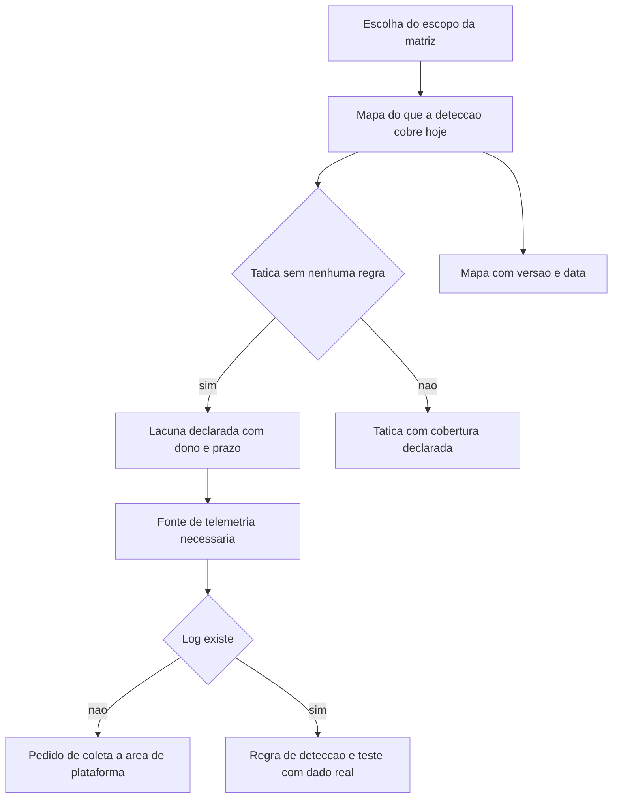

# MITRE ATT&CK na prática

Uma ideia central: ATT&CK é um catálogo de comportamento observado em campo, organizado por objetivo do adversário, e serve para transformar "quantas regras temos" em "quais comportamentos conseguimos ver" — desde que o mapa carregue versão e data.

## 1. Objetivo de aprendizagem

Ao final deste tema você deve conseguir: mapear um comportamento observado em tática e técnica do ATT&CK, registrar versão e data do mapa, e usar o resultado para declarar uma lacuna de cobertura de detecção com dono e prazo.

## 2. Pré-requisitos

O [TEMA-03](TEMA-03-threat-intelligence-fontes-e-niveis.md) vem antes, porque o mapa só tem conteúdo se existir fonte de observação. Mapear em ATT&CK sem dado de campo produz um desenho de intenções, não de cobertura.

## 3. Pré-teste

Responda de palpite, antes de ler o resto. Anote a confiança de 1 a 5.

1. Quantas táticas você aposta que a matriz Enterprise exibia na leitura registrada neste tema? Chute um número antes de conferir.
   Confiança: ___
2. Em palpite, qual fração das táticas a sua detecção cobre com pelo menos uma regra: menos de um quarto, cerca de metade ou quase todas?
   Confiança: ___
3. Um relatório de incidente cita só o nome de um agrupamento, sem técnica observada. Você acha que ele muda alguma regra de detecção? Sim, não ou depende.
   Confiança: ___
## 4. Caso real

A página inicial do MITRE ATT&CK descreve o projeto como base de conhecimento de táticas e técnicas adversariais baseada em observações do mundo real, usada como fundamento para modelos e metodologias de ameaça na iniciativa privada, no governo e na comunidade de produtos e serviços de segurança. O acesso é aberto e sem custo.

Na leitura feita para este tema, a matriz Enterprise exibia 15 táticas, com identificadores que vão de TA0043 em Reconhecimento até TA0040 em Impact, passando por TA0001 Initial Access, TA0008 Lateral Movement e TA0112 Defense Impairment. Duas delas contam a história de uma mudança de modelagem: Defense Impairment aparece como tática própria, com técnicas como Disable or Modify System Firewall e Disable or Modify Tools, enquanto Stealth ocupa TA0005.

Esse desenho tem consequência direta para quem compra ou opera detecção. Ataque que desliga registro de evento, altera firewall do host ou degrada controle passa a ficar visível como objetivo próprio do adversário, separado do ato de esconder-se. Quem organizou a cobertura apenas por táticas clássicas de execução e movimento lateral descobriu uma família de comportamento sem regra.

A pergunta que o caso deixa aberta: a sua matriz de cobertura tem uma linha para o adversário que primeiro desliga o seu controle, antes de fazer qualquer outra coisa?

## 5. Conteúdo

### 5.1 Conceito

ATT&CK organiza comportamento em duas camadas. A tática descreve o objetivo do adversário em um momento do ataque — entrar, persistir, escalar privilégio, mover-se lateralmente, exfiltrar, causar impacto. A técnica descreve como ele persegue esse objetivo, com um identificador estável e, em muitos casos, sub-técnicas que separam variações de implementação. A distinção adotada aqui segue o uso corrente da matriz; a definição literal, tal como o projeto a formula em suas perguntas frequentes, não foi lida nesta execução: NAO CONFIRMADO em fonte oficial.

Cada entrada carrega algo que interessa à operação: o comportamento observado, os dados que podem revelar aquele comportamento e as mitigações conhecidas. É por isso que o catálogo serve para três usos diferentes — desenhar detecção, priorizar coleta de telemetria e acompanhar grupos e campanhas ao longo do tempo. Um uso só de cada vez desperdiça o material.

O erro mais caro é tratar ATT&CK como lista de ferramentas. Um nome de malware ajuda pouco, porque muda de nome sem mudar de comportamento. O que sobrevive à troca de ferramenta é o procedimento: como o ator obtém credencial, o que ele executa para persistir, por onde ele move dados. Quando o SOC mapeia ferramenta em vez de comportamento, cada rebranding de malware exige regra nova.

Um mapa de cobertura sem versão e sem data não é auditável. A matriz muda: táticas entram e saem, sub-técnicas são criadas e desmembradas. Um relatório que diz "cobrimos 60% das técnicas" sem dizer qual versão da matriz foi usada não pode ser comparado com o relatório do semestre seguinte nem revisado por terceiro.

### 5.2 Como funciona

O uso prático tem quatro passos: escolher o escopo da matriz, mapear o que existe, declarar a lacuna e priorizar o que entra depois. Sem o quarto passo, o mapa vira figura de apresentação.

O escopo da matriz é decisão de arquitetura, não de gosto. Matriz Enterprise cobre sistemas corporativos; existem matrizes próprias para ambientes móveis, para sistemas de controle industrial e para ambientes de nuvem. Uma empresa com planta industrial e sem matriz correspondente no mapa tem um ponto cego declarado, e é melhor declarar do que descobrir.

O mapeamento do que existe é feito de baixo para cima. Pegue os alertas dos últimos 60 dias, as regras ativas e os casos de uso aprovados, e associe cada um à técnica correspondente. O resultado quase sempre surpreende: cobertura concentrada em umas poucas táticas, com famílias de comportamento inteiras sem nenhuma regra e com várias regras apontando para a mesma técnica.

A declaração da lacuna precisa de dono e prazo por tática sem cobertura, e precisa dizer o que falta: telemetria, regra ou ambos. Sem essa separação, o pedido ao comitê vira genérico, do tipo "precisamos de mais visibilidade", e pedido genérico não entra em orçamento.

A priorização do que entra depois usa o requisito de inteligência do [TEMA-03](TEMA-03-threat-intelligence-fontes-e-niveis.md) e a evidência de exploração em campo. Existe técnica que compensa mais do que outra para o seu setor e para o seu tipo de ativo, e essa escolha precisa de justificativa escrita por causa da fila de trabalho do time.

### 5.3 Exemplo resolvido

Cenário de trabalho: um analista recebe alerta de que uma máquina tentou resolver um nome interno incomum e, minutos depois, executou um comando de linha de comando com privilégio administrativo. Nenhum código de prova de conceito público foi identificado.

Passo 1 — separar observação de interpretação. O que existe é registro de resolução de nome e registro de execução de processo. O resto é inferência.

Passo 2 — mapear por objetivo. A descoberta de nomes internos aponta para a tática Discovery, em técnicas de enumeração de rede local. A execução com privilégio administrativo aponta para Execution, em interpretador de comandos e script, e para Privilege Escalation, se houver evidência de ganho de privilégio e não apenas de uso.

Passo 3 — verificar o que o alerta pode provar. A regra atual detecta a execução, não o caminho de obtenção de privilégio. Portanto a cobertura declarada é de uma técnica e de uma tática, não das duas.

Passo 4 — declarar a lacuna. Privilege Escalation fica sem cobertura nesse caminho específico. O que falta é telemetria de criação de processo com campo de usuário e de token, que já existe, e regra de correlação. O dono é o time de detecção, o prazo é o ciclo seguinte e o critério de aceite é o teste com dado real replicado.

Passo 5 — registrar o mapa. O documento final tem a versão da matriz, a data da leitura, a lista de táticas com e sem cobertura, e a lista de lacunas com dono e prazo. Sem versão e data, o mapa não entra em auditoria.

### 5.4 Problema de completar

Uma ocorrência real levantou sete fatos, listados abaixo. Preencha a tática, a técnica e a fonte de telemetria necessária. Use apenas as táticas e técnicas citadas neste tema ou já conhecidas por você; quando não houver certeza, escreva "não determinado" e diga o que falta para determinar.

| # | Fato observado | Tática | Técnica | Telemetria necessária |
|---|---|---|---|---|
| 1 | Mensagem de correio com anexo de arquivo compactado aberta por um usuário | ______ | ______ | ______ |
| 2 | Assistente de linha de comando executado com privilégio administrativo | ______ | ______ | ______ |
| 3 | Criação de tarefa agendada com nome semelhante ao de componente do sistema | ______ | ______ | ______ |
| 4 | Leitura em massa de diretórios de rede por conta de serviço | ______ | ______ | ______ |
| 5 | Coleta de arquivos compactados em diretório temporário | ______ | ______ | ______ |
| 6 | Transferência de volume anormal para destino externo em horário atípico | ______ | ______ | ______ |
| 7 | Limpeza de registro de eventos do sistema operacional no fim da atividade | ______ | ______ | ______ |

Responda ainda: qual dos sete fatos costuma faltar na cobertura de um SOC que organiza a detecção apenas por táticas clássicas, e por que ele é o mais caro dos sete quando não é visto? Justifique em três linhas.

## 6. Por que isso importa para o CISO

ATT&CK dá ao CISO uma unidade de medida que o comitê entende e que a auditoria aceita: táticas cobertas por pelo menos uma regra testada com dado real, com versão da matriz e data do mapa. Substitui "temos 480 regras" por "cobrimos 9 das 15 táticas, e esta é a lista das 6 sem cobertura", e a segunda frase leva a decisão de orçamento.

O segundo efeito é de negociação de telemetria. A lacuna declarada por tática identifica o log que falta. Isso conversa direto com a área de plataforma: não é "queremos mais visibilidade", é "sem registro de linha de comando com campo de usuário não existe regra para esta tática".

O terceiro efeito é de continuidade. Como a matriz muda, o mapa precisa de dono e de cadência de revisão. Um mapa de 18 meses atrás, sem versão declarada, produz uma falsa sensação de cobertura justamente quando uma tática nova aparece — e a mudança de modelagem que separou Defense Impairment de Stealth é o exemplo dessa classe de surpresa.

## 7. Aplicação prática

Liste os dez últimos incidentes ou alertas que consumiram tempo do time. Para cada um, escreva a tática e a técnica em que ele se encaixa e a fonte de telemetria que provou o comportamento. Marque com um traço as táticas que não apareceram em nenhuma das dez linhas.

Depois, escolha uma tática sem nenhuma ocorrência e responda por escrito a duas perguntas: essa tática é irrelevante para o meu setor, ou é relevante e não a veríamos? A resposta define se o item vira aceite de risco declarado ou lacuna com dono e prazo. Nenhuma das duas respostas exige ferramenta nova.

## 8. Autoexplicação

Explique em três frases por que mapear ferramenta não substitui mapear comportamento. Ligue ao seu ambiente: cite uma regra de detecção que você tem hoje, diga qual técnica ela cobre e qual técnica próxima a ela continua descoberta.

## 9. Erros comuns e equívocos

| Equívoco | Por que está errado | O que é correto |
|---|---|---|
| ATT&CK é uma lista de malwares e ferramentas | Nomes de ferramenta mudam sem que o procedimento mude | Mapeie comportamento e trate a ferramenta como pista secundária |
| Cobertura é o número de regras | Várias regras podem apontar para a mesma técnica e nenhuma para outra | Conte táticas e técnicas cobertas, com teste em dado real |
| Citar o agrupamento é o objetivo do relatório | Atribuição sem técnica observada não muda detecção nem prazo | Separe agrupamento, campanha e infraestrutura, e use a técnica como saída |
| O mapa não precisa de versão | A matriz muda e o número deixa de ser comparável entre semestres | Registre versão da matriz e data da leitura em todo mapa |
| Tática nova é problema de fornecedor | A lacuna é sua: a regra não existe no seu ambiente | Revise o mapa quando a matriz mudar e a decisão de cobertura for reavaliada |
| Sem telemetria, o time de detecção resolve | Regra sem log não tem onde ser avaliada | Peça a coleta com nome de fonte, dono e prazo antes de prometer cobertura |

## 10. Recuperação ativa

Responda tudo antes de abrir o gabarito.

1. Quantas táticas a matriz Enterprise exibia na leitura registrada neste tema, e cite três delas com o identificador.
2. Qual é a diferença entre tática e técnica, e por que as duas camadas são necessárias no mapa?
3. Por que um mapa de cobertura precisa carregar versão da matriz e data de leitura?
4. O que muda na cobertura quando uma tática nova, como Defense Impairment, passa a existir separada de Stealth?
5. O que uma lacuna declarada precisa conter para entrar em decisão de orçamento?
6. Por que citar agrupamento sem citar técnica observada limita o valor do relatório de inteligência?

Conferir respostas

1. A matriz exibia 15 táticas na leitura. Entre elas: TA0043 Reconhecimento, TA0001 Initial Access, TA0008 Lateral Movement, TA0112 Defense Impairment e TA0040 Impact.
2. A tática é o objetivo do adversário no momento do ataque; a técnica é o procedimento com que ele persegue esse objetivo, com identificador estável. Sem a tática, o mapa não mostra quais objetivos ficaram sem cobertura; sem a técnica, não existe objeto para testar.
3. Porque a matriz muda: táticas e sub-técnicas entram, saem e se desmembram. Um número de cobertura sem versão não é comparável entre períodos nem revisável por terceiro.
4. Passa a existir uma família de comportamento com nome próprio: desligar ou alterar firewall, limpar registro de eventos, degradar controle. Quem organizava a cobertura só por táticas clássicas descobre essa família sem regra.
5. A tática ou a técnica, o que falta em termos de telemetria ou de regra, o dono nominal e o prazo, além do critério de aceite com teste em dado real.
6. Porque atribuição não gera regra, não define prazo e não altera telemetria. A técnica observada é o que a detecção consegue implementar e verificar.

## 11. Revisão espaçada

| Intervalo | O que fazer | Se errar |
|---|---|---|
| D+1 | Repetir as 15 táticas de memória e marcar as que a sua detecção não cobre | Rebaixar: repetir em D+1 |
| D+7 | Mapear os dez últimos alertas em tática e técnica e listar as táticas ausentes | Rebaixar: repetir em D+3 |
| D+30 | Reabrir a matriz, comparar com o mapa salvo e registrar o que mudou desde a leitura anterior | Rebaixar: repetir em D+7 |

## 12. Conexões com outros temas

Leitura humana do `relacoes` do frontmatter — que é a fonte. Relações que saem desta área
também aparecem em [mapa-relacoes.md](../mapa-relacoes.md). Regras em
[templates/RELACOES-TEMAS.md](../templates/RELACOES-TEMAS.md).

| Relação | Alvo | Por que |
|---|---|---|
| complementa | 10-operacoes-soc#TEMA-03 | a matriz diz qual comportamento observar e o caso de uso de detecção entrega a regra que observa |
| complementa | 11-resposta-forense#TEMA-01 | a mesma matriz organiza a triagem do incidente e a hipótese de contenção |
| complementa | 13-ofensiva-pentest#TEMA-04 | o exercício adversarial valida no ambiente a cobertura que o mapa de técnicas declarou, e o resultado volta para o mapa |

## 13. Certificações e leitura recomendada

| Certificação | Domínio coberto | Leitura recomendada |
|---|---|---|
| CySA+ | Operações de segurança; gestão de vulnerabilidades; resposta a incidentes; reporte e comunicação | [MITRE ATT&CK](https://attack.mitre.org/) |
| SC-200 | Cobertura declarada no guia da área (TEMA-01, TEMA-02 e TEMA-04); domínio de exame não publicado nas fontes conferidas | [NIST SP 800-150](https://csrc.nist.gov/pubs/sp/800/150/final) |
## 14. Fontes verificadas

| # | Título | Tipo | URL | Acessado em | Confiança |
|---|---|---|---|---|---|
| 1 | MITRE ATT&CK, base de conhecimento de táticas e técnicas adversariais baseada em observações do mundo real; matriz Enterprise com 15 táticas, identificadores TA0043 a TA0040 e TA0112, e as técnicas e sub-técnicas citadas neste tema | primaria | https://attack.mitre.org/ | "2026-09-25" | alta |
| 2 | NIST SP 800-150, outubro de 2016, DOI 10.6028/NIST.SP.800-150; origem do insumo de observação que alimenta o mapa | primaria | https://csrc.nist.gov/pubs/sp/800/150/final | "2026-09-25" | alta |
| 3 | CISA — Known Exploited Vulnerabilities Catalog, fonte autoritativa de vulnerabilidades exploradas em campo, estabelecida pela Binding Operational Directive 22-01 | primaria | https://www.cisa.gov/known-exploited-vulnerabilities-catalog | "2026-09-25" | media |

A versão da matriz exibida na data de acesso não é exibida na página lida e não é afirmada aqui: NAO CONFIRMADO em fonte oficial. As descrições oficiais de cada técnica e o texto do FAQ do projeto não foram lidos; nomes e identificadores foram lidos na matriz. Não há, neste tema, estatística de tempo de detecção, de número de regras ou de custo.

---

| Navegação | |
|---|---|
| Área | [12 Gestão de vulnerabilidades e threat intelligence](./README.md) |
| Tema anterior | [TEMA-03](TEMA-03-threat-intelligence-fontes-e-niveis.md) |
| Próximo tema | [TEMA-05](TEMA-05-bug-bounty-e-divulgacao-responsavel.md) |
| Home | [README](../README.md) |
