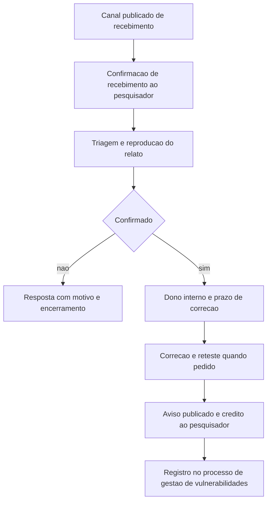

# Bug bounty e divulgação responsável

Uma ideia central: divulgação de vulnerabilidade é um processo de duas pontas — receber relato e publicar correção — e o programa de recompensa só faz sentido depois que as duas pontas existem, com canal, prazo e salvo-conduto escritos.

## 1. Objetivo de aprendizagem

Ao final deste tema você deve conseguir: avaliar o programa de recebimento de relatos e divulgação da sua empresa contra os objetos do ISO/IEC 29147 e do ISO/IEC 30111, e apontar o que falta antes de abrir recompensa financeira.

## 2. Pré-requisitos

O [TEMA-01](TEMA-01-gestao-de-vulnerabilidades-do-inventario-ao-fechamento.md) vem antes: o relato externo entra no mesmo processo de correção, com o mesmo dono, o mesmo prazo e a mesma verificação. Programa de recompensa sem processo de correção compra fila de trabalho, não reduz exposição.

## 3. Pré-teste

Responda de palpite, antes de ler o resto. Anote a confiança de 1 a 5.

1. Se um pesquisador achasse hoje uma falha em um sistema seu, você aposta que ele acharia o canal correto em menos de cinco minutos? Sim, não ou não sei.
   Confiança: ___
2. Existe prazo escrito entre receber um relato e dar a primeira resposta ao pesquisador? Antes de ler, diga o que você acha que existe na sua empresa hoje.
   Confiança: ___
3. Quando a empresa corrige uma falha que afeta clientes, você aposta que publica um aviso? Diga o que você imagina que está publicado agora.
   Confiança: ___
## 4. Caso real

O ISO/IEC 29147:2018 é a edição vigente da norma de divulgação de vulnerabilidade, publicada em 23 de outubro de 2018, com 32 páginas. O resumo declara o escopo: requisitos e recomendações a fornecedores sobre a divulgação de vulnerabilidades em produtos e serviços, incluindo orientação para receber relatos, orientação para divulgar informação de remediação, termos e definições próprios, visão geral dos conceitos, técnicas e considerações de política, além de exemplos de políticas no Anexo A e de comunicações no Anexo B. As atividades que acontecem entre receber o relato e divulgá-lo estão descritas em outra norma, o ISO/IEC 30111.

A página oficial mostra o histórico de ciclo de vida. A norma foi confirmada após revisão sistemática em 3 de maio de 2024 e, em 26 de setembro de 2025, entrou novamente em revisão sistemática, passando ao estágio 90.92, descrito como "a ser revisada". A substituição está em desenvolvimento, como novo item de trabalho. O ISO/IEC 30111:2019, publicado em 1º de outubro de 2019, com 13 páginas, está no mesmo estágio, e o documento que o substituirá também está em desenvolvimento.

Para quem mantém um programa de recebimento de relatos, isso significa duas coisas. A primeira é que o objeto de cada uma das duas normas é diferente e complementar: a 29147 governa a relação com quem relata e a comunicação pública; a 30111 governa o processo interno de processar e remediar o que foi relatado. A segunda é que a norma vigente tem data de revisão declarada, e uma política interna que a cite precisa carregar data de revisão no mesmo formato.

A pergunta que o caso deixa aberta: se a norma que governa a sua divulgação entrou em revisão, quem na sua empresa é responsável por saber disso antes da auditoria?

## 5. Conteúdo

### 5.1 Conceito

Existem três modelos de divulgação em uso. Na divulgação privada, o relato chega em confiança e a decisão de publicar fica com a organização; a maioria dos programas de recompensa exige esse modelo. Na divulgação integral, os detalhes vão a público assim que identificados, às vezes antes de existir correção, e o uso principal é pressionar organização que ignora relato. No meio está a divulgação responsável, também chamada de coordenada: o relato inicial é privado e os detalhes são publicados depois que a correção está disponível, muitas vezes com um prazo declarado para a organização responder antes de o pesquisador publicar.

O objeto do ISO/IEC 29147 é a relação com o pesquisador e com o público, e o do ISO/IEC 30111 é o processo interno de tratamento. Uma empresa que só tem a primeira metade recebe relato e não consegue fechar; uma que só tem a segunda não tem por onde receber. O resumo da 29147 aponta a divulgação como forma de permitir que usuários façam gestão técnica de vulnerabilidade e citam que ela ajuda a priorizar investimento defensivo e a avaliar risco.

O canal de recebimento é a peça mais barata e a mais frequentemente ausente. O OWASP Cheat Sheet de divulgação lista os mecanismos usuais: contato de segurança dedicado na página de contato, instruções em rastreador de problemas, endereço no formato security em arroba, arquivo security.txt publicado no caminho bem conhecido do domínio conforme a RFC 9116, com os campos obrigatórios de contato e expiração, e programa de recompensa operado por terceiro. O mesmo material recomenda treinar quem atende o contato geral — telefone, chat e caixa postal — para encaminhar relato em vez de responder por conta própria.

O salvo-conduto é o que separa programa de risco jurídico. O Cheat Sheet trata do tema de forma direta: teste fora do escopo declarado pode ser infração; alguns países restringem engenharia reversa; exigir pagamento como condição para informar uma falha pode configurar extorsão, e o material recomenda que o pesquisador não faça isso e que a empresa não ameace ação legal contra quem relata de boa-fé. O documento cita o projeto disclose.io como fonte de modelos de política e de termos de salvo-conduto.

### 5.2 Como funciona

O caminho tem seis estações, e o programa falha quando uma delas não tem dono. O tempo entre estações é o que o pesquisador enxerga, e é o que decide se ele volta a relatar.

A triagem é o gargalo real. Relato externo chega sem contexto de negócio, às vezes em idioma diferente, às vezes duplicado, e precisa ser reproduzido antes de virar item de correção. O Cheat Sheet registra que boa parte do volume pode ser ruído ou falso positivo e que o programa operado por terceiro costuma incluir a triagem inicial como serviço — o que explica a taxa cobrada.

O aviso publicado tem conteúdo mínimo, segundo o mesmo material: resumo e impacto da falha, lista clara de versões vulneráveis, lista clara de versões corrigidas, condições em que o produto é afetado, mitigação ou contorno temporário e o identificador CVE. Publicar aviso é o que permite ao cliente fazer a gestão técnica citada na norma, e omitir versões vulneráveis é o defeito mais comum.

O crédito ao pesquisador é decisão de política e não de simpatia. Recompensa financeira é uma das opções; crédito em lista pública, item promocional e desconto são outras, e o Cheat Sheet recomenda alguma forma de reconhecimento a quem relatou de forma profissional fora de programa. Pesquisador não reconhecido não volta, e o custo de perder a fonte é maior do que o custo do reconhecimento.

O pré-requisito do programa de recompensa é o ponto que mais se ignora. O Cheat Sheet afirma que o programa só deve ser usado por organizações que já tenham processo de divulgação maduro, apoiado por processo interno forte de resolução de vulnerabilidades, e lista os problemas concretos de abrir antes disso: tempo e recurso para responder, pessoal qualificado para triagem, volume de relato inútil, dificuldade de distinguir teste legítimo de ataque, pesquisador fora do escopo e custo financeiro do programa.

### 5.3 Exemplo resolvido

Uma empresa de software B2B decide abrir programa de recompensa. Tem 2.400 clientes, um time de produto de 60 pessoas e nenhum canal de segurança publicado.

Passo 1 — inventariar o que existe. Leitura do site: nenhuma página de segurança, nenhum contato dedicado, nenhum arquivo security.txt. Chamados recebidos por canal genérico nos últimos 12 meses: 3 relatos, todos encaminhados para o suporte de primeiro nível e encerrados sem registro de correção.

Passo 2 — comparar com o objeto da norma de divulgação. O relatório de lacuna lista o que falta em cada bloco: canal de recebimento ausente; processo interno de tratamento ausente; política de comunicação ausente; nenhum registro de aviso publicado.

Passo 3 — comparar com o objeto da norma de tratamento. O que a empresa tem: fila de correção com dono e prazo. O que falta: classificação de relato externo na fila, prazo de primeira resposta ao pesquisador, e critério de reteste.

Passo 4 — construir na ordem. Publica security.txt com contato e data de expiração, cria a caixa dedicada com dois responsáveis nominais, escreve a política de divulgação com escopo, prazo de resposta, salvo-conduto e o que não é elegível, e treina o suporte de primeiro nível para encaminhar sem responder.

Passo 5 — operar sem recompensa por dois ciclos. Roda 90 dias com o canal publicado, mede tempo de primeira resposta, tempo até triagem e tempo até correção, e publica os avisos das falhas corrigidas com CVE e versões.

Passo 6 — decidir sobre recompensa com dado. Com os tempos medidos e a fila de correção operando, a decisão passa a ser de preço e escopo, não de esperança. A empresa decide abrir faixa de recompensa apenas para dois produtos expostos à internet, com triagem por terceiro.

O que o exercício entrega é uma sequência: canal, política, processo e por último dinheiro. Invertida, a mesma sequência produz fila de relato sem correção, que é o pior resultado possível de exposição.

### 5.4 Problema de completar

A empresa decide abrir recompensa imediatamente, sem canal publicado. Preencha o que falta em cada etapa e indique o risco concreto de cada ausência.

| Etapa | O que falta | Risco concreto | Onde a norma trata |
|---|---|---|---|
| Canal de recebimento | ______ | ______ | ______ |
| Prazo de primeira resposta | ______ | ______ | ______ |
| Escopo do programa | ______ | ______ | ______ |
| Salvo-conduto | ______ | ______ | ______ |
| Triagem e reprodução | ______ | ______ | ______ |
| Aviso publicado | ______ | ______ | ______ |

Responda ainda: se o programa abrisse hoje sem política de escopo, dois problemas apareceriam na primeira semana. Quais são, e qual dos dois você resolveria primeiro, em duas linhas.

## 6. Por que isso importa para o CISO

Receber relato externo é a única fonte de descoberta que não depende do seu próprio instrumento. Ela encontra falha de lógica, de autorização e de desenho — classes que varredura e análise estática erram com frequência. O resumo do ISO/IEC 29147 declara o objetivo da norma como reduzir o risco associado à exploração de vulnerabilidades, e a via é permitir que o usuário faça a própria gestão técnica de vulnerabilidade.

O segundo efeito é jurídico e de reputação. Sem salvo-conduto escrito e sem canal publicado, o pesquisador que encontra falha na sua empresa tem dois caminhos ruins: publicar inteiro ou vender. O Cheat Sheet descreve exatamente esse encadeamento — relato ignorado historicamente levou pesquisadores à divulgação integral. A política de escopo e o salvo-conduto convertem uma decisão de risco em procedimento.

O terceiro efeito é de sequência de investimento. Recompensa sem processo maduro de correção é gasto que aumenta o passivo visível. O próprio material de referência recomenda que ela venha depois. Levar essa recomendação ao comitê, com a ordem proposta — canal, política, processo, recompensa — evita a compra de um programa que produz relato que a empresa não consegue fechar.

## 7. Aplicação prática

Tente relatar uma falha fictícia na sua própria empresa. Procure, no site público e nos canais de atendimento, a forma de contato para questões de segurança. Cronometre quanto tempo levou e anote quantos caminhos diferentes você encontrou antes de chegar a uma pessoa. O resultado é o diagnóstico do canal.

Em seguida, escreva a política em uma página, mesmo que ainda não exista programa: contato, prazo de primeira resposta, prazo-alvo de correção por faixa de severidade, escopo, o que não é elegível, o que a empresa oferece como reconhecimento e o trecho de salvo-conduto. Nomeie o dono da política e a data de revisão. Uma página escrita vale mais do que um programa no papel.

## 8. Autoexplicação

Explique em três frases por que o programa de recompensa vem depois do processo de correção. Ligue ao seu ambiente: descreva o caminho que um relato externo percorreria hoje na sua empresa, do primeiro contato até o aviso publicado, e marque onde o caminho se interrompe.

## 9. Erros comuns e equívocos

| Equívoco | Por que está errado | O que é correto |
|---|---|---|
| Bug bounty é o primeiro passo do programa | Produz volume de relato sem processo de correção para fechar | Publique canal e política, opere sem recompensa e só então decida sobre dinheiro |
| Divulgação responsável depende da boa vontade do pesquisador | O que garante prazo e escopo é política escrita, com salvo-conduto | Escreva escopo, prazo e salvo-conduto, e publique o canal |
| Aviso de segurança é risco de imagem | Ocultar falha é o que destrói confiança; publicar mostra processo | Publique resumo, impacto, versões vulneráveis, versões corrigidas, mitigação e CVE |
| Triagem é trabalho administrativo | Exige reprodução, contexto de negócio e priorização | Trate triagem como função com dono e capacidade reservada |
| ISO/IEC 29147 e 30111 são a mesma coisa | Uma governa a divulgação e a relação com o pesquisador, a outra o tratamento interno | Use as duas, uma para fora e uma para dentro |
| Ameaçar ação legal resolve relato inconveniente | Agrava a situação e empurra o pesquisador para divulgação integral | Responda com processo e mantenha o salvo-conduto |

## 10. Recuperação ativa

Responda tudo antes de abrir o gabarito.

1. Qual é o objeto do ISO/IEC 29147 e qual é o objeto do ISO/IEC 30111?
2. Qual é o pré-requisito operacional que o OWASP Cheat Sheet exige antes de abrir um programa de recompensa, e quais problemas ele lista quando isso é ignorado?
3. Onde fica o arquivo security.txt, qual norma descreve sua localização e quais são os campos obrigatórios?
4. Quais são os três modelos de divulgação descritos e qual deles a maioria dos programas de recompensa exige?
5. Qual é o conteúdo mínimo de um aviso de segurança publicado?
6. O que caracteriza risco jurídico no contato com o pesquisador e o que a política precisa conter para endereçá-lo?

Conferir respostas

1. A 29147 trata de requisitos e recomendações a fornecedores sobre a divulgação de vulnerabilidades em produtos e serviços, incluindo recebimento de relatos e divulgação de informação de remediação. A 30111 trata de requisitos e recomendações para processar e remediar vulnerabilidades potenciais reportadas em um produto ou serviço.
2. Ter processo de divulgação maduro, apoiado por processo interno forte de resolução de vulnerabilidades. Sem isso, os problemas listados incluem falta de tempo e recurso para responder, falta de pessoal qualificado para triagem, volume de relato inútil, dificuldade de distinguir teste legítimo de ataque, pesquisador fora do escopo e custo financeiro do programa.
3. No caminho bem conhecido do domínio, como arquivo security.txt, conforme a RFC 9116. Os campos obrigatórios são contato e expiração; idiomas preferidos, canônico, política e vagas são opcionais.
4. Divulgação privada, divulgação integral e divulgação responsável, também chamada de coordenada. A maioria dos programas de recompensa exige a privada.
5. Resumo com impacto, lista de versões vulneráveis, lista de versões corrigidas, condições em que o produto é afetado, mitigação ou contorno e o identificador CVE.
6. Testar fora do escopo declarado, atuar em jurisdição que restringe engenharia reversa e condicionar a informação a pagamento. A política precisa conter escopo explícito, salvo-conduto e o procedimento de relato.

## 11. Revisão espaçada

| Intervalo | O que fazer | Se errar |
|---|---|---|
| D+1 | Repetir de memória o objeto das duas normas e os três modelos de divulgação | Rebaixar: repetir em D+1 |
| D+7 | Testar o canal de relato da própria empresa e cronometrar o caminho até uma pessoa responsável | Rebaixar: repetir em D+3 |
| D+30 | Revisar a política de divulgação escrita e conferir o estágio de revisão das normas citadas | Rebaixar: repetir em D+7 |

## 12. Conexões com outros temas

Leitura humana do `relacoes` do frontmatter — que é a fonte. Relações que saem desta área
também aparecem em [mapa-relacoes.md](../mapa-relacoes.md). Regras em
[templates/RELACOES-TEMAS.md](../templates/RELACOES-TEMAS.md).

| Relação | Alvo | Por que |
|---|---|---|
| aplicado_em | 13-ofensiva-pentest#TEMA-06 | autorizar teste e receber relato de falha usam o mesmo documento de escopo e salvo-conduto |

## 13. Certificações e leitura recomendada

| Certificação | Domínio coberto | Leitura recomendada |
|---|---|---|
| CySA+ | Operações de segurança; gestão de vulnerabilidades; resposta a incidentes; reporte e comunicação | [ISO/IEC 29147:2018](https://www.iso.org/standard/72311.html) |
## 14. Fontes verificadas

| # | Título | Tipo | URL | Acessado em | Confiança |
|---|---|---|---|---|---|
| 1 | ISO/IEC 29147:2018, edição 2, publicada em 23/10/2018, 32 páginas, comitê ISO/IEC JTC 1/SC 27; objeto e conteúdo do resumo; confirmada em 03/05/2024 e em revisão sistemática desde 26/09/2025, no estágio a ser revisada | primaria | https://www.iso.org/standard/72311.html | "2026-09-25" | alta |
| 2 | ISO/IEC 30111:2019, edição 2, publicada em 01/10/2019, 13 páginas; objeto e resumo; estágio a ser revisada desde 26/09/2025, com substituição em desenvolvimento | primaria | https://www.iso.org/standard/69725.html | "2026-09-25" | alta |
| 3 | OWASP Vulnerability Disclosure Cheat Sheet; modelos de divulgação, security.txt conforme RFC 9116, requisitos de programa de recompensa, conteúdo mínimo de aviso e orientação sobre risco jurídico | primaria | https://cheatsheetseries.owasp.org/cheatsheets/Vulnerability_Disclosure_Cheat_Sheet.html | "2026-09-25" | alta |
| 4 | FIRST — CVSS v4.0 Specification Document, versão 1.2; uso do escore como insumo de priorização no tratamento do relato | primaria | https://www.first.org/cvss/v4.0/specification-document | "2026-09-25" | alta |

O prazo de 90 dias aparece no Cheat Sheet do OWASP como descrição da política de divulgação do Project Zero, e é citado aqui nessa condição: é exemplo declarado, não norma. O conteúdo das seções 4 a 10 das duas normas ISO não foi lido. Não há, neste tema, estatística de volume de relato, de valor de recompensa paga ou de prazo médio de correção.

---

| Navegação | |
|---|---|
| Área | [12 Gestão de vulnerabilidades e threat intelligence](./README.md) |
| Tema anterior | [TEMA-04](TEMA-04-mitre-attack-na-pratica.md) |
| Próximo tema | [TEMA-06](TEMA-06-metricas-de-exposicao-e-divida-de-remediacao.md) |
| Home | [README](../README.md) |
