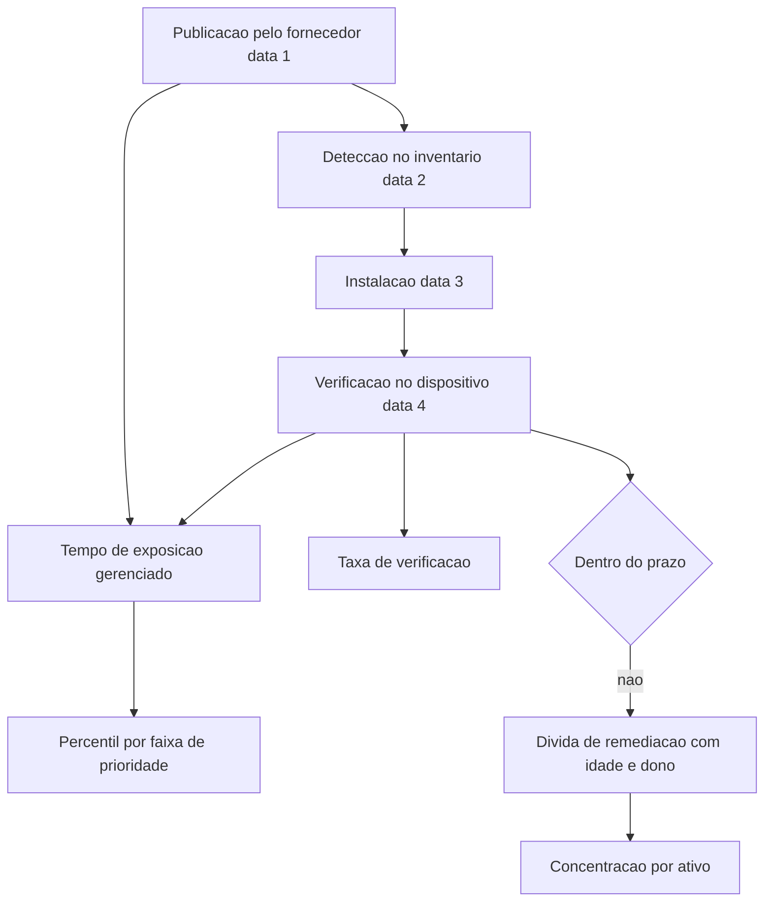

# Métricas de exposição e dívida de remediação

Uma ideia central: a única métrica de gestão de vulnerabilidades que resiste à auditoria é a que começa na data de publicação pelo fornecedor, termina na verificação no dispositivo e carrega o contexto do ativo — percentual de itens fechados mede atividade, não exposição.

## 1. Objetivo de aprendizagem

Ao final deste tema você deve conseguir: construir três métricas de exposição com numerador, denominador e data de referência declarados, e criticar por escrito uma métrica de percentual corrigido apontando o que ela esconde.

## 2. Pré-requisitos

O [TEMA-01](TEMA-01-gestao-de-vulnerabilidades-do-inventario-ao-fechamento.md) fornece o processo, as quatro datas e o registro de fechamento. O [TEMA-02](TEMA-02-cvss-epss-e-priorizacao-por-risco-real.md) fornece o critério de priorização. Sem processo e sem critério, a métrica mede a si mesma.

## 3. Pré-teste

Responda de palpite, antes de ler o resto. Anote a confiança de 1 a 5.

1. Qual métrica de vulnerabilidade você aposta que impressiona mais o seu comitê hoje: percentual corrigido, tempo de exposição ou concentração da dívida? Aposte.
   Confiança: ___
2. Se a taxa de correção de itens críticos subiu no trimestre, você acha que a exposição caiu na mesma proporção? Sim, não ou depende do inventário.
   Confiança: ___
3. Entre os itens abertos há mais de um ano, você aposta que poucos (até 20%) ou muitos (mais da metade) estão concentrados em menos de cinco ativos?
   Confiança: ___
## 4. Caso real

O NIST registrou, na revisão do SP 800-40 publicada em abril de 2022, que existe com frequência uma divisão entre donos de negócio e de missão de um lado e a gestão de segurança e tecnologia do outro quanto ao valor de aplicar correção. Essa divisão é de linguagem, e a linguagem que falta é a de manutenção: quem paga manutenção preventiva quer saber o que muda no risco, não quantos pacotes foram instalados.

O mesmo documento define a quinta etapa do processo como verificar a instalação. Essa etapa é o que transforma o processo em métrica auditável, porque produz uma data que não depende do painel da ferramenta: a data em que o dispositivo reportou a versão corrigida.

Do lado do critério, a especificação do CVSS v4.0 registra que provedores de avaliação, entre eles o National Vulnerability Database, normalmente publicam apenas a pontuação Base, na nomenclatura CVSS-B. A mesma especificação afirma que as métricas de Threat e Environmental são de responsabilidade do consumidor. Isso significa que, na maior parte das empresas, o número usado no painel descreve o pior caso agnóstico ao ambiente — e que qualquer métrica de exposição construída apenas sobre esse número mede a severidade do defeito, não a exposição da empresa.

A pergunta que o caso deixa aberta: qual é a data de referência do número que você levou ao comitê no mês passado, e quem consegue reproduzi-lo sem depender do seu painel?

## 5. Conteúdo

### 5.1 Conceito

Métrica de exposição responde a uma pergunta de risco, e não a uma pergunta de atividade. Atividade é quantos itens foram corrigidos; exposição é quanto tempo o ambiente ficou com defeito explorável em ativo que importa. As duas podem se mover em direções opostas: a equipe pode bater recorde de correção enquanto o tempo de exposição do servidor exposto sobe.

A definição de trabalho adotada aqui para tempo de exposição é a distância entre a data de publicação pelo fornecedor e a data de verificação no dispositivo. Duas variantes são úteis: a primeira inclui a demora do fornecedor e a demora interna; a segunda começa na detecção no inventário e isola o desempenho da equipe. Relatar as duas separa responsabilidade e evita culpar a operação por atraso de fabricante.

Dívida de remediação é o conjunto de itens abertos além do prazo declarado na política, com idade, faixa de prioridade, dono e concentração por ativo. Ela é medida em quatro cortes: quantidade, idade, faixa de prioridade e ativos distintos afetados. O quarto corte é o que mais muda decisão, porque dívida concentrada em poucos ativos deixa de ser problema de capacidade e passa a ser decisão de substituição ou isolamento.

Uma definição acadêmica formal de dívida de segurança, distinta de dívida técnica, foi citada na etapa de fundação deste roadmap com um capítulo da Springer, e o texto não foi lido nesta execução: NAO CONFIRMADO em fonte oficial. O que este tema usa é a definição operacional acima, que qualquer empresa consegue calcular com os próprios registros.

### 5.2 Como funciona

Três métricas sustentam a conversa com o comitê, e cada uma precisa de três elementos declarados: numerador, denominador e data de referência. Métrica sem os três não é comparável entre meses nem entre áreas.

A primeira é tempo de exposição, com a definição e as duas variantes acima. Reporte por faixa de prioridade e como percentil, não como média. A média é arrastada por itens fáceis e esconde a cauda: um item aberto há mais de dois anos desaparece no meio de duzentos itens fechados em uma semana.

A segunda é taxa de verificação, definida como itens com versão corrigida confirmada no dispositivo divididos por itens que a ferramenta reporta como instalados. É o número que expõe a diferença entre entrega de pacote e correção real, e é provavelmente o mais barato de todos: a maior parte das ferramentas de gestão já coleta versão de componente no host.

A terceira é cobertura de contexto, definida como itens com métrica de ameaça ou de ambiente preenchida divididos pelo total da fila. Ela mede se a empresa está usando o critério do [TEMA-02](TEMA-02-cvss-epss-e-priorizacao-por-risco-real.md) ou apenas repetindo o número publicado pelo fornecedor. Uma organização com cobertura de contexto baixa tem fila ordenada por severidade técnica e mais nada.

Três regras de disciplina evitam que a métrica seja manipulada sem má-fé. Primeira: proibido comparar áreas com definições diferentes de prazo. Segunda: proibido reportar percentual sem denominador explícito. Terceira: toda métrica precisa da data de referência no título, porque a pontuação de exploração estimada muda todos os dias e a mesma fila ordenada em datas diferentes não é a mesma fila.

### 5.3 Exemplo resolvido

Uma empresa de logística com 900 estações, 120 servidores e 30 equipamentos de rede quer substituir o indicador atual de percentual de itens fechados. O indicador atual reporta 91% de fechamento em itens de severidade alta.

Passo 1 — auditar o indicador atual. O denominador é a lista de itens de severidade alta detectados no mês. Itens que saíram da lista por desinstalação de software contam como fechados. Itens que ficaram pendentes de reinício contam como fechados. A verificação no dispositivo não é consultada. Conclusão: o indicador mede movimento de lista, não exposição.

Passo 2 — definir as três métricas com numerador, denominador e data.

| Métrica | Numerador | Denominador | Data de referência |
|---|---|---|---|
| Tempo de exposição gerenciado | soma dos dias entre detecção e verificação no dispositivo | itens verificados no período | fim do mês, com hora |
| Taxa de verificação | itens com versão corrigida lida no host | itens que a ferramenta reporta como instalados | 48 horas após cada janela |
| Cobertura de contexto | itens com métrica de ameaça ou ambiente preenchida | itens na fila do período | fim do mês |

Passo 3 — medir por faixa de prioridade. O tempo de exposição sai separado para os itens de exploração confirmada em campo, para os da faixa prioritária e para a rotina. Misturar as três faixas produz um número médio que não serve para decidir nada, porque as metas são diferentes.

Passo 4 — medir a dívida. A lista de itens além do prazo é classificada por idade em quatro faixas — até 30 dias, 31 a 90, 91 a 365 e mais de um ano — e por ativos distintos. O resultado do primeiro mês aponta 61 itens acima de um ano distribuídos em 12 ativos, sendo 9 deles equipamentos de rede sem suporte do fabricante.

Passo 5 — mudar a decisão. Os 9 equipamentos não entram em um novo ciclo de correção: entram em plano de substituição, com orçamento e data, ou em isolamento de rede, se a substituição não couber no exercício. Essa é a única saída em que a métrica mudou uma decisão, e é o teste final de utilidade: um número que não altera decisão sai do relatório.

Passo 6 — fixar a cadência de reporte. Uma página por mês, com as três métricas, as faixas de prioridade, a dívida por idade e a lista das decisões tomadas por causa dos números. Nada além disso. Relatório que cresce perde leitor.

### 5.4 Problema de completar

O comitê pede um único número para acompanhar a exposição. Complete a avaliação de três candidatos e escolha.

| Candidato | O que mede de fato | Como pode ser manipulado | Serve para o comitê |
|---|---|---|---|
| Percentual de itens fechados no mês | ______ | ______ | ______ |
| Tempo de exposição mediano por faixa de prioridade | ______ | ______ | ______ |
| Quantidade de itens abertos além do prazo | ______ | ______ | ______ |

Complete ainda a definição das duas métricas de apoio.

| Métrica de apoio | Fórmula | Para que serve |
|---|---|---|
| Taxa de verificação | ______ | ______ |
| Cobertura de contexto | ______ | ______ |

Responda por último: se a empresa tem 40 itens acima do prazo concentrados em 3 ativos sem suporte do fabricante, qual decisão esse recorte habilita, e qual métrica você deixaria de reportar para não confundir o comitê? Justifique em três linhas.

## 6. Por que isso importa para o CISO

Métrica de exposição é o único artefato do programa de vulnerabilidades que sobrevive à troca de gestão. Números de atividade morrem com o gestor que os produziu, porque dependem do contexto de quem montou o painel. Data de publicação, data de verificação e identificador do ativo são fatos reproduzíveis por terceiro.

O segundo efeito é de negociação de prazo. Quando o tempo de exposição é reportado por faixa de prioridade, a discussão com o dono de negócio deixa de ser sobre a janela de manutenção de sábado e passa a ser sobre a quantidade de dias que o ativo ficou vulnerável. A conversa muda de conveniência para custo.

O terceiro efeito é de orçamento de substituição. Dívida de remediação concentrada em poucos ativos sem suporte de fabricante é o argumento técnico mais forte que existe para trocar equipamento. Sem o recorte por ativo, esses itens aparecem como parte de um percentual genérico e nunca viram linha de orçamento.

## 7. Aplicação prática

Escolha dez itens abertos há mais de 90 dias no seu inventário. Para cada um, monte uma linha com seis campos: identificador, faixa de prioridade, data de publicação pelo fornecedor, data de detecção no inventário, ativo afetado e presença ou ausência no catálogo de exploração confirmada em campo. Não use ferramenta nova; planilha basta.

Depois, agrupe por ativo e conte quantos itens cada ativo carrega. Se três ativos concentrarem metade da dívida, o relatório do próximo mês tem uma linha de decisão e não uma linha de percentual. Leve também a taxa de verificação de uma janela recente: consulte no host a versão do componente em dez máquinas e compare com o que a ferramenta reporta como instalado.

## 8. Autoexplicação

Explique em três frases por que percentual de itens fechados não mede exposição. Ligue ao seu ambiente: pegue o último número que você reportou ao comitê e descreva o que ele esconderia se um auditor perguntasse pela data de verificação de cada item.

## 9. Erros comuns e equívocos

| Equívoco | Por que está errado | O que é correto |
|---|---|---|
| Percentual de itens fechados mede risco | Mede movimento de lista e ignora tempo, prioridade e exposição do ativo | Reporte tempo de exposição por faixa de prioridade |
| Média é suficiente para resumir | A média esconde a cauda e é arrastada por itens triviais | Use percentil e separe por faixa de prioridade |
| Instalação reportada equivale a correção | Reinício pendente e reversão mantêm o código antigo em execução | Meça a taxa de verificação no próprio dispositivo |
| Dívida é problema de capacidade da equipe | Frequentemente se concentra em poucos ativos sem suporte do fabricante | Recorte a dívida por ativo e decida substituição ou isolamento |
| A métrica mais simples é a mais honesta | Simplicidade sem definição de numerador e data de referência esconde manipulação | Declare numerador, denominador e data de referência no título |
| Comparar áreas com a mesma métrica sem a mesma definição | Prazos e escopos diferentes tornam a comparação inválida | Publique uma definição única antes de comparar |

## 10. Recuperação ativa

Responda tudo antes de abrir o gabarito.

1. Defina tempo de exposição com as quatro datas envolvidas e explique a diferença entre a variante que isola o desempenho interno e a que inclui o fornecedor.
2. O que é dívida de remediação e quais são os quatro cortes de medição?
3. Quais três elementos uma métrica precisa declarar para ser comparável entre meses e entre áreas?
4. Como se calcula a taxa de verificação e por que ela é o número mais barato do conjunto?
5. O que a cobertura de contexto mede e o que a especificação do CVSS diz sobre a responsabilidade pelas métricas de ameaça e ambiente?
6. Por que a concentração de itens vencidos em poucos ativos muda a decisão de natureza?

Conferir respostas

1. É a distância entre a data de publicação pelo fornecedor e a data de verificação no dispositivo, passando pela detecção no inventário e pela instalação. Medir de detecção até verificação isola o desempenho interno; medir de publicação até verificação inclui a demora do fornecedor em publicar.
2. É o conjunto de itens abertos além do prazo declarado na política. Os quatro cortes são quantidade, idade, faixa de prioridade e ativos distintos afetados.
3. Numerador, denominador e data de referência. Métrica sem os três não é comparável.
4. Itens com versão corrigida lida no host divididos por itens que a ferramenta reporta como instalados. É barata porque a maior parte das ferramentas de gestão já coleta versão de componente no dispositivo.
5. Mede a proporção de itens da fila com métrica de ameaça ou de ambiente preenchida, ou seja, se a priorização usa o contexto do ambiente. A especificação atribui ao consumidor a responsabilidade pelas métricas de Threat e Environmental e registra que provedores normalmente publicam apenas a Base.
6. Porque deixa de ser problema de capacidade de correção e passa a ser decisão de arquitetura e contrato: substituir o ativo, isolá-lo ou registrar aceite formal de risco, com orçamento e data.

## 11. Revisão espaçada

| Intervalo | O que fazer | Se errar |
|---|---|---|
| D+1 | Repetir as três métricas com numerador, denominador e data de referência | Rebaixar: repetir em D+1 |
| D+7 | Montar a planilha de dez itens vencidos e agrupar por ativo | Rebaixar: repetir em D+3 |
| D+30 | Recalcular as três métricas com o dado do mês e levar a lista de decisões que elas mudaram | Rebaixar: repetir em D+7 |

## 12. Conexões com outros temas

Leitura humana do `relacoes` do frontmatter — que é a fonte. Relações que saem desta área
também aparecem em [mapa-relacoes.md](../mapa-relacoes.md). Regras em
[templates/RELACOES-TEMAS.md](../templates/RELACOES-TEMAS.md).

| Relação | Alvo | Por que |
|---|---|---|
| aplicado_em | 02-governanca-risco-compliance#TEMA-06 | exposição e dívida medidas são as linhas de métrica que o comitê consome |
| nao_confundir_com | 03-arquitetura-engenharia#TEMA-06 | dívida de desenho adiada e item de correção vencido têm dono, prazo e instrumento de medição diferentes |

## 13. Certificações e leitura recomendada

| Certificação | Domínio coberto | Leitura recomendada |
|---|---|---|
| CySA+ | Operações de segurança; gestão de vulnerabilidades; resposta a incidentes; reporte e comunicação | [NIST SP 800-40 Rev. 4](https://csrc.nist.gov/pubs/sp/800/40/r4/final) |
## 14. Fontes verificadas

| # | Título | Tipo | URL | Acessado em | Confiança |
|---|---|---|---|---|---|
| 1 | NIST SP 800-40 Rev. 4, abril de 2022, DOI 10.6028/NIST.SP.800-40r4; etapa de verificação da instalação e registro da divisão de linguagem entre donos de negócio e gestão de tecnologia | primaria | https://csrc.nist.gov/pubs/sp/800/40/r4/final | "2026-09-25" | alta |
| 2 | FIRST — CVSS v4.0 Specification Document, versão 1.2; provedores de avaliação como o NVD normalmente publicam apenas a pontuação Base, e as métricas de Threat e Environmental são responsabilidade do consumidor | primaria | https://www.first.org/cvss/v4.0/specification-document | "2026-09-25" | alta |
| 3 | FIRST — EPSS, pontuação diária por CVE com valor entre 0 e 1 e percentil de ranking, o que obriga a declarar data de referência | primaria | https://www.first.org/epss/ | "2026-09-25" | alta |
| 4 | CISA — Known Exploited Vulnerabilities Catalog, fonte autoritativa de vulnerabilidades exploradas em campo, estabelecida pela Binding Operational Directive 22-01 | primaria | https://www.cisa.gov/known-exploited-vulnerabilities-catalog | "2026-09-25" | media |

O recorte por ativo, a taxa de verificação e a cobertura de contexto são definições de trabalho deste tema, não conceitos normativos: nenhuma norma lida nesta execução prescreve a fórmula desses indicadores. A definição acadêmica de dívida de segurança, citada no capítulo com DOI 10.1007/978-3-031-78386-9_4, não foi lida nesta execução: NAO CONFIRMADO em fonte oficial. Os prazos de correção da Binding Operational Directive 22-01 não foram lidos. Não há, neste tema, estatística de tempo de remediação, de volume de vulnerabilidades exploradas ou de custo de incidente.

---

| Navegação | |
|---|---|
| Área | [12 Gestão de vulnerabilidades e threat intelligence](./README.md) |
| Tema anterior | [TEMA-05](TEMA-05-bug-bounty-e-divulgacao-responsavel.md) |
| Home | [README](../README.md) |
