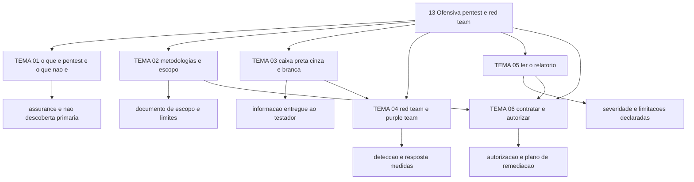

# Segurança ofensiva (pentest e red team)

O TIBER-EU foi publicado em maio de 2018 pelo Banco Central Europeu, depois de aprovado pelo
Conselho do BCE, e atualizado em 2024 para alinhar-se aos padrões técnicos de regulamentação sobre
threat-led penetration testing (TLPT) do DORA
(https://www.ecb.europa.eu/paym/cyber-resilience/tiber-eu/html/index.en.html, acessado em
25/09/2026). Em parte da União Europeia, contratar um adversário autorizado deixou de ser uma linha
opcional do orçamento anual e passou a ser obrigação supervisionada, com relatório assinado e plano de
remédio aceito pela autoridade.

Esta área trata do que um teste ofensivo consegue afirmar, do que ele custa, de quem precisa
autorizá-lo e de como o resultado entra na decisão. A definição de trabalho usada aqui é a do NCSC:
método para obter assurance sobre a segurança de um sistema tentando romper parte ou toda a sua
segurança, com as mesmas ferramentas e técnicas que um adversário usaria
(https://www.ncsc.gov.uk/guidance/penetration-testing, publicado em 08/08/2017, revisado em
10/01/2022, acessado em 25/09/2026).

## 1. Introdução

### 1.1 O que é esta área

Governo do teste ofensivo: definição e limites, metodologia e escopo, escolha do que informar ao
testador, exercícios adversariais, leitura de relatório e contratação com autorização.

Fora do escopo: instrução operacional de exploração. Não há aqui comando, payload, técnica de
evasão de defesa nem receita de ataque. Um CISO não precisa montar a exploração; precisa saber
julgar quem a monta, delimitar onde ela pode acontecer e decidir o que fazer com o resultado.

### 1.2 Por que isso importa para o CISO

O NCSC registra que um teste só valida que o ambiente não é vulnerável aos problemas conhecidos no
dia do teste, e que não é raro passar um ano ou mais entre dois testes. Se o teste ofensivo for a
única forma de validação, existe uma janela longa em que a exposição não é medida por ninguém.

O segundo fato pesa mais na sua mesa: a decisão sobre aplicar ou não a correção é sua, não do
testador. O mesmo guia afirma que a avaliação de risco e a decisão de corrigir não podem ser
terceirizadas por inteiro, e que a equipe de teste pode classificar um achado acima ou abaixo do
que você classificaria por não conhecer o impacto no negócio. Quem assina o risco aceito é quem
confere o relatório, não quem o escreveu.

### 1.3 O que você será capaz de fazer ao final

- Explicar, em uma página, o que um teste ofensivo entrega e o que ele não entrega, distinguindo-o
  de varredura, auditoria e certificação de produto.
- Escrever um documento de escopo com alvos, janelas, limites, contatos e critério de parada.
- Escolher quanto de informação entregar ao testador a partir do objetivo do teste.
- Decidir entre teste de escopo conhecido e exercício adversarial com base no que o conselho
  precisa saber.
- Ler um relatório de pentest, interpretar a nota de severidade com a nomenclatura correta e
  transformar os achados em fila de remediação com dono.
- Contratar e autorizar um teste, com os documentos que sustentam a autorização e o aceite do
  usuário do resultado.

### 1.4 Os temas desta área, em prosa

O TEMA-01 fixa a definição e o limite: teste ofensivo como assurance, não como método primário de
descoberta de falhas. O TEMA-02 trata do que sustenta qualquer afirmação do relatório — metodologia
e escopo. O TEMA-03 mostra que a quantidade de informação entregue ao testador decide o que o
teste consegue provar. O TEMA-04 separa teste de escopo de exercício adversarial, onde o alvo é a
sua detecção e a sua resposta. O TEMA-05 ensina a ler o produto final, inclusive a nota de
severidade e as limitações declaradas. O TEMA-06 fecha com contratação, autorização e uso do
resultado.

## 2. Objetivos de aprendizagem (terminais)

| # | Objetivo | Bloom | Temas que o sustentam |
|---|---|---|---|
| 1 | Descrever o que um pentest entrega e o que ele não entrega, citando ao menos duas técnicas de avaliação que ele não substitui. | entender | TEMA-01 |
| 2 | Produzir um documento de escopo com alvos, janelas, limitações, contatos e critério de parada, aplicado a um sistema real da organização. | aplicar | TEMA-02, TEMA-03 |
| 3 | Justificar a escolha entre teste de escopo fechado, teste com informação interna e exercício adversarial para três objetivos diferentes. | avaliar | TEMA-03, TEMA-04 |
| 4 | Interpretar um relatório de pentest, separando severidade de prioridade e identificando as limitações declaradas do trabalho. | analisar | TEMA-05 |
| 5 | Montar o pacote de contratação e autorização de um teste ofensivo, com documentos, donos e plano de fechamento dos achados. | criar | TEMA-06 |

## 3. Diagrama dos tópicos

## 4. Temas

| # | tema_id | Tema | Nível | Tempo |
|---|---|---|---|---|
| 1 | TEMA-01 | O que é pentest e o que ele não é | base | 30-40 min |
| 2 | TEMA-02 | Metodologias e escopo | intermediario | 40-50 min |
| 3 | TEMA-03 | Tipos de teste: black, grey e white box | intermediario | 35-45 min |
| 4 | TEMA-04 | Red team, purple team e exercícios adversariais | avancado | 40-50 min |
| 5 | TEMA-05 | Como ler um relatório de pentest | intermediario | 35-45 min |
| 6 | TEMA-06 | Contratar, autorizar e usar o resultado ofensivo | intermediario | 40-50 min |

## 5. Pré-requisitos e sequência

A área pressupõe o vocabulário de vulnerabilidade e de exposição de
[01 Fundamentos](../01-fundamentos/README.md) e o processo de gestão de vulnerabilidades de
[12 Vulnerabilidades e threat intelligence](../12-vulnerabilidades-threat-intel/README.md). Sem o
segundo, o relatório de pentest chega a uma fila que já está cheia e sem critério.

| Antes | Esta área | Depois |
|---|---|---|
| [01 Fundamentos](../01-fundamentos/README.md) | [13 Ofensiva, pentest e red team](./README.md) | [11 Resposta a incidentes e forense](../11-resposta-forense/README.md) |
| [12 Vulnerabilidades e threat intelligence](../12-vulnerabilidades-threat-intel/README.md) | | [17 Liderança e gestão do CISO](../17-lideranca-ciso/README.md) |

## 6. Certificações desta área

Apenas siglas. Domínios, pesos, custo e validade pertencem a
[90-certificacoes/](../90-certificacoes/README.md).

| Certificação | Sigla | O que cobre aqui |
|---|---|---|
| CompTIA PenTest+ | PenTest+ | V3 (PT0-003), lançado em 17/12/2024: "Engagement management" com 13% do exame, incluindo definição de rules of engagement, janelas de teste, seleção de alvos, cartas de autorização e elaboração de relatório |
| EC-Council CEH | CEH | TEMA-01 e TEMA-05. Estrutura de módulos e pesos: NAO CONFIRMADO em fonte oficial nesta execução |
| OffSec OSCP | OSCP | TEMA-03. Estrutura do exame: NAO CONFIRMADO em fonte oficial nesta execução |

## 7. Conexões com outras áreas

Relações de saída dos temas desta área que apontam para fora dela, agregadas do frontmatter
`relacoes`. A visão consolidada está em [mapa-relacoes.md](../mapa-relacoes.md); as regras, em
[templates/RELACOES-TEMAS.md](../templates/RELACOES-TEMAS.md). Alvos marcados como pendentes
ainda não foram escritos.

| Tema daqui | Relação | Destino | Por que |
|---|---|---|---|
| TEMA-01 | nao_confundir_com | 02-governanca-risco-compliance#TEMA-06 | teste ofensivo aponta falha pontual em um alvo; auditoria verifica se o sistema de gestão opera como declarado |
| TEMA-01 | nao_confundir_com | 12-vulnerabilidades-threat-intel#TEMA-01 | varredura encontra fraqueza em escala pelo catálogo; pentest encadeia exploração com julgamento humano e escopo autorizado |
| TEMA-02 | complementa | 11-resposta-forense#TEMA-02 | regras de engajamento e exercícios usam a mesma preparação: papéis, contatos e critério de parada |
| TEMA-03 | complementa | 12-vulnerabilidades-threat-intel#TEMA-01 | o teste com informação interna confirma a eficácia do processo de gestão de vulnerabilidades, que é o objeto do outro tema |
| TEMA-04 | complementa | 10-operacoes-soc#TEMA-03 | purple team mede detecção; sem caso de uso no SOC não existe o que medir |
| TEMA-04 | complementa | 12-vulnerabilidades-threat-intel#TEMA-04 | o exercício se planeja por tática e técnica, na mesma linguagem que sustenta a detecção |
| TEMA-05 | aplicado_em | 17-lideranca-ciso#TEMA-03 | o achado do relatório entra na fila de investimento como exposição com custo de tratamento |
| TEMA-05 | complementa | 12-vulnerabilidades-threat-intel#TEMA-02 | severidade vem no relatório; prioridade exige o contexto que a área de vulnerabilidades mantém |
| TEMA-06 | aplicado_em | 17-lideranca-ciso#TEMA-05 | contratar teste ofensivo é uma instância da decisão de terceirizar capacidade descrita lá |
| TEMA-06 | complementa | 11-resposta-forense#TEMA-06 | achado que revela incidente em curso sai do backlog e entra na comunicação de crise e na notificação regulatória |

## 8. Atividades práticas e laboratórios

| # | Atividade | O que a prática demonstra | Pré-requisito técnico |
|---|---|---|---|
| 1 | Escrever o documento de escopo de um teste para um sistema seu, com alvos, janelas e limitações | Escopo como documento auditável, não como conversa | nenhum |
| 2 | Listar os cinco últimos achados de qualquer avaliação e classificar o que era conhecido antes | Quanto do teste ofensivo serve para confirmar o processo interno | acesso ao registro de remediação |
| 3 | Pedir a um fornecedor o relatório de um teste anterior com as limitações declaradas | Capacidade de distinguir relatório comercial de relatório técnico | nenhum |
| 4 | Montar a matriz de duas decisões: informação entregue ao testador e aviso à operação | Efeito de cada combinação sobre o que se mede | nenhum |
| 5 | Escolher, entre dois fornecedores, qual faria o exercício de detecção, justificando por escrito | Critério de contratação que resiste a auditoria | nenhum |
| 6 | Reconstruir um plano de fechamento de achados com dono e data para um relatório antigo | Uso do resultado: o relatório só vale pelo que acontece depois dele | acesso ao registro de riscos |

## 9. Checkpoint da área

Avaliação somativa e intercalada: os itens vêm das seções de recuperação ativa dos temas, sem
questões novas. A ordem não segue a ordem dos temas.

1. Quais duas providências o NCSC admite quando o testador encontra, durante a execução, um sistema
   fora do escopo que afeta a segurança do alvo? (TEMA-02)
2. Por que a nota de severidade de um relatório pode ser diferente da sua prioridade? (TEMA-05)
3. O que o teste com informação interna confirma, segundo a definição do NCSC? (TEMA-03)
4. Qual participante de um teste TIBER-EU é a única pessoa dentro da entidade testada que sabe do
   teste? (TEMA-04)
5. Qual documento sustenta uma carta de autorização e o que ele precisa conter além dos alvos?
   (TEMA-06)
6. Varredura autenticada de vulnerabilidades não substitui pentest por qual motivo principal?
   (TEMA-01)

Conferir respostas e critério

1. Propor mudança de escopo, que altera prazo e custo, ou registrar a exclusão como limitação do
   teste; a escolha é do dono do risco, com os fatores apresentados pela equipe de teste.
2. Porque o testador pode não ter tido acesso a todos os detalhes do sistema e ao impacto no
   negócio: ele pode classificar acima ou abaixo do seu limiar, e o risco aceito é decisão sua.
3. A eficácia dos controles internos de avaliação e gestão de vulnerabilidades, identificando
   vulnerabilidades conhecidas e configurações incorretas comuns.
4. A control team, o pequeno grupo dentro da entidade que lidera e gerencia o teste junto à equipe
   TIBER da autoridade.
5. O plano de ação produzido no escopo, com tipos de teste, prazo e esforço em dias de recurso,
   requisitos de reporte, exigências regulatórias aplicáveis e restrições de tempo.
6. Porque a varredura aplica catálogo e escala; o pentest usa o julgamento de um testador para
   encadear falhas em um escopo declarado, e o NCSC registra que o resultado depende da capacidade
   de quem testa.

Critério para seguir adiante: 80% de acerto sem consultar os temas.

## 10. Termos desta área

- pentest
- teste de intrusão
- varredura de vulnerabilidades
- assurance
- escopo
- rules of engagement
- janela de teste
- carta de autorização
- caixa preta, caixa cinza e caixa branca
- red team
- purple team
- control team
- threat-led penetration testing
- relatório de pentest
- severidade e prioridade
- CVSS
- limitação de teste
- plano de remediação

## 11. Fontes verificadas

| # | Título | Tipo | URL | Acessado em | Confiança |
|---|---|---|---|---|---|
| 1 | NCSC — Penetration testing, versão 1.0, publicado em 08/08/2017 e revisado em 10/01/2022 | primaria | https://www.ncsc.gov.uk/guidance/penetration-testing | "2026-09-25" | alta |
| 2 | NIST SP 800-115, setembro de 2008, DOI 10.6028/NIST.SP.800-115 | primaria | https://csrc.nist.gov/pubs/sp/800/115/final | "2026-09-25" | alta |
| 3 | OWASP WSTG — versão estável 4.2, versão 5.0 em desenvolvimento | primaria | https://owasp.org/www-project-web-security-testing-guide/ | "2026-09-25" | alta |
| 4 | OWASP MASTG | primaria | https://mas.owasp.org/MASTG/ | "2026-09-25" | alta |
| 5 | ECB — TIBER-EU, publicado em maio de 2018 e atualizado em 2024 | primaria | https://www.ecb.europa.eu/paym/cyber-resilience/tiber-eu/html/index.en.html | "2026-09-25" | alta |
| 6 | FIRST — CVSS v4.0 Specification Document, versão 1.2 | primaria | https://www.first.org/cvss/v4.0/specification-document | "2026-09-25" | alta |
| 7 | CompTIA PenTest+ V3 (PT0-003), lançado em 17/12/2024 | primaria | https://www.comptia.org/en-us/certifications/pentest/ | "2026-09-25" | alta |
| 8 | MITRE ATT&CK | primaria | https://attack.mitre.org/ | "2026-09-25" | alta |

### NAO CONFIRMADO em fonte oficial nesta execução

| Item | Situação |
|---|---|
| PTES (Penetration Testing Execution Standard): fases e estrutura | O domínio ptes-standard.org devolveu timeout em duas tentativas, na página inicial e na página de technical guidelines. Nenhuma fase do PTES é afirmada nesta área |
| PCI DSS v4.0.1, requisito de teste de penetração e periodicidade | O endereço do PDF na área de documentos do PCI SSC devolveu 404; nenhuma exigência de frequência é afirmada |
| Texto legal sobre acesso não autorizado e pesquisa de segurança de boa-fé | Apenas endereços do Departamento de Justiça dos EUA apareceram em resultado de busca; o texto não foi lido. Vale para qualquer jurisdição: confirmar com o jurídico antes de assinar autorização cross-border |

---

| Navegação | |
|---|---|
| Anterior | [09 Segurança de aplicações e DevSecOps](../09-aplicacoes-devsecops/README.md) |
| Próximo | [16 Segurança em IA e LLM](../16-ia-seguranca/README.md) |
| Home | [README](../README.md) |
