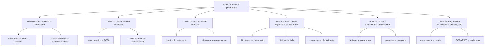

# Dados, privacidade e LGPD/GDPR

O art. 52 da LGPD fixa a multa máxima em 2% do faturamento, excluídos os tributos, limitada a R$ 50.000.000,00 por infração; o art. 83 do Regulamento (UE) 2016/679 fixa até 20.000.000 EUR ou 4% do volume de negócios anual do grupo em nível mundial, o que for mais elevado, para violação dos princípios de tratamento, dos direitos dos titulares e das regras de transferência internacional. São dois tetos com ordens de grandeza e moedas diferentes, aplicáveis ao mesmo banco de dados de um grupo com operação no Brasil e na Europa. Esta área existe para que o CISO saiba qual dos dois responde por qual decisão.

## 1. Introdução

### 1.1 O que é esta área

Esta área trata do dado pessoal como objeto próprio: o que o qualifica, onde ele está, por quanto tempo fica guardado, com que base legal pode ser tratado, o que o titular pode exigir e o que a organização deve comunicar quando ele vaza.

Ficam fora do escopo: o catálogo de controles de segurança (áreas 06, 07, 08 e 09), a mecânica da resposta a incidentes (área 11), a gestão de riscos e o ISMS (área 02) e a tecnologia de anonimização e pseudonimização em si (áreas 07 e 16, além dos temas de PETs do roadmap de pesquisa). Aqui se decide finalidade, legitimidade, prazo e comunicação; a execução mora nas outras áreas.

### 1.2 Por que isso importa para o CISO

A Resolução CD/ANPD nº 15, de 24 de abril de 2024, obriga o controlador a comunicar à ANPD, em três dias úteis contados do conhecimento, o incidente que possa acarretar risco ou dano relevante aos titulares. Três dias úteis é menos do que a maioria dos planos de resposta a incidentes leva para concluir a triagem forense.

Considere a consequência em uma mesa de crise. O time de segurança detecta exfiltração em um servidor de vendas na sexta-feira à noite. O CISO precisa responder, antes de ter o escopo completo: o ambiente continha dado pessoal? Se sim, existe risco ou dano relevante nos critérios do regulamento? Quem assina a comunicação, em nome do controlador? O encarregado tem o contato público atualizado no site da empresa? Cada uma dessas perguntas pertence a esta área, e a primeira delas — resposta honesta à pergunta "havia dado pessoal ali?" — depende do inventário do [TEMA-02](TEMA-02-classificacao-inventario-dados.md).

### 1.3 O que você será capaz de fazer ao final

- Separar, em uma lista de achados do próprio ambiente, o que é obrigação de segurança da informação e o que é obrigação de proteção de dado pessoal, indicando quem decide cada uma.
- Montar o inventário de dados pessoais de um processo de negócio, com finalidade, base legal, retenção e dono por campo.
- Aplicar o teste de necessidade e o teste de legítimo interesse a um tratamento já em produção, com conclusão escrita.
- Decidir, com o texto legal na mão, se um incidente dispara comunicação à ANPD e ao titular, e sustentar a decisão em registro.
- Comparar as condições de transferência internacional da LGPD e do GDPR para o mesmo fornecedor estrangeiro.
- Especificar o programa de governança em privacidade do art. 50 da LGPD, com papéis, encarregado e evidências de supervisão.

### 1.4 Os temas desta área, em prosa

O [TEMA-01](TEMA-01-privacidade-dado-pessoal.md) estabelece o que é dado pessoal e dado pessoal sensível na definição legal, e por que tratar dado pessoal de forma legítima é uma obrigação diferente de proteger um dado contra acesso indevido. O [TEMA-02](TEMA-02-classificacao-inventario-dados.md) transforma essa definição em inventário: data mapping, linha de base de classificação e a diferença entre classificar dado pessoal e classificar informação. O [TEMA-03](TEMA-03-ciclo-de-vida-retencao.md) cobre o prazo: quando o tratamento termina por lei, o que a eliminação exige e o que pode ser conservado mesmo depois.

O [TEMA-04](TEMA-04-lgpd-bases-legais-direitos-incidentes.md) é o núcleo operacional da LGPD — as dez hipóteses de tratamento do art. 7º, as hipóteses restritas do art. 11 para dado sensível, os nove direitos do art. 18 e o dever de comunicação do art. 48 com o prazo do regulamento da ANPD. O [TEMA-05](TEMA-05-gdpr-transferencia-internacional.md) trata o regime europeu e o problema de mandar dado para fora: decisão de adequação, garantias adequadas e derrogações, no GDPR, e o capítulo de transferência da LGPD. O [TEMA-06](TEMA-06-programa-privacidade-encarregado.md) fecha com o programa: encarregado, registro das operações de tratamento, relatório de impacto e as evidências que sustentam a defesa da empresa em uma fiscalização.

## 2. Objetivos de aprendizagem (terminais)

| # | Objetivo | Bloom | Temas que o sustentam |
|---|---|---|---|
| 1 | Distinguir, em 10 situações do próprio ambiente, a obrigação de segurança da informação da obrigação de proteção de dado pessoal, nomeando o dono da decisão em cada caso. | entender | TEMA-01, TEMA-02 |
| 2 | Construir o inventário de dados pessoais de um processo de negócio, com finalidade, base legal, prazo de retenção e dono por campo, a partir de fontes que já existem na empresa. | aplicar | TEMA-02, TEMA-03 |
| 3 | Avaliar um tratamento em produção contra as hipóteses legais de tratamento, concluindo por escrito se há base legal e qual é ela. | avaliar | TEMA-04 |
| 4 | Decidir, em um incidente com dado pessoal, se há dever de comunicação à ANPD e ao titular, justificando pelo critério de risco ou dano relevante e pelo prazo aplicável. | avaliar | TEMA-04 |
| 5 | Comparar as condições de transferência internacional da LGPD e do GDPR aplicáveis a um fornecedor estrangeiro específico, indicando o instrumento que falta em cada uma. | analisar | TEMA-05 |
| 6 | Especificar um programa de governança em privacidade com papéis, atribuições do encarregado e evidências de supervisão, integrado à governança de segurança já existente. | criar | TEMA-06 |

## 3. Diagrama dos tópicos

Rótulos sem `<`, `"`, `(` e `#`; nenhum nó usa `end` como id.

## 4. Temas

| # | tema_id | Tema | Nível | Tempo |
|---|---|---|---|---|
| 1 | TEMA-01 | Privacidade, dado pessoal e o que a distingue de segurança | base | 30-40 min |
| 2 | TEMA-02 | Classificação e inventário de dados | base | 30-40 min |
| 3 | TEMA-03 | Ciclo de vida do dado e retenção | intermediario | 30-40 min |
| 4 | TEMA-04 | LGPD: bases legais, direitos do titular e incidentes | intermediario | 40-45 min |
| 5 | TEMA-05 | GDPR e transferência internacional | intermediario | 35-45 min |
| 6 | TEMA-06 | Programa de privacidade e o papel do encarregado | avancado | 35-45 min |

## 5. Pré-requisitos e sequência

A área depende de [01 Fundamentos](../01-fundamentos/README.md): sem a noção de ativo, de controle e de risco, o vocabulário de dado pessoal não se sustenta. A ordem `ordem_estudo` desta área é 5 no README raiz.

| Antes | Esta área | Depois |
|---|---|---|
| 01-fundamentos | 14-dados-privacidade | 15-fatores-humanos, 17-lideranca-ciso |

Dentro da área, TEMA-04 pode ser lido antes de TEMA-03 por quem já responde pela comunicação de incidentes: os dois se cruzam no art. 48, que exige saber quais dados foram afetados.

## 6. Certificações desta área

Apenas siglas; domínios, pesos, custos e validade pertencem a [90-certificacoes/](../90-certificacoes/README.md) e não foram conferidos em fonte primária nesta execução.

| Certificação | Sigla | O que cobre aqui |
|---|---|---|
| ISACA CDPSE | CDPSE | Privacidade desde a concepção, governança de dados e ciclo de vida |
| IAPP CIPP/E | CIPP/E | Regime europeu de proteção de dados e transferência internacional |
| ISACA CISM | CISM | Risco, resposta e comunicação ao executivo |
| ISC2 CISSP | CISSP | Domínio de segurança e gestão de ativos |

## 7. Conexões com outras áreas

Relações de saída dos temas desta área que apontam para fora dela, agregadas do frontmatter
`relacoes`. A visão consolidada está em [mapa-relacoes.md](../mapa-relacoes.md); as regras, em
[templates/RELACOES-TEMAS.md](../templates/RELACOES-TEMAS.md). Alvos marcados como pendentes
ainda não foram escritos.

| Tema daqui | Relação | Destino | Por que |
|---|---|---|---|
| TEMA-01 | nao_confundir_com | 01-fundamentos#TEMA-01 | proteger um dado e tratar dado pessoal são obrigações distintas, com donos distintos |
| TEMA-02 | complementa | 06-endpoint-plataforma#TEMA-05 | a política de DLP só consegue bloquear o que o inventário classificou antes |
| TEMA-03 | aplicado_em | 02-governanca-risco-compliance#TEMA-02 | a tabela de retenção só tem efeito quando publicada como norma aprovada com dono e evidência de execução |
| TEMA-04 | aplicado_em | 11-resposta-forense#TEMA-06 | o incidente com dado pessoal dispara a notificação regulatória, com prazo e critério próprios |
| TEMA-04 | nao_confundir_com | 11-resposta-forense#TEMA-04 | coletar evidência forense não autoriza tratar dado pessoal para outra finalidade |
| TEMA-05 | aprofundado_por | 07-criptografia-segredos#TEMA-04 | a garantia técnica da transferência depende de quem detém a chave e em qual jurisdição ela está custodiada |
| TEMA-05 | complementa | 08-cloud#TEMA-06 | a transferência internacional só se materializa em cláusula contratual e anexo de garantias no contrato de nuvem |
| TEMA-06 | nao_confundir_com | 02-governanca-risco-compliance#TEMA-04 | o sistema de gestão de segurança da informação organiza controles; o programa de governança em privacidade decide finalidade, hipótese legal e direitos do titular |
| TEMA-06 | nao_confundir_com | 17-lideranca-ciso#TEMA-01 | o mandato do CISO responde pelo risco de segurança; o do encarregado responde pela legitimidade do tratamento e pelo canal do titular |

## 8. Atividades práticas e laboratórios

| # | Atividade | O que a prática demonstra | Pré-requisito técnico |
|---|---|---|---|
| 1 | Levantar os dados pessoais de um processo de negócio em uma planilha de seis colunas, incluindo dado sensível e dado de criança | Que o inventário muda de tamanho quando a definição legal de dado pessoal é aplicada com rigor | planilha eletrônica |
| 2 | Escrever a hipótese legal do art. 7º de cada campo do inventário e marcar os que não têm nenhuma | Que tratamento sem hipótese é a falha mais comum e a mais fácil de corrigir | nenhum |
| 3 | Redigir, para um campo, a justificativa de necessidade com o teste de três perguntas | Que a resposta "é útil para a operação" não sustenta necessidade | nenhum |
| 4 | Simular a decisão de comunicação de um incidente com dado sensível de 200 titulares e cronometrar a decisão | Que três dias úteis é prazo de processo, não de investigação completa | acesso à Resolução CD/ANPD nº 15/2024 |
| 5 | Montar a matriz de transferência internacional dos fornecedores de nuvem, com país, instrumento e lacuna | Que o instrumento contratual é a diferença entre transferir e transferir legalmente | nenhum |
| 6 | Escrever a descrição de atribuições do encarregado e publicar o contato em uma página acessível | Que o encarregado precisa existir fora do organograma | acesso ao site institucional |

## 9. Checkpoint da área

Cinco itens retirados dos temas, fora da ordem original. Responda antes de abrir o gabarito.

1. Um relatório de auditoria aponta que o sistema de RH guarda data de afastamento médico de 4.000 pessoas desde 2015. Qual dispositivo da LGPD decide até quando esse dado pode ficar guardado, e o que a empresa pode conservar mesmo depois? (TEMA-03)
2. O time de segurança pede autorização para reter uma cópia do banco de clientes afetado por um incidente, para análise forense. Que obrigação de privacidade essa cópia cria? (TEMA-04)
3. Um fornecedor de folha de pagamento na Irlanda processa dados de funcionários brasileiros. Quais instrumentos cada regime exige, e o que acontece se o contrato citar cláusulas-padrão europeias e nada sobre a LGPD? (TEMA-05)
4. A empresa coleta dados de localização de entregadores. O time de operações diz que não há dado pessoal porque "não há nome no sistema". A afirmação se sustenta? (TEMA-01)
5. O encarregado é um gerente de TI que acumula três funções e não tem assento em nenhum comitê. Qual falha concreta do art. 41 isso representa? (TEMA-06)

Conferir respostas e critério

1. Arts. 15 e 16 da LGPD. O tratamento termina quando a finalidade foi alcançada, quando o período acabou, quando o titular pede a revogação ou por determinação da ANPD; depois disso os dados devem ser eliminados, autorizada a conservação para cumprimento de obrigação legal ou regulatória, estudo por órgão de pesquisa, transferência a terceiro nos termos da lei ou uso exclusivo do controlador, vedado acesso por terceiro e anonimizados os dados. No caso, obrigação trabalhista e previdenciária sustenta uma fatia, não o histórico inteiro desde 2015.
2. A cópia passa a ser operação de tratamento com finalidade nova, que precisa de hipótese legal própria e de prazo de eliminação ao fim da análise. A cadeia de custódia explica a origem da cópia, não legitima o tratamento.
3. No GDPR, o instrumento típico é decisão de adequação da Comissão ou garantias adequadas com direitos oponíveis aos titulares; na LGPD, os incisos do art. 33, incluindo cláusulas-padrão contratuais definidas pela ANPD. Cláusula europeia citada sozinha não cobre a transferência perante a ANPD; o contrato fica com uma lacuna por regime.
4. Não. O art. 5º define dado pessoal como informação relacionada a pessoa natural identificada ou identificável, e o art. 12 considera dados pessoais os usados para formação de perfil comportamental de pessoa identificada. A ausência de nome não afasta a identificabilidade.
5. O art. 41 exige a indicação do encarregado pelo controlador e a divulgação pública da identidade e do contato, com atribuições de aceitar reclamações dos titulares, receber comunicações da autoridade nacional e orientar funcionários. Sem canal público e sem acesso à decisão, o encarregado existe no papel e não no processo.

Critério para seguir adiante: acertar 80% ou mais sem consultar os temas. Erro no item 2 significa que forense e privacidade ainda estão fundidos; releia o TEMA-04 desta área e o [TEMA-04 de 11 Resposta e forense](../11-resposta-forense/TEMA-04-forense-digital-evidencia-cadeia-de-custodia.md).

## 10. Termos desta área

Termos que o glossário central precisa conter; as definições ficam em [glossario.md](../glossario.md).

- dado pessoal
- dado pessoal sensível
- dado anonimizado
- pseudonimização
- anonimização
- titular
- controlador
- operador
- agente de tratamento
- encarregado
- tratamento
- hipótese legal de tratamento
- consentimento
- legítimo interesse
- finalidade
- necessidade
- relatório de impacto à proteção de dados pessoais
- registro das operações de tratamento
- incidente de segurança com dado pessoal
- comunicação de incidente
- transferência internacional de dados
- decisão de adequação
- cláusulas contratuais padrão
- programa de governança em privacidade
- ciclo de vida do dado
- retenção
- eliminação
- data mapping
- direito do titular

## 11. Fontes verificadas

| # | Título | Tipo | URL | Acessado em | Confiança |
|---|---|---|---|---|---|
| 1 | Lei nº 13.709, de 14 de agosto de 2018 — texto atualizado | primaria | https://www2.camara.leg.br/legin/fed/lei/2018/lei-13709-14-agosto-2018-787077-normaatualizada-pl.pdf | "2026-09-25" | alta |
| 2 | Regulamento (UE) 2016/679 — texto em língua portuguesa | primaria | https://eur-lex.europa.eu/legal-content/PT/TXT/HTML/?uri=CELEX:32016R0679 | "2026-09-25" | alta |
| 3 | Resolução CD/ANPD nº 15, de 24 de abril de 2024 | primaria | https://www.in.gov.br/web/dou/-/resolucao-cd/anpd-n-15-de-24-de-abril-de-2024-556243024 | "2026-09-25" | alta |
| 4 | ANPD — página inicial oficial | primaria | https://www.gov.br/anpd/pt-br | "2026-09-25" | media |
| 5 | EDPB — public consultations, guidelines and other tools | primaria | https://www.edpb.europa.eu/public-consultations_en | "2026-09-25" | alta |

O detalhe de cada credencial (CDPSE, CIPP/E, CISM, CISSP) não foi conferido nesta execução: NAO CONFIRMADO em fonte oficial. A ISO/IEC 27701:2025, edição 2, publicada em outubro de 2025, é a norma de gestão de privacidade da família ISO/IEC 27001 e sucede a edição de 2019 ([iso.org](https://www.iso.org/standard/27701), verificado em 2026-09-25).

---

| Navegação | |
|---|---|
| Anterior | [02 Governança, risco e compliance](../02-governanca-risco-compliance/README.md) |
| Próximo | [15 Fatores humanos e cultura de segurança](../15-fatores-humanos/README.md) |
| Home | [README](../README.md) |
