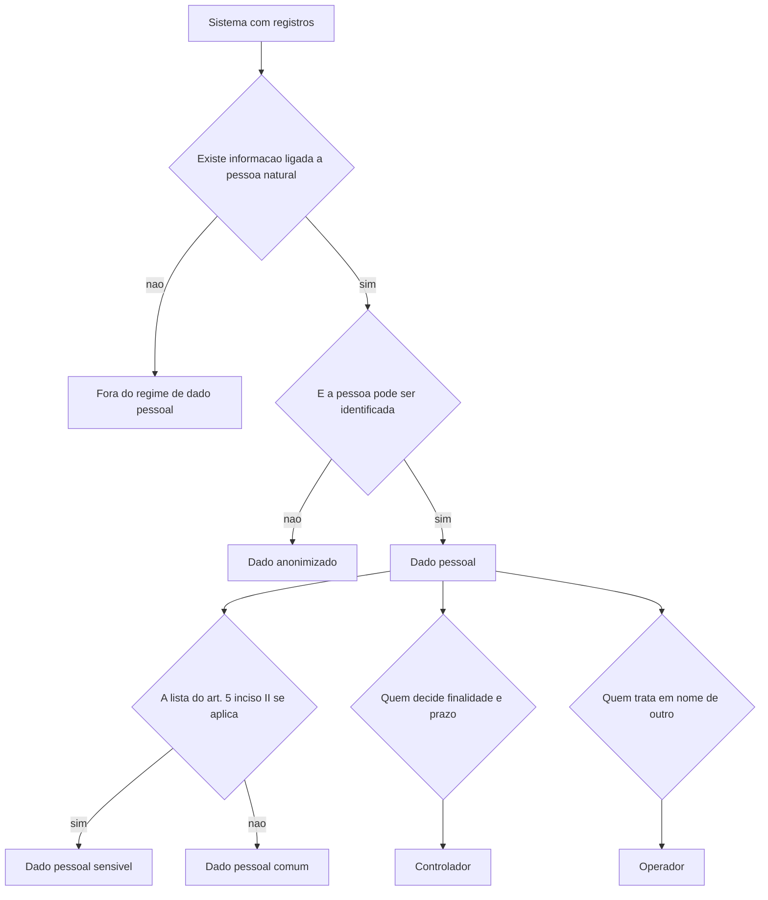

# Privacidade, dado pessoal e o que a distingue de segurança

Dado pessoal é, pela lei brasileira, informação relacionada a pessoa natural identificada ou identificável. Um log de acesso com endereço IP, data e hora pode satisfazer essa definição; um banco de dados de preços de insumos não. A linha que separa os dois casos é o objeto deste tema.

## 1. Objetivo de aprendizagem

Ao final deste tema você deve conseguir: classificar 10 situações do próprio ambiente como obrigação de segurança da informação ou de proteção de dado pessoal, citando a definição legal que sustenta a classificação e nomeando quem decide em cada caso.

## 2. Pré-requisitos

Nenhum dentro desta área. O tema pressupõe apenas o vocabulário de ativo e controle de [01 Fundamentos](../01-fundamentos/README.md).

## 3. Pré-teste

Responda de palpite, antes de ler o resto. Anote a confiança de 1 a 5.

1. O log de acesso com endereço IP, data e hora da sua empresa é dado pessoal? Aposte sim ou não antes de ler.
   Confiança: ___
2. A sua organização consegue dizer qual foi a finalidade declarada do último dado pessoal que coletou, e quem a aprovou? Aposte sim, não ou parcialmente.
   Confiança: ___
3. Criptografar um banco de dados de clientes encerra a discussão de privacidade daquele banco? Aposte antes de ler.
   Confiança: ___
## 4. Caso real

Uma operadora de logística implanta rastreamento de veículos por GPS. O sistema exibe placa, motorista identificado por matrícula e histórico de paradas. O gerente de frota afirma, em reunião, que o sistema é "de segurança patrimonial" e que a proteção de dados não se aplica porque não há dados de cliente.

Na auditoria seguinte, o jurídico pergunta três coisas que ninguém responde: qual é a finalidade declarada do histórico de paradas fora do horário de trabalho, quem aprovou essa finalidade e por quanto tempo o rastro fica guardado. O caso deixa aberta a pergunta que o conteúdo resolve: o que, naquele sistema, deixou de ser controle de ativo e passou a ser tratamento de dado pessoal?

## 5. Conteúdo

### 5.1 Conceito

O art. 5º, inciso I, da LGPD define dado pessoal como "informação relacionada a pessoa natural identificada ou identificável". O inciso V define titular: a pessoa natural a quem os dados se referem. O inciso X define tratamento de forma ampla, listando coleta, produção, recepção, classificação, utilização, acesso, reprodução, transmissão, distribuição, processamento, arquivamento, armazenamento, eliminação, avaliação ou controle da informação, modificação, comunicação, transferência, difusão e extração. Ler e compartilhar já é tratar. O simples armazenamento também.

A mesma lei cria uma categoria com regime mais restrito: dado pessoal sensível, definido no inciso II como dado sobre origem racial ou étnica, convicção religiosa, opinião política, filiação a sindicato ou a organização de caráter religioso, filosófico ou político, dado referente à saúde ou à vida sexual, dado genético ou biométrico, quando vinculado a uma pessoa natural. A lista é fechada no texto legal e cobre mais do que a intuição sugere: biometria de ponto e atestado médico entram.

Dado anonimizado sai do regime. O inciso III o define como dado relativo a titular que não possa ser identificado, considerando a utilização de meios técnicos razoáveis e disponíveis na ocasião de seu tratamento; o art. 12 confirma que esses dados não são considerados pessoais, salvo quando o processo de anonimização puder ser revertido com meios próprios ou com esforços razoáveis. O §1º do art. 12 manda pesar custo e tempo de reversão e as tecnologias disponíveis; o §2º admite como dado pessoal o conjunto usado para formação de perfil comportamental de pessoa identificada.

Entre o dado identificado e o anonimizado existe a pseudonimização, definida no §4º do art. 13 como o tratamento pelo qual o dado perde a possibilidade de associação direta ou indireta a um indivíduo, senão pelo uso de informação adicional mantida separadamente pelo controlador em ambiente controlado e seguro. Dado pseudonimizado continua sendo dado pessoal: a informação adicional existe e está sob controle de alguém.

### 5.2 Como funciona

A segurança da informação parte do dado e do sistema e pergunta se houve acesso, uso, divulgação, interrupção, modificação ou destruição não autorizados. A privacidade parte do tratamento e pergunta se havia finalidade legítima, informada ao titular, se o volume era o necessário e se o prazo estava definido. As duas perguntas convivem sobre o mesmo banco de dados, e as respostas apontam para donos diferentes.

O art. 5º fixa os papéis. O controlador é quem toma as decisões referentes ao tratamento (inciso VI). O operador realiza o tratamento em nome do controlador (inciso VII). O encarregado é a pessoa indicada pelo controlador e pelo operador para atuar como canal de comunicação entre eles, os titulares e a ANPD (inciso VIII). A definição de controlador é o critério mais útil na prática, porque quem decide finalidade e prazo responde pelas consequências, mesmo quando a execução está terceirizada.

O mesmo teste vale para o regime europeu. O art. 5.º do Regulamento (UE) 2016/679 abre com princípios: licitude, lealdade e transparência, limitação das finalidades, minimização dos dados e exatidão, nas alíneas a) a d). A diferença de vocabulário é pequena; a de consequência, não, porque os tetos de coima são outros.

### 5.3 Exemplo resolvido

Volte ao caso do rastreamento. Quatro perguntas, na ordem.

Passo 1, existe pessoa natural identificável. A matrícula liga o veículo ao motorista, e o próprio motorista é pessoa natural. O histórico de paradas é dado pessoal do motorista, mesmo sem nome escrito. Se o sistema guardasse apenas a placa de veículo de carga sem vínculo com condutor, a análise seria outra.

Passo 2, existe dado sensível. O histórico de paradas não está na lista do inciso II. Havia dado de saúde quando o sistema registrava atestado médico de afastamento em relatório de jornada: nesse recorte, a categoria é sensível e as hipóteses de tratamento encolhem para as do art. 11.

Passo 3, qual é a finalidade e quem a decidiu. A finalidade declarada é segurança patrimonial e gestão de frota. Rastrear paradas fora da jornada é finalidade diferente daquela que justificou a compra do sistema, e o art. 6º, inciso I, exige propósito legítimo, específico, explícito e informado, sem tratamento posterior incompatível. Quem decide manter essa finalidade é o controlador, não o fornecedor do sistema.

Passo 4, qual é o prazo e quem responde. O rastro de localização não tem prazo definido por lei; o prazo precisa de decisão documentada, com eliminação prevista nos arts. 15 e 16. O responsável pela decisão é o controlador. O fornecedor do sistema é operador e executa a instrução, com contrato que delimite isso.

Conclusão escrita em uma linha: há tratamento de dado pessoal de empregados, sem finalidade declarada para o rastro fora da jornada, sem prazo definido; decisão pendente do controlador, execução do operador sob contrato.

### 5.4 Problema de completar

Caso novo: o time de marketing cria um painel que cruza dados de navegação do site, identificador de dispositivo e CEP para montar públicos semelhantes. O painel é entregue a uma agência externa.

Preencha as etapas e feche as duas últimas.

1. Definição aplicada e classificação do conjunto. __________
2. Papéis do cliente, da agência e da ferramenta de painel. __________
3. Pergunta de finalidade e de necessidade sobre o CEP. __________
4. Prazo de retenção do identificador de dispositivo e quem decide. __________
5. O que muda se o conjunto for anonimizado antes de sair, e o que isso exige. __________

## 6. Por que isso importa para o CISO

A definição legal muda o inventário, e o inventário muda o orçamento. Em muitas empresas, o CISO descobre na primeira fiscalização da ANPD que os sistemas com dado pessoal incluem o controle de acesso, o Wi-Fi com autenticação nominal, o RH, o comercial e quatro planilhas mantidas por áreas de negócio. Nenhum desses costuma estar no escopo da avaliação de riscos de segurança.

Há uma consequência de autoridade. O art. 5º, inciso VI, coloca a decisão sobre o tratamento com o controlador, que raramente é a área de segurança. Quando o CISO assume ser o controlador de fato, ele passa a responder por finalidade e por prazo — decisões que exigem aprovação de negócio e jurídico. O que cabe na função de segurança é a execução técnica e a evidência: controle de acesso, registro de operações, cifra, monitoramento e resposta. O CISO que confunde os dois papéis herda a sanção sem herdar a autoridade.

## 7. Aplicação prática

Escolha três sistemas do seu ambiente que ninguém chama de "sistema de dados pessoais": controle de acesso físico, autenticação de rede e uma ferramenta de suporte ao usuário. Para cada um, responda em cinco linhas: que informação liga o registro a uma pessoa natural; se a lista do art. 5º, inciso II, alcança algum campo; quem é o controlador; que finalidade declarada existe hoje; e qual seria o prazo de retenção mínimo defensável.

Some os três e leve o resultado ao comitê. A pergunta a fazer é: esses sistemas alguma vez entraram na avaliação de risco da área de segurança?

## 8. Autoexplicação

Explique em três frases, sem consultar o texto, quando um registro deixa de ser dado de operação e passa a ser dado pessoal. Conecte a explicação a algo que você já faz: o relatório de incidentes da sua equipe informa, por incidente, se havia dado pessoal no escopo? Se não informa, essa é a lacuna a fechar antes da próxima comunicação à ANPD.

## 9. Erros comuns e equívocos

| Equívoco | Por que está errado | O que é correto |
|---|---|---|
| Dado anonimizado e dado pseudonimizado são a mesma coisa | O anonimizado sai do regime; o pseudonimizado continua dado pessoal, porque a informação adicional existe | O art. 13, §4º, mantém a informação adicional separada e exige ambiente controlado e seguro |
| Sem nome, sem dado pessoal | Informação identificável basta, e o art. 12, §2º, alcança o conjunto usado para perfil comportamental de pessoa identificada | Teste a identificabilidade pelos meios disponíveis, não pela presença de nome |
| Criptografia encerra a obrigação de privacidade | Confidencialidade protege contra acesso indevido; finalidade, necessidade e prazo continuam em aberto | A cifra é controle de segurança; ela não substitui a base legal |
| Dado público não tem regime | O art. 7º, §3º, manda considerar finalidade, boa-fé e interesse público que justificaram a disponibilização | Dado tornado manifestamente público dispensa consentimento, mas preserva princípios e direitos |
| O fornecedor é responsável pelo dado do cliente | O fornecedor normalmente é operador e segue instrução; quem decide finalidade e prazo é o controlador | Papel se define por quem decide, não por quem hospeda |

## 10. Recuperação ativa

Responda tudo antes de abrir o gabarito.

1. Reproduza a definição de dado pessoal e de dado pessoal sensível do art. 5º, indicando o que a lista de sensíveis inclui.
2. Qual é a diferença entre o efeito jurídico do dado anonimizado e o do dado pseudonimizado?
3. Quem é o controlador e como esse papel se distingue do operador e do encarregado?
4. Um conjunto de dados usados para montar perfil comportamental de pessoa identificada pode ser tratado como anônimo? Fundamente.

Conferir respostas

1. Dado pessoal: informação relacionada a pessoa natural identificada ou identificável. Dado pessoal sensível: dado sobre origem racial ou étnica, convicção religiosa, opinião política, filiação a sindicato ou a organização de caráter religioso, filosófico ou político, dado referente à saúde ou à vida sexual, dado genético ou biométrico, quando vinculado a uma pessoa natural.
2. O anonimizado não é considerado dado pessoal para os fins da lei, salvo reversibilidade com meios próprios ou esforços razoáveis; o pseudonimizado permanece dado pessoal, porque a informação adicional mantida separadamente permite a associação.
3. Controlador é quem toma as decisões referentes ao tratamento; operador realiza o tratamento em nome do controlador; encarregado é o canal de comunicação entre controlador, titulares e ANPD, sem ser dono da base.
4. Não. O art. 12, §2º, admite expressamente como dado pessoal o conjunto usado para formação de perfil comportamental de determinada pessoa natural, se identificada.

## 11. Revisão espaçada

| Intervalo | O que fazer | Se errar |
|---|---|---|
| D+1 | Responder a seção 10 sem reler | Rebaixar: repetir em D+1 |
| D+7 | Refazer a seção 7 com três sistemas novos | Rebaixar: repetir em D+3 |
| D+30 | Aplicar o teste das quatro perguntas a um incidente real e comparar com a classificação feita na época | Rebaixar: repetir em D+7 |

## 12. Conexões com outros temas

Leitura humana do `relacoes` do frontmatter — que é a fonte. Relações que saem desta área
também aparecem em [mapa-relacoes.md](../mapa-relacoes.md). Regras em
[templates/RELACOES-TEMAS.md](../templates/RELACOES-TEMAS.md).

| Relação | Alvo | Por que |
|---|---|---|
| complementa | 14-dados-privacidade#TEMA-02 | a definição legal de dado pessoal só produz efeito quando o inventário diz em que sistemas esses dados estão |
| nao_confundir_com | 01-fundamentos#TEMA-01 | proteger um dado e tratar dado pessoal são obrigações distintas, com donos distintos |

## 13. Certificações e leitura recomendada

| Certificação | Domínio coberto | Leitura recomendada |
|---|---|---|
| CDPSE | Quatro domínios de privacidade embutida em sistemas, cujos nomes a página oficial não publica | [Lei nº 13.709, de 14 de agosto de 2018](https://www2.camara.leg.br/legin/fed/lei/2018/lei-13709-14-agosto-2018-787077-normaatualizada-pl.pdf) |
| CIPP/E | Direito europeu de proteção de dados, na concentração europeia da família CIPP | [Regulamento (UE) 2016/679](https://eur-lex.europa.eu/legal-content/PT/TXT/HTML/?uri=CELEX:32016R0679) |
## 14. Fontes verificadas

| # | Título | Tipo | URL | Acessado em | Confiança |
|---|---|---|---|---|---|
| 1 | Lei nº 13.709, de 14 de agosto de 2018 — texto atualizado | primaria | https://www2.camara.leg.br/legin/fed/lei/2018/lei-13709-14-agosto-2018-787077-normaatualizada-pl.pdf | "2026-09-25" | alta |
| 2 | Regulamento (UE) 2016/679 — art. 5.º | primaria | https://eur-lex.europa.eu/legal-content/PT/TXT/HTML/?uri=CELEX:32016R0679 | "2026-09-25" | alta |

Não confirmados nesta execução, e por isso ausentes deste tema: a definição oficial de segurança cibernética em fonte primária; o conteúdo do art. 34.º do GDPR, sobre comunicação ao titular; e os prazos regulamentares brasileiros de atendimento a direitos do titular.

---

| Navegação | |
|---|---|
| Área | [14 Dados, privacidade e LGPD/GDPR](./README.md) |
| Próximo tema | [TEMA-02](TEMA-02-classificacao-inventario-dados.md) |
| Home | [README](../README.md) |
