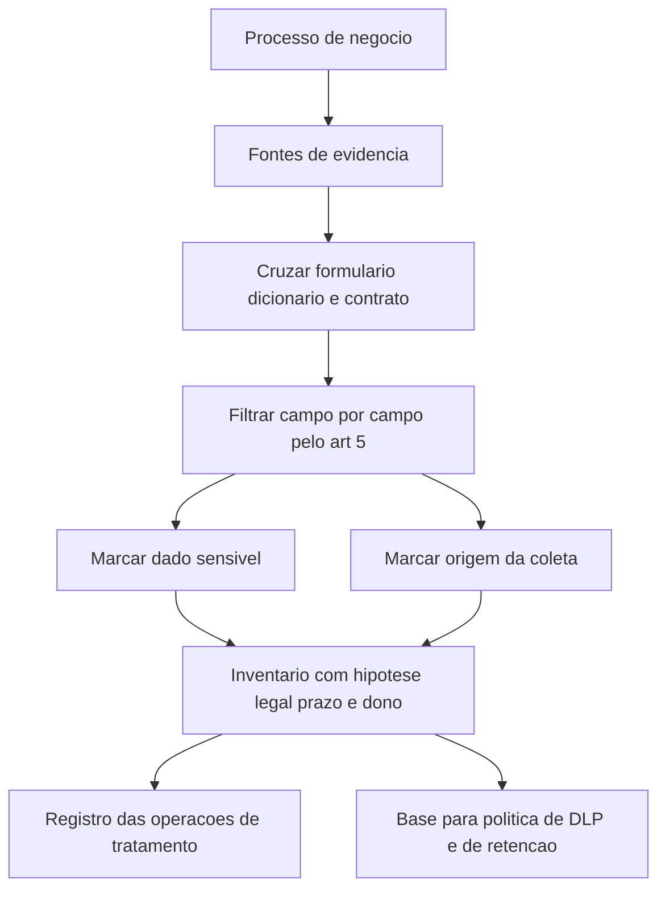

# Classificação e inventário de dados

O art. 37 da LGPD exige que controlador e operador mantenham registro das operações de tratamento de dados pessoais que realizarem, com menção especial ao tratamento baseado em legítimo interesse. O art. 8º do Regulamento de Comunicação de Incidente de Segurança autoriza a ANPD a pedir esse registro, junto com o relatório de impacto, durante a apuração de um incidente. Sem inventário, esse pedido vira uma corrida contra o prazo.

## 1. Objetivo de aprendizagem

Ao final deste tema você deve conseguir: construir o inventário de dados pessoais de um processo de negócio com dono, hipótese legal, prazo de retenção e origem da coleta por campo, usando fontes que já existem na empresa.

## 2. Pré-requisitos

[TEMA-01](TEMA-01-privacidade-dado-pessoal.md). Sem a definição legal de dado pessoal e de dado pessoal sensível, o inventário perde o critério de inclusão e vira catálogo de tabelas.

## 3. Pré-teste

Responda de palpite, antes de ler o resto. Anote a confiança de 1 a 5.

1. Quantas bases de dado pessoal você acha que a sua empresa tem, contando as que nasceram fora do processo oficial? Chute um número.
   Confiança: ___
2. Para responder a uma fiscalização amanhã, quantos campos você aposta que o seu inventário precisa ter: menos de dez, dez a vinte ou mais de vinte? Aposte.
   Confiança: ___
3. O que é mais difícil de obter no seu inventário hoje: a lista de sistemas ou o prazo de retenção de cada campo? Escolha um antes de ler.
   Confiança: ___
## 4. Caso real

Um banco conclui a migração para um novo core e descobre, na reconciliação, 34 bases de dados de clientes criadas por projetos anteriores, quatro delas em servidores de área de negócio sem backup e sem dono declarado. Uma delas guarda número de cartão truncado, data de nascimento e telefone de 900 mil clientes, usada por um script de marketing que roda desde 2016.

A pergunta do comitê de riscos é simples e ninguém responde com documento: quantas bases de dado pessoal a empresa tem, quem responde por cada uma e qual delas tem hipótese legal declarada? O conteúdo a seguir responde como montar essa resposta em semanas, não em anos.

## 5. Conteúdo

### 5.1 Conceito

Inventário de dados pessoais é a lista, por processo de negócio, de quais dados pessoais são tratados, em quais sistemas, com qual finalidade, sob qual hipótese legal, por quanto tempo e sob qual dono. Ele não é o catálogo de dados da engenharia, que descreve tabelas e colunas, e não é o inventário de ativos, que descreve máquinas e aplicações. Os três se cruzam, mas respondem a perguntas diferentes.

A lei brasileira pede dois artefatos distintos, e vale não confundi-los. O art. 37 pede o registro das operações de tratamento: a lista do que se faz com dado pessoal. O art. 38 permite que a ANPD determine a elaboração de relatório de impacto à proteção de dados pessoais, o RIPD, que o art. 5º, inciso XVII, define como documentação que descreve os processos que podem gerar riscos às liberdades civis e aos direitos fundamentais, com as medidas, salvaguardas e mecanismos de mitigação. O registro descreve; o relatório avalia risco e resposta.

A classificação serve ao inventário, e não o contrário. O marcador mais útil na prática é a lista do art. 5º, inciso II: dado sensível exige hipótese legal restrita, do art. 11, e comunicação de incidente tende a ser devida, porque o art. 5º do Regulamento de Comunicação de Incidente de Segurança inclui dados pessoais sensíveis entre os critérios de risco ou dano relevante. Um segundo marcador é a origem do dado: coletado do titular, recebido de terceiro, gerado por observação ou inferido por modelo. Origem diferente implica dever de informação diferente.

### 5.2 Como funciona

O inventário se constrói de baixo para cima, a partir do que existe, e se corrige de cima para baixo, a partir do processo. A ordem que funciona começa pelo processo de negócio, porque é nele que existe dono, contrato e obrigação. Quatro passos:

Primeiro, escolha o processo, não o sistema. "Admissão de empregado" tem começo e fim, tem dono no RH e tem obrigação legal que sustenta retenção. "Base X do banco" não tem nada disso.

Segundo, cole as fontes de evidência já disponíveis: formulário de admissão, dicionário de dados do sistema de RH, contrato com o operador de folha, e a lista de campos exigidos pela obrigação legal que justifica guardar o dado.

Terceiro, aplique o filtro do TEMA-01 campo por campo, e marque os sensíveis. Um dicionário de dados não marca dado de saúde; ele chama a coluna de "cod_afast", e a classificação depende de alguém perguntar o que o código significa.

Quarto, preencha as colunas que a fiscalização vai pedir: hipótese legal, prazo, dono e forma de eliminação. Campo sem hipótese legal é achado de auditoria, não linha em branco.

### 5.3 Exemplo resolvido

Processo: admissão de empregado em uma indústria, 1.200 contratações por ano.

Passo 1, lista de campos observada no formulário e no sistema de RH: nome completo, CPF, RG, data de nascimento, endereço, telefone, estado civil, nome de dependentes, escolaridade, número de conta bancária, resultado de exame admissional, laudo de aptidão, cópia de atestado de vacinação, dado biométrico de ponto.

Passo 2, classificação. Sensíveis pelo art. 5º, inciso II: resultado de exame admissional e laudo de aptidão, que são dados referentes à saúde, e o dado biométrico vinculado à pessoa. Todos os demais são dado pessoal comum. Título de eleitor e filiação sindical, se estivessem coletados, entrariam na lista sensível.

Passo 3, hipótese legal por bloco. Identificação, contrato e conta bancária: art. 7º, inciso V, execução de contrato e procedimentos preliminares. Registro de empregado exigido pela legislação trabalhista: art. 7º, inciso II, cumprimento de obrigação legal ou regulatória. Exame admissional: art. 11, inciso II, alínea f, tutela da saúde em procedimento realizado por profissional de saúde. Ponto biométrico: art. 11, inciso I, consentimento específico e destacado, quando a empresa não oferecer alternativa não biométrica de registro.

Passo 4, prazo e dono. Registro trabalhista segue o prazo da obrigação trabalhista e previdenciária correspondente; exame admissional e laudo seguem o prazo preventivo e trabalhista aplicável, e não o prazo do sistema de ponto. Dono: gerente de RH, não a TI. Eliminação: procedimento documentado no sistema de RH, com evidência de execução.

Resultado em uma linha: 13 campos, 3 classificados como sensíveis, 4 hipóteses legais diferentes, 2 prazos distintos, 1 dono.

### 5.4 Problema de completar

Caso novo: o processo de atendimento de suporte ao cliente usa um sistema de tickets com nome, e-mail, telefone, descrição livre do problema — onde o cliente costuma colar número de cartão e resultado de exame —, gravação de ligação e transcrição automática.

Preencha as etapas e feche as duas últimas.

1. Campos que entram no inventário, incluindo o que aparece em campo livre. __________
2. Quais campos provavelmente são sensíveis e por qual critério. __________
3. Hipótese legal do atendimento e da gravação. __________
4. Prazo de retenção da gravação e da transcrição. __________
5. O que fazer com o dado de cartão que o cliente colou no campo livre, e quem executa. __________

## 6. Por que isso importa para o CISO

O inventário é a resposta que o CISO precisa ter no dia do incidente, não no dia da auditoria. Quando a ANPD pede o registro das operações de tratamento durante a apuração de um incidente, a empresa tem dias para entregar o que levou meses para não construir. Empresas que mantêm inventário respondem ao pedido com consulta; as outras respondem com estimativa — e estimativa em processo sancionador é desvantagem.

Há efeito direto no orçamento de ferramentas. Política de DLP, classificação automática, cifra seletiva e descarte seguro todos dependem de saber onde o dado está e qual a sua classe. Comprar a ferramenta antes do inventário é o padrão que produz o resultado clássico: sensor instalado, política vazia, nenhuma ação. O inventário é o que dá conteúdo à política.

## 7. Aplicação prática

Escolha um processo de negócio com início e fim claros, com no máximo 20 campos. Monte a planilha com sete colunas: campo, sistema, origem da coleta, dado pessoal ou sensível, hipótese legal, prazo de retenção, dono da decisão.

Preencha as quatro primeiras colunas em uma hora. Na quinta, marque com a cor da vergonha todos os campos que não têm hipótese legal identificável, e não invente uma: campo sem hipótese é achado a comunicar, e o valor do exercício está exatamente ali.

## 8. Autoexplicação

Explique em três frases, sem consultar o texto, por que o inventário de dados pessoais não é o mesmo que o catálogo de tabelas do time de engenharia. Ligue isso a algo que você já faz: quem hoje responde, na sua empresa, à pergunta "esse sistema tem dado pessoal?" — e com base em quê.

## 9. Erros comuns e equívocos

| Equívoco | Por que está errado | O que é correto |
|---|---|---|
| O catálogo de dados do time de engenharia serve como inventário | Ele descreve tabelas e colunas, sem hipótese legal, sem prazo e sem dono de negócio | O inventário é por processo de negócio, com as colunas que a lei e a fiscalização pedem |
| O inventário é um projeto com data de término | Bases nascem em todo projeto e todo processo novo cria tratamento novo | O inventário é um processo com dono, revisão periódica e porta de entrada no ciclo de mudança |
| Marcar sensível é tarefa do jurídico | Quem conhece o significado do código da coluna é quem opera o processo | A regra de classificação vem do jurídico; a aplicação campo a campo é do dono do processo |
| Registro das operações e relatório de impacto são o mesmo documento | Um descreve o que se faz; o outro avalia risco e mitigação | O art. 37 pede o registro; o art. 38 trata do relatório de impacto, com conteúdo mínimo próprio |
| Guardar tudo é mais seguro que descartar | Reter além do prazo mantém o risco e amplia o escopo de qualquer incidente futuro | Prazo definido e eliminação comprovada reduzem a exposição |

## 10. Recuperação ativa

Responda tudo antes de abrir o gabarito.

1. O que o art. 37 da LGPD exige de controlador e operador, e em que hipótese a menção é destacada?
2. Qual é a diferença entre registro das operações de tratamento e relatório de impacto à proteção de dados pessoais?
3. Por que o inventário se organiza por processo de negócio e não por sistema?
4. Que documento da ANPD pode ser exigido durante a apuração de um incidente, além do relatório de impacto?

Conferir respostas

1. Exige manter registro das operações de tratamento de dados pessoais que realizarem, especialmente quando o tratamento for baseado em legítimo interesse.
2. O registro descreve as operações de tratamento; o relatório de impacto é a documentação que descreve os processos de tratamento que podem gerar riscos às liberdades civis e aos direitos fundamentais, com medidas, salvaguardas e mecanismos de mitigação, conforme o art. 5º, inciso XVII, e o art. 38.
3. Porque o processo tem dono, contrato, obrigação legal e ponto de partida e de término do tratamento; o sistema é apenas um dos lugares onde o dado passa.
4. O registro das operações de tratamento dos dados pessoais afetados, conforme o art. 8º do Regulamento de Comunicação de Incidente de Segurança.

## 11. Revisão espaçada

| Intervalo | O que fazer | Se errar |
|---|---|---|
| D+1 | Responder a seção 10 sem reler | Rebaixar: repetir em D+1 |
| D+7 | Completar as colunas de hipótese legal e prazo de um processo novo | Rebaixar: repetir em D+3 |
| D+30 | Comparar o inventário com a lista de incidentes do trimestre e verificar se todo incidente apontou a classe do dado | Rebaixar: repetir em D+7 |

## 12. Conexões com outros temas

Leitura humana do `relacoes` do frontmatter — que é a fonte. Relações que saem desta área
também aparecem em [mapa-relacoes.md](../mapa-relacoes.md). Regras em
[templates/RELACOES-TEMAS.md](../templates/RELACOES-TEMAS.md).

| Relação | Alvo | Por que |
|---|---|---|
| complementa | 06-endpoint-plataforma#TEMA-05 | a política de DLP só consegue bloquear o que o inventário classificou antes |
| complementa | 14-dados-privacidade#TEMA-01 | a definição legal de dado pessoal só produz efeito quando o inventário diz em que sistemas esses dados estão |

## 13. Certificações e leitura recomendada

| Certificação | Domínio coberto | Leitura recomendada |
|---|---|---|
| CDPSE | Quatro domínios de privacidade embutida em sistemas, cujos nomes a página oficial não publica | [Lei nº 13.709, de 14 de agosto de 2018](https://www2.camara.leg.br/legin/fed/lei/2018/lei-13709-14-agosto-2018-787077-normaatualizada-pl.pdf) |
| CIPP/E | Direito europeu de proteção de dados, na concentração europeia da família CIPP | [Resolução CD/ANPD nº 15, de 24 de abril de 2024](https://www.in.gov.br/web/dou/-/resolucao-cd/anpd-n-15-de-24-de-abril-de-2024-556243024) |
## 14. Fontes verificadas

| # | Título | Tipo | URL | Acessado em | Confiança |
|---|---|---|---|---|---|
| 1 | Lei nº 13.709, de 14 de agosto de 2018 — texto atualizado | primaria | https://www2.camara.leg.br/legin/fed/lei/2018/lei-13709-14-agosto-2018-787077-normaatualizada-pl.pdf | "2026-09-25" | alta |
| 2 | Resolução CD/ANPD nº 15, de 24 de abril de 2024 | primaria | https://www.in.gov.br/web/dou/-/resolucao-cd/anpd-n-15-de-24-de-abril-de-2024-556243024 | "2026-09-25" | alta |

Não confirmados nesta execução: a existência de modelo oficial de registro das operações de tratamento publicado pela ANPD; o formato específico de entrega do registro em procedimento de fiscalização. O art. 83.º, n.º 4, alínea a), do GDPR foi lido apenas quanto à lista de obrigações alcançadas (arts. 8.º, 11.º, 25.º a 39.º e 42.º e 43.º), sem leitura integral dos artigos citados.

---

| Navegação | |
|---|---|
| Área | [14 Dados, privacidade e LGPD/GDPR](./README.md) |
| Tema anterior | [TEMA-01](TEMA-01-privacidade-dado-pessoal.md) |
| Próximo tema | [TEMA-03](TEMA-03-ciclo-de-vida-retencao.md) |
| Home | [README](../README.md) |
