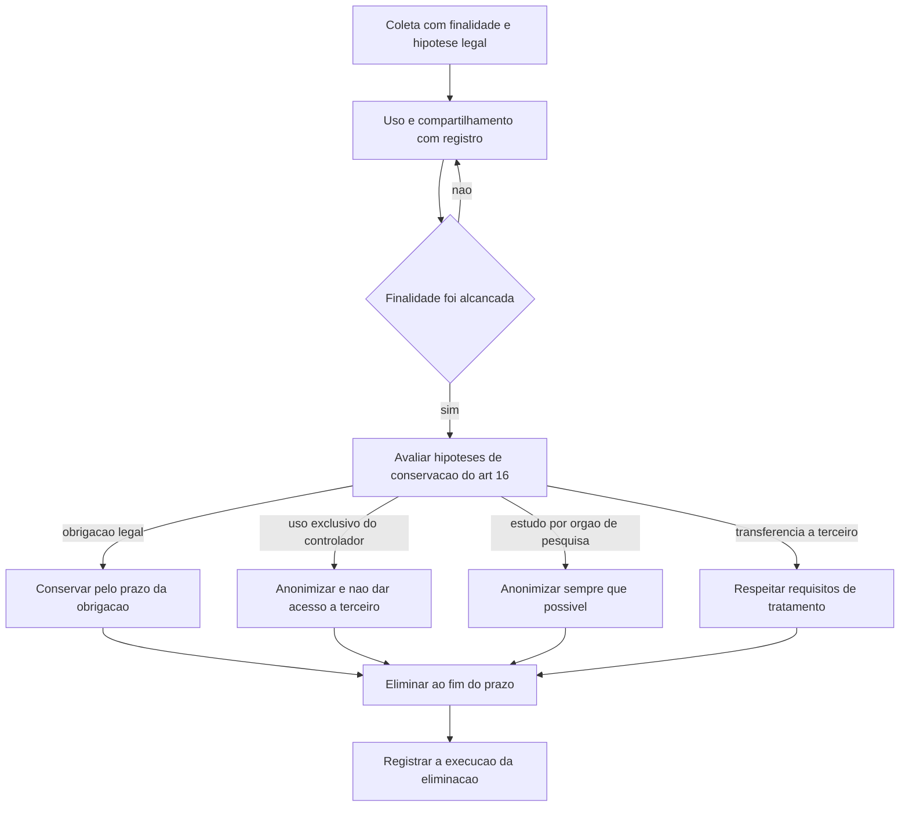

# Ciclo de vida do dado e retenção

A LGPD não fixa prazo de retenção. O art. 15 lista quatro situações que encerram o tratamento, e o art. 16 manda eliminar os dados depois disso, autorizando a conservação em quatro hipóteses. O prazo, portanto, é decisão documentada do controlador, ancorada na obrigação que sustenta a conservação — e é essa decisão que falta na maioria das empresas.

## 1. Objetivo de aprendizagem

Ao final deste tema você deve conseguir: definir, para os campos de um inventário de dados pessoais, o evento que encerra o tratamento e o prazo de retenção de cada grupo, distinguindo o que a lei manda eliminar do que ela autoriza conservar.

## 2. Pré-requisitos

[TEMA-02](TEMA-02-classificacao-inventario-dados.md). A retenção é uma coluna do inventário; defini-la antes de ter os campos classificados produz prazo genérico por sistema, que não se sustenta em auditoria.

## 3. Pré-teste

Responda de palpite, antes de ler o resto. Anote a confiança de 1 a 5.

1. A LGPD fixa prazo de retenção de dado pessoal? Aposte sim ou não, e diga quem você acha que fixa o prazo.
   Confiança: ___
2. Depois que o tratamento termina, você acha que a empresa pode conservar o dado para uso próprio? Sim, não ou depende da hipótese.
   Confiança: ___
3. Um dado anonimizado guardado em data lake continua sujeito a pedido de eliminação? Aposte antes de ler.
   Confiança: ___
## 4. Caso real

Uma rede de clínicas guarda prontuário eletrônico, imagem de exame e gravação de teleconsulta. O sistema nunca foi projetado para exclusão: o campo de observação é texto livre, o anexo fica em storage de objeto com versionamento e o backup é retido por tempo indeterminado. Quando um titular pede a eliminação de dados tratados com consentimento, a equipe responde que "não é possível apagar por causa do backup".

O que ninguém consegue dizer na reunião: qual dispositivo legal decide aquele pedido, o que a clínica é obrigada a conservar apesar do pedido e o que sobrevive em cópia sem violar a lei. O conteúdo deste tema responde às três.

## 5. Conteúdo

### 5.1 Conceito

O art. 15 da LGPD enumera o término do tratamento: verificação de que a finalidade foi alcançada ou de que os dados deixaram de ser necessários ou pertinentes ao alcance da finalidade específica; fim do período de tratamento; comunicação do titular, inclusive no exercício do direito de revogação do consentimento, resguardado o interesse público; e determinação da autoridade nacional, quando houver violação à lei. Três desses quatro eventos dependem de decisão prévia da empresa: alguém precisa ter declarado quando a finalidade se esgota, qual é o período e o que o interesse público protege.

O art. 16 descreve o efeito: os dados pessoais serão eliminados após o término de seu tratamento, no âmbito e nos limites técnicos das atividades, autorizada a conservação para cumprimento de obrigação legal ou regulatória pelo controlador; para estudo por órgão de pesquisa, garantida sempre que possível a anonimização; para transferência a terceiro, respeitados os requisitos de tratamento da lei; e para uso exclusivo do controlador, vedado o acesso por terceiro e desde que os dados sejam anonimizados. As duas primeiras hipóteses cobrem quase todo o contencioso real; as duas últimas exigem anonimização, não cifra.

Eliminação é definida no art. 5º, inciso XIV, como exclusão de dado ou de conjunto de dados armazenados em banco de dados, independentemente do procedimento empregado. Bloqueio, no inciso XIII, é a suspensão temporária de qualquer operação de tratamento, mediante guarda do dado. São respostas diferentes para problemas diferentes: bloqueio suspende o uso e mantém o dado sob custódia; eliminação tira o dado. O art. 18 dá ao titular o direito de pedir anonimização, bloqueio ou eliminação de dados desnecessários, excessivos ou tratados em desconformidade, e a eliminação dos dados tratados com consentimento, exceto nas hipóteses do art. 16.

### 5.2 Como funciona

Retenção se define por evento, não por data fixa. O padrão que resiste a auditoria é uma tabela com quatro colunas: grupo de campos, evento que inicia a contagem, prazo, base da conservação. O evento costuma ser o fim de um vínculo, o encerramento de um contrato, a conclusão de um processo ou a prescrição de uma ação. A base da conservação precisa nomear a obrigação concreta: uma lei trabalhista, uma norma fiscal, uma regra de prevenção à fraude.

O prazo não é único por sistema. Em um mesmo sistema de RH convivem dados com prazo trabalhista, prazo fiscal e prazo de saúde, e o descarte correto exige campo separado ou bloco separado. O art. 6º, inciso V, exige exatidão, clareza, relevância e atualização de acordo com a finalidade, e a finalidade da ficha de admissão é diferente da finalidade do laudo de aptidão.

Depois do término, a obrigação não acaba. O art. 47 estende o dever de garantir a segurança da informação em relação aos dados pessoais mesmo após o término do tratamento, e o art. 49 exige que os sistemas sejam estruturados para atender aos requisitos de segurança, aos padrões de boas práticas e de governança e aos princípios da lei. Cópia de backup com dado que já devia ter sido eliminado continua sendo tratamento ativo.

### 5.3 Exemplo resolvido

Volte ao caso da clínica. Passo a passo.

Passo 1, identificar o pedido. O titular pede eliminação de dados tratados com consentimento. O dispositivo é o art. 18, inciso VI, com a ressalva expressa das hipóteses do art. 16. O prazo de resposta não está na lei: o art. 18, §5º, manda atender sem custo "nos prazos e nos termos previstos em regulamento". Enquanto o regulamento aplicável não for lido em fonte oficial, trate o prazo como pendência: NAO CONFIRMADO em fonte oficial. Para confirmação e acesso, o art. 19 fixa a declaração clara e completa em até 15 dias, contados do requerimento.

Passo 2, separar o que é eliminável do que é conservável. A gravação de teleconsulta consentida sai, salvo se houver base em outra hipótese. O prontuário permanece: há obrigação legal e regulatória de guarda de registro de saúde, hipótese do art. 16, inciso I, e a consequência é que a resposta ao titular não é "não podemos apagar", e sim "apagamos o que a lei permite e conservamos o prontuário pela obrigação X até o prazo Y".

Passo 3, tratar anonimização como operação, não como atalho. Se a clínica quiser manter o conjunto para estatística, precisa anonimizar de fato, considerando o art. 12: a anonimização só vale se a reversão exigir meios próprios ou esforços razoáveis, ponderados custo, tempo e tecnologia. Pseudonimizar e guardar a chave no mesmo ambiente não produz esse efeito, pelo §4º do art. 13.

Passo 4, resolver a cópia. Backup com dado a eliminar exige decisão escrita: ou o ciclo de rotação garante que a cópia expira em prazo conhecido, ou existe processo de expurgo direcionado. O que não se sustenta é reter indefinidamente por conveniência operacional. A ação da primeira semana é documentar o ciclo de rotação com data de expiração e registrá-lo no inventário.

Passo 5, registrar. Cada eliminação executada precisa de evidência: data, escopo, quem executou e onde ficam os dados que restaram com a base da conservação.

### 5.4 Problema de completar

Caso novo: um e-commerce guarda dados de pedidos por dez anos, incluindo endereço de entrega, telefone, histórico de compras e o número do cartão truncado. A área fiscal diz que precisa de sete anos para documentos fiscais; o marketing usa o histórico completo para recomendação.

Preencha as etapas e feche as duas últimas.

1. Evento que inicia a contagem de cada grupo de campos. __________
2. Base de conservação de cada grupo, com a obrigação nomeada. __________
3. O que a recomendação de produtos conserva, e sob qual hipótese. __________
4. O que fazer com o telefone e o endereço depois do prazo fiscal. __________
5. Como comprovar a eliminação em uma fiscalização futura. __________

## 6. Por que isso importa para o CISO

Retenção indefinida amplia o escopo de qualquer incidente. O banco que guarda dez anos de histórico de clientes produz uma notificação à ANPD com dez vezes mais titulares afetados do que o banco que guarda dois anos, e o critério de risco ou dano relevante do art. 5º do Regulamento de Comunicação de Incidente de Segurança inclui dados em larga escala. Cada ano de dado guardado sem base é chamado de titular adicional na comunicação e de euro e real adicionais na indenização.

Há também um efeito de custo que o CISO controla. Eliminação programada reduz volume de armazenamento, reduz o escopo de busca em litígio e em pedido de titular, e reduz o trabalho de classificação. A conversa com o board é direta: o custo de guardar decresce, e o risco de guardar cai junto, com uma decisão por grupo de campo.

## 7. Aplicação prática

Pegue o inventário do tema anterior e crie a tabela de retenção com quatro colunas: grupo de campos, evento, prazo, base da conservação. Preencha primeiro os grupos que têm uma obrigação legal identificável, porque são os mais fáceis e os mais defensáveis.

Depois liste os grupos que sobraram sem base e classifique-os em três destinos: eliminar agora, anonimizar e manter, ou escalar para decisão de negócio. Leve a lista dos escalados para a próxima reunião de governança. A pergunta a fazer é quem assina a decisão de manter dado pessoal sem obrigação legal que a sustente.

## 8. Autoexplicação

Explique em três frases, sem consultar o texto, a diferença entre bloqueio e eliminação e quando cada um resolve. Conecte a explicação a algo que você já faz: seu processo de baixa de usuário em sistema desativa a conta, apaga os dados ou nenhum dos dois?

## 9. Erros comuns e equívocos

| Equívoco | Por que está errado | O que é correto |
|---|---|---|
| Manter o dado não incomoda ninguém | Reter além do prazo mantém o risco aberto e amplia o escopo de incidente e de pedido de titular | Prazo definido e eliminação comprovada reduzem exposição e custo |
| Backup é exceção permanente | Backup com dado que já devia ter sido eliminado continua sendo tratamento ativo, sob o art. 47 | Documente o ciclo de rotação com data de expiração ou faça expurgo direcionado |
| Pseudonimizar resolve a retenção | Dado pseudonimizado continua sendo dado pessoal, pelo art. 13, §4º | Para sair do regime, a anonimização precisa resistir a reversão por esforços razoáveis |
| O prazo de retenção é decisão da TI | A base da conservação é obrigação legal ou decisão de negócio, não parâmetro de armazenamento | Quem assina a tabela é o dono do processo, com validação jurídica |
| Eliminar dado de saúde atende qualquer pedido de titular | O art. 18, inciso VI, ressalva expressamente as hipóteses do art. 16 | A resposta ao titular informa o que foi eliminado e a obrigação que sustenta o que permanece |

## 10. Recuperação ativa

Responda tudo antes de abrir o gabarito.

1. Quais são as quatro situações que encerram o tratamento de dados pessoais?
2. Quais são as quatro hipóteses em que a lei autoriza conservar o dado depois do término, e o que cada uma exige?
3. O que a lei define como eliminação e o que define como bloqueio?
4. Um pedido de eliminação de dados de saúde pode ser recusado? Em que termos deve ser respondido?

Conferir respostas

1. Verificação de que a finalidade foi alcançada ou de que os dados deixaram de ser necessários ou pertinentes à finalidade; fim do período de tratamento; comunicação do titular, inclusive por revogação do consentimento, resguardado o interesse público; determinação da autoridade nacional em caso de violação à lei.
2. Cumprimento de obrigação legal ou regulatória pelo controlador; estudo por órgão de pesquisa, com anonimização sempre que possível; transferência a terceiro, respeitados os requisitos de tratamento da lei; uso exclusivo do controlador, vedado acesso por terceiro e desde que anonimizados os dados.
3. Eliminação é a exclusão de dado ou de conjunto de dados armazenados em banco de dados, independentemente do procedimento empregado; bloqueio é a suspensão temporária de qualquer operação de tratamento, mediante guarda do dado pessoal ou do banco de dados.
4. Pode, quando incide uma das hipóteses do art. 16, como a obrigação legal de guarda de registro de saúde. A resposta deve informar o que foi eliminado, o que permanece e a obrigação concreta que sustenta a conservação, não uma negativa genérica.

## 11. Revisão espaçada

| Intervalo | O que fazer | Se errar |
|---|---|---|
| D+1 | Responder a seção 10 sem reler | Rebaixar: repetir em D+1 |
| D+7 | Preencher a tabela de retenção de um processo novo | Rebaixar: repetir em D+3 |
| D+30 | Verificar, em um caso real de pedido de titular, se a resposta nomeou a obrigação de conservação | Rebaixar: repetir em D+7 |

## 12. Conexões com outros temas

Leitura humana do `relacoes` do frontmatter — que é a fonte. Relações que saem desta área
também aparecem em [mapa-relacoes.md](../mapa-relacoes.md). Regras em
[templates/RELACOES-TEMAS.md](../templates/RELACOES-TEMAS.md).

| Relação | Alvo | Por que |
|---|---|---|
| aplicado_em | 02-governanca-risco-compliance#TEMA-02 | a tabela de retenção só tem efeito quando publicada como norma aprovada com dono e evidência de execução |

## 13. Certificações e leitura recomendada

| Certificação | Domínio coberto | Leitura recomendada |
|---|---|---|
| CDPSE | Quatro domínios de privacidade embutida em sistemas, cujos nomes a página oficial não publica | [Lei nº 13.709, de 14 de agosto de 2018](https://www2.camara.leg.br/legin/fed/lei/2018/lei-13709-14-agosto-2018-787077-normaatualizada-pl.pdf) |
| CIPP/E | Direito europeu de proteção de dados, na concentração europeia da família CIPP | [Regulamento (UE) 2016/679](https://eur-lex.europa.eu/legal-content/PT/TXT/HTML/?uri=CELEX:32016R0679) |
## 14. Fontes verificadas

| # | Título | Tipo | URL | Acessado em | Confiança |
|---|---|---|---|---|---|
| 1 | Lei nº 13.709, de 14 de agosto de 2018 — texto atualizado | primaria | https://www2.camara.leg.br/legin/fed/lei/2018/lei-13709-14-agosto-2018-787077-normaatualizada-pl.pdf | "2026-09-25" | alta |
| 2 | Regulamento (UE) 2016/679 — art. 5.º | primaria | https://eur-lex.europa.eu/legal-content/PT/TXT/HTML/?uri=CELEX:32016R0679 | "2026-09-25" | alta |

Não confirmados nesta execução: o prazo regulamentar para atender pedido de titular previsto no art. 18, §5º; os prazos específicos de guarda de registro de saúde aplicáveis à clínica usada como exemplo, que dependem de norma setorial não lida nesta execução; a alínea do art. 5.º do GDPR que trata da limitação da conservação, cuja leitura integral não foi feita.

---

| Navegação | |
|---|---|
| Área | [14 Dados, privacidade e LGPD/GDPR](./README.md) |
| Tema anterior | [TEMA-02](TEMA-02-classificacao-inventario-dados.md) |
| Próximo tema | [TEMA-04](TEMA-04-lgpd-bases-legais-direitos-incidentes.md) |
| Home | [README](../README.md) |
