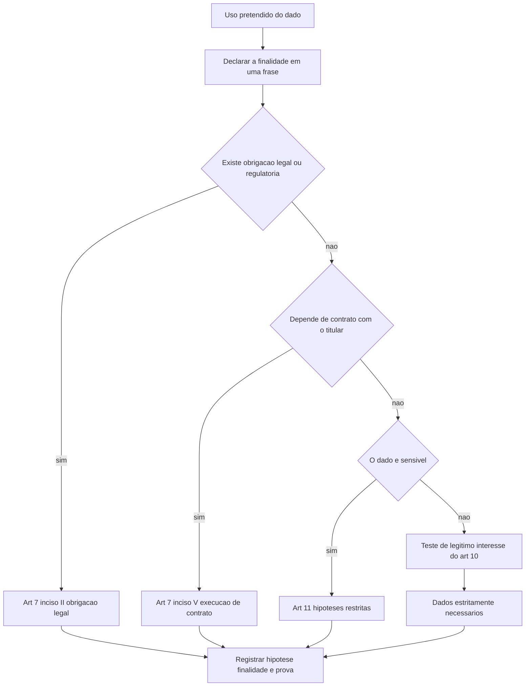

# LGPD: bases legais, direitos do titular e incidentes

O art. 48 da LGPD manda o controlador comunicar à ANPD e ao titular a ocorrência de incidente de segurança que possa acarretar risco ou dano relevante aos titulares, em prazo razoável a ser definido pela autoridade. O art. 6º do Regulamento de Comunicação de Incidente de Segurança definiu: três dias úteis, contados do conhecimento pelo controlador de que o incidente afetou dados pessoais. Três dias úteis é o prazo total, não o prazo para começar a investigar.

## 1. Objetivo de aprendizagem

Ao final deste tema você deve conseguir: determinar a hipótese de tratamento aplicável a um uso concreto de dado pessoal e decidir, em um incidente, se há dever de comunicação à ANPD e ao titular, justificando pelo critério de risco ou dano relevante e pelo prazo aplicável.

## 2. Pré-requisitos

[TEMA-01](TEMA-01-privacidade-dado-pessoal.md) e [TEMA-02](TEMA-02-classificacao-inventario-dados.md). A hipótese legal se decide por campo e por finalidade; sem inventário, a análise vira declaração genérica que não resiste à primeira pergunta da ANPD.

## 3. Pré-teste

Responda de palpite, antes de ler o resto. Anote a confiança de 1 a 5.

1. Você aposta que o consentimento é a base legal da maior parte dos tratamentos da sua empresa? Sim, não ou não sei.
   Confiança: ___
2. Um bucket de comprovantes ficou com leitura pública por 11 meses. Você acha que isso é incidente notificável à ANPD? Aposte antes de ler.
   Confiança: ___
3. Se existe obrigação legal de guarda, você acha que o titular ainda pode pedir a eliminação? Responda de palpite.
   Confiança: ___
## 4. Caso real

Em uma quinta-feira, o time de segurança identifica que um bucket de armazenamento de objetos estava com leitura pública. O bucket continha comprovantes de residência enviados por clientes para abertura de conta: arquivo em PDF com nome, CPF, endereço e, em alguns casos, foto de documento. A exposição começou 11 meses antes, segundo os registros de acesso.

No comitê de crise, o jurídico pergunta se há dever de comunicar; a operação pergunta se precisa avisar 200 mil clientes; o CISO pergunta se a empresa aguenta três dias úteis sem ter o escopo final. O caso deixa aberta a pergunta que o conteúdo resolve: quais critérios transformam um incidente em dever de comunicação, e o que a empresa precisa ter pronto antes de decidir.

## 5. Conteúdo

### 5.1 Conceito

Tratamento de dado pessoal só é legítimo se houver hipótese legal. O art. 7º da LGPD lista dez: consentimento do titular; cumprimento de obrigação legal ou regulatória pelo controlador; tratamento e uso compartilhado pela administração pública para execução de políticas públicas; realização de estudos por órgão de pesquisa, com anonimização sempre que possível; execução de contrato ou de procedimentos preliminares a pedido do titular; exercício regular de direitos em processo judicial, administrativo ou arbitral; proteção da vida ou da incolumidade física do titular ou de terceiro; tutela da saúde por profissionais de saúde, serviços de saúde ou autoridade sanitária; interesses legítimos do controlador ou de terceiro, exceto se prevalecerem direitos e liberdades fundamentais do titular; e proteção do crédito. Consentimento é a primeira hipótese e uma entre dez.

O art. 11 restringe o dado sensível a hipóteses mais estreitas: consentimento específico e destacado para finalidades específicas, e, sem consentimento, cumprimento de obrigação legal ou regulatória; tratamento compartilhado para políticas públicas; estudos por órgão de pesquisa com anonimização sempre que possível; exercício regular de direitos, inclusive em contrato e em processo; proteção da vida ou da incolumidade física; tutela da saúde; e garantia da prevenção à fraude e à segurança do titular em processos de identificação e autenticação de cadastro em sistemas eletrônicos. Não há hipótese de legítimo interesse para dado sensível na lista lida.

Consentimento tem requisitos próprios. O art. 8º exige que seja fornecido por escrito ou por outro meio que demonstre a manifestação de vontade; que conste em cláusula destacada quando escrito; e impõe ao controlador o ônus da prova de que o consentimento foi obtido conforme a lei. Autorizações genéricas para tratamento de dados são nulas, o consentimento deve referir-se a finalidades determinadas e pode ser revogado a qualquer momento mediante manifestação expressa, por procedimento gratuito e facilitado.

O art. 6º traz os princípios que se aplicam a todas as hipóteses: finalidade, adequação, necessidade, livre acesso, qualidade dos dados, transparência, segurança, prevenção, não discriminação e responsabilização e prestação de contas. O princípio da necessidade é o que mais reprova tratamentos em auditoria: limitação do tratamento ao mínimo necessário para a realização de suas finalidades, com dados pertinentes, proporcionais e não excessivos.

### 5.2 Como funciona

A escolha da hipótese legal é uma decisão documentada, não uma consequência do sistema. Comece pela finalidade: o que se quer fazer com o dado, em uma frase. Depois verifique se existe obrigação legal ou regulatória que cubra o uso — se existir, a hipótese é o inciso II e não há espaço para consentimento, porque consentimento não afasta obrigação legal. Se não existir, avalie se o uso depende de contrato ou de procedimento preliminar a pedido do titular; se não depender, teste o legítimo interesse, com a verificação do art. 10: finalidade legítima avaliada a partir de situações concretas, uso restrito aos dados estritamente necessários e transparência sobre o tratamento. Consentimento, quando for a hipótese, exige registro da prova e caminho de revogação.

Do lado do titular, o art. 18 lista nove direitos exercíveis a qualquer momento e mediante requisição: confirmação da existência de tratamento; acesso aos dados; correção de dados incompletos, inexatos ou desatualizados; anonimização, bloqueio ou eliminação de dados desnecessários, excessivos ou tratados em desconformidade com a lei; portabilidade a outro fornecedor, mediante requisição expressa e conforme regulamentação, observados os segredos comercial e industrial; eliminação dos dados tratados com consentimento, exceto nas hipóteses do art. 16; informação das entidades com as quais houve uso compartilhado; informação sobre a possibilidade de não fornecer consentimento e sobre as consequências da negativa; e revogação do consentimento. O art. 18, §6º, manda o responsável informar de imediato os agentes com quem houve uso compartilhado, para que repitam o procedimento, exceto quando a comunicação seja comprovadamente impossível ou implique esforço desproporcional. O art. 20 dá ainda o direito de solicitar revisão de decisões tomadas unicamente com base em tratamento automatizado.

O prazo de atendimento tem um detalhe que engana. O art. 18, §5º, manda atender o requerimento sem custo para o titular, nos prazos e nos termos previstos em regulamento; a lei não fixa esse prazo no dispositivo. O prazo de 15 dias aparece no art. 19 para a declaração clara e completa de confirmação de existência ou de acesso. Para os demais direitos, o prazo depende de regulamento da ANPD, não lido nesta execução: NAO CONFIRMADO em fonte oficial.

O que acontece quando a conformidade falha tem preço calculado. A Resolução CD/ANPD nº 4, de 24 de fevereiro de 2023, aprovou o Regulamento de Dosimetria e Aplicação de Sanções Administrativas, e ele classifica a infração em **leve, média ou grave** — é grave quando afeta significativamente direitos e, cumulativamente, envolve larga escala, vantagem econômica pretendida, risco à vida, dados sensíveis ou de crianças, adolescentes e idosos, tratamento sem hipótese legal, efeitos discriminatórios ou prática irregular sistemática ([in.gov.br](https://www.in.gov.br/en/web/dou/-/resolucao-cd/anpd-n-4-de-24-de-fevereiro-de-2023-466146077), acessado em 2026-09-25). O valor-base sai de metodologia própria, considerando a classificação, o faturamento do último exercício no ramo em que a infração ocorreu e o grau do dano. Sobre ele incidem agravantes somáveis: 10% por reincidência específica, com teto de 40%; 5% por reincidência genérica, teto de 20%; 20% por medida de orientação descumprida, teto de 80%; e 30% por medida corretiva descumprida, teto de 90%. Do outro lado, atenuantes: a cessação da infração reduz 75% se vier antes do procedimento preparatório, 50% entre ele e o processo sancionador, e 30% até a primeira instância; política de boas práticas e governança vale 20%; medidas que revertam ou mitiguem o efeito, 20% ou 10%; cooperação e boa-fé, 5% — e o ônus de provar cabe ao infrator.

A leitura de gestão é direta: **descumprir medida corretiva custa mais caro que a infração original** — é o agravante de maior percentual do regulamento —, e ter política de boas práticas vale 20% de desconto antes de qualquer discussão de mérito. A multa tem teto de 2% do faturamento, limitado a R$ 50 milhões por infração, com pagamento em até 20 dias úteis da ciência e redução de 25% para quem renuncia a recorrer ([in.gov.br](https://www.in.gov.br/en/web/dou/-/resolucao-cd/anpd-n-4-de-24-de-fevereiro-de-2023-466146077)). Os percentuais de valor-base e os valores mínimos por classificação estão nos Apêndices I e II do regulamento, que **não** puderam ser lidos nesta execução: `NAO CONFIRMADO em fonte oficial`.

Sobre prazos de atendimento ao titular, a distinção que costuma escapar: a lei fixa **15 dias**, contados do requerimento, para a declaração de confirmação de existência ou de acesso, com formato simplificado imediato (art. 19, I e II); para as demais providências do art. 18, o prazo é "nos termos previstos em regulamento" (art. 18, §5º), e **a ANPD não publicou o prazo geral** ([planalto.gov.br](https://www.planalto.gov.br/ccivil_03/_ato2015-2018/2018/lei/L13709.htm)). Quem promete prazo único ao titular está prometendo mais do que a norma exige, e menos do que o art. 19 obriga.

A ANPD mantém publicada a lista dos processos sancionadores, com os casos encerrados e os em andamento — entre eles um caso de 2026 envolvendo a Bytedance Brasil, ainda em instrução. Os **valores** das sanções aplicadas não estão publicados de forma legível em fonte primária: qualquer número de multa que circule sem essa origem deve ser tratado como não confirmado ([gov.br/anpd](https://www.gov.br/anpd/pt-br/centrais-de-conteudo/decisoes-em-processos-sancionadores/)).

### 5.3 Exemplo resolvido

Volte ao caso do bucket público. Quatro decisões, em ordem.

Passo 1, há dado pessoal e há incidente. Sim: nome, CPF, endereço, imagem de documento. Incidem os arts. 46 e 47, que exigem medidas de segurança técnicas e administrativas e a garantia de segurança mesmo após o término do tratamento. Objeto com leitura pública é falha de controle, e o desenho de controles é matéria do [TEMA-05 de 06 Endpoint e plataforma](../06-endpoint-plataforma/README.md).

Passo 2, aplicar o critério de risco ou dano relevante. O art. 5º do Regulamento de Comunicação de Incidente de Segurança considera que o incidente pode acarretar risco ou dano relevante quando puder afetar significativamente interesses e direitos fundamentais dos titulares e envolver, cumulativamente, ao menos um destes critérios: dados pessoais sensíveis; dados de crianças, adolescentes ou idosos; dados financeiros; dados de autenticação em sistemas; dados protegidos por sigilo legal, judicial ou profissional; ou dados em larga escala. No caso: dado financeiro e dado de identificação em larga escala, com §2º definindo larga escala por número significativo de titulares, volume, duração, frequência e extensão geográfica. A resposta é sim, com fundamento escrito nesses critérios, e o critério deixa de ser opinião.

Passo 3, montar as duas comunicações. À ANPD, em até três dias úteis contados do conhecimento de que o incidente afetou dados pessoais, com o conteúdo do art. 6º, §2º, do regulamento: descrição da natureza e da categoria dos dados afetados; número de titulares, discriminando crianças, adolescentes e idosos quando aplicável; medidas técnicas e de segurança adotadas antes e depois do incidente; riscos com identificação dos possíveis impactos; motivos da demora, se houver; e as medidas adotadas ou previstas. Ao titular, em até três dias úteis contados do mesmo evento, com o conteúdo do art. 9º. Os dois prazos correm do conhecimento de que o incidente afetou dado pessoal, e não da conclusão da perícia.

Passo 4, preparar a defesa de gravidade. O art. 48, §3º, manda avaliar, no juízo de gravidade, a comprovação de que foram adotadas medidas técnicas adequadas que tornem os dados pessoais afetados ininteligíveis para terceiros não autorizados. É aqui que cifra de disco, tokenização de documento e segregação de chave mudam o resultado de uma comunicação. Para um arquivo aberto em claro, não há essa comprovação; o registro deve ser honesto quanto a isso.

Anote a lacuna: o regulamento trata do pedido de sigilo de informações protegidas por lei (art. 7º) e autoriza a ANPD a pedir o registro das operações de tratamento, o relatório de impacto e o relatório de tratamento do incidente (art. 8º). Se o registro do art. 37 não existir, a empresa responde ao pedido com estimativa.

### 5.4 Problema de completar

Caso novo: um analista de suporte envia, por engano, a planilha de folha de pagamento de 300 funcionários ao e-mail de um candidato não contratado. A planilha contém nome, CPF, cargo, salário, desconto de pensão alimentícia e resultado de exame periódico. O destinatário responde informando o recebimento e diz que não abriu o arquivo.

Preencha as etapas e feche as duas últimas.

1. Classificação dos dados da planilha e as hipóteses legais de cada bloco. __________
2. Aplicação dos critérios de risco ou dano relevante do art. 5º do regulamento. __________
3. Prazo e conteúdo mínimo das comunicações, se devidas. __________
4. O que muda se a planilha tivesse saído cifrada e com chave separada. __________
5. O que a empresa deve documentar para sustentar a decisão, inclusive se decidir não comunicar. __________

## 6. Por que isso importa para o CISO

O prazo de três dias úteis transforma privacidade em requisito de operação de segurança. A decisão de comunicar precisa ser tomada antes de a análise forense terminar, e ela depende de algo que o CISO pode construir: saber, por sistema, se há dado pessoal, de que classe, e qual controle torna o dado ininteligível. O regulamento dá valor de prova à cifra e à descaracterização — o art. 48, §3º, fala em medidas técnicas adequadas que tornem os dados afetados ininteligíveis. Isso reposiciona investimento em tokenização, cifra com chave segregada e mascaramento como defesa de comunicação, e não como higiene.

Há também o custo da sanção e da reparação. O art. 52 admite advertência, multa simples de até 2% do faturamento limitada a R$ 50.000.000,00 por infração, multa diária, publicização da infração, bloqueio, eliminação, suspensão parcial do banco de dados por até seis meses prorrogável, suspensão da atividade e proibição parcial ou total. O art. 42 trata da reparação de dano patrimonial, moral, individual ou coletivo, com responsabilidade solidária do operador que descumprir obrigações ou instruções. A decisão de comunicar, portanto, não é só conformidade: é gestão de contingência.

## 7. Aplicação prática

Escolha três tratamentos vivos na sua empresa e escreva, para cada um, a hipótese legal com o inciso, a finalidade em uma frase e o teste de necessidade em dois itens. Marque com clareza qualquer tratamento que só se sustente se o legítimo interesse passar no art. 10.

Depois monte, em uma página, o cartão de decisão de incidente para dado pessoal: quem decide a comunicação, qual o critério, onde está o registro das operações de tratamento, quem preenche o conteúdo mínimo e como o titular é notificado. Cronometre a decisão em um exercício de mesa. Se ela não fechar em um dia útil, o prazo de três dias úteis já está comprometido.

## 8. Autoexplicação

Explique em três frases, sem consultar o texto, por que consentimento não é a base legal padrão de um programa de privacidade. Ligue isso a algo que você já faz: em quantos formulários da sua empresa o consentimento aparece como se fosse a única hipótese disponível?

## 9. Erros comuns e equívocos

| Equívoco | Por que está errado | O que é correto |
|---|---|---|
| Consentimento é a base legal mais segura | É uma hipótese entre dez, com ônus da prova no controlador, revogação a qualquer momento e nulidade de autorização genérica | Prefira a hipótese que descreve a obrigação real; use consentimento quando o uso depende da vontade do titular |
| Legítimo interesse serve para qualquer uso comercial | O art. 10 exige finalidade legítima avaliada em situação concreta, dados estritamente necessários e transparência, e cede se prevalecerem direitos e liberdades do titular | Documente o teste e o resultado, e não use legítimo interesse para dado sensível |
| O prazo de três dias úteis corre da conclusão da apuração | O regulamento conta o prazo do conhecimento de que o incidente afetou dados pessoais | Comunique com o que se sabe, informe os motivos de eventual demora e complemente depois |
| Comunicar ao titular é opcional quando o risco é baixo | A obrigação do art. 48 abrange ANPD e titular na mesma frase, na hipótese de risco ou dano relevante | Decida com critério escrito; se decidir não comunicar, registre o fundamento e a evidência |
| Anonimizar depois do incidente resolve | O juízo de gravidade olha o que existia e as medidas adotadas; a anonimização posterior não reescreve o passado | Mantenha o dado ininteligível desde a origem, com cifra e chave segregada |
| Dado de saúde em planilha de RH é problema do RH | O tratamento alcança também quem armazena e transmite | A classificação do dado sensível define controle em todos os pontos do ciclo |

## 10. Recuperação ativa

Responda tudo antes de abrir o gabarito.

1. Cite seis hipóteses de tratamento do art. 7º e diga qual delas não existe para dado sensível.
2. Quais são os requisitos do consentimento e o que a lei diz sobre autorizações genéricas?
3. Quais são os critérios que caracterizam incidente com risco ou dano relevante, e o que significa larga escala no regulamento?
4. Quais são os prazos e os destinatários da comunicação de incidente, e de que evento cada prazo conta?
5. O que o art. 48, §3º, valoriza no juízo de gravidade do incidente?

Conferir respostas

1. Consentimento; obrigação legal ou regulatória; administração pública em políticas públicas; estudos por órgão de pesquisa; execução de contrato ou procedimentos preliminares; exercício regular de direitos; proteção da vida ou da incolumidade física; tutela da saúde; legítimo interesse; proteção do crédito. O legítimo interesse não consta das hipóteses do art. 11 para dado sensível.
2. Fornecido por escrito ou por outro meio que demonstre a manifestação de vontade; cláusula destacada quando escrito; ônus da prova do controlador; referência a finalidades determinadas; autorizações genéricas são nulas; revogação a qualquer momento por procedimento gratuito e facilitado.
3. Quando puder afetar significativamente interesses e direitos fundamentais dos titulares e envolver, cumulativamente, ao menos um critério: dados pessoais sensíveis; dados de crianças, adolescentes ou idosos; dados financeiros; dados de autenticação em sistemas; dados protegidos por sigilo legal, judicial ou profissional; ou dados em larga escala. Larga escala é o incidente que abranger número significativo de titulares, considerando volume de dados, duração, frequência e extensão geográfica.
4. Três dias úteis à ANPD e três dias úteis ao titular, ambos contados do conhecimento pelo controlador de que o incidente afetou dados pessoais.
5. A comprovação de que foram adotadas medidas técnicas adequadas que tornem os dados pessoais afetados ininteligíveis, no âmbito e nos limites técnicos dos serviços, para terceiros não autorizados a acessá-los.

## 11. Revisão espaçada

| Intervalo | O que fazer | Se errar |
|---|---|---|
| D+1 | Responder a seção 10 sem reler | Rebaixar: repetir em D+1 |
| D+7 | Redigir a hipótese legal de três tratamentos reais e conferir o inciso | Rebaixar: repetir em D+3 |
| D+30 | Rodar o exercício de mesa de comunicação de incidente e medir o tempo até a decisão | Rebaixar: repetir em D+7 |

## 12. Conexões com outros temas

Leitura humana do `relacoes` do frontmatter — que é a fonte. Relações que saem desta área
também aparecem em [mapa-relacoes.md](../mapa-relacoes.md). Regras em
[templates/RELACOES-TEMAS.md](../templates/RELACOES-TEMAS.md).

| Relação | Alvo | Por que |
|---|---|---|
| aplicado_em | 11-resposta-forense#TEMA-06 | o incidente com dado pessoal dispara a notificação regulatória, com prazo e critério próprios |
| nao_confundir_com | 11-resposta-forense#TEMA-04 | coletar evidência forense não autoriza tratar dado pessoal para outra finalidade |

## 13. Certificações e leitura recomendada

| Certificação | Domínio coberto | Leitura recomendada |
|---|---|---|
| CDPSE | Quatro domínios de privacidade embutida em sistemas, cujos nomes a página oficial não publica | [Lei nº 13.709, de 14 de agosto de 2018](https://www2.camara.leg.br/legin/fed/lei/2018/lei-13709-14-agosto-2018-787077-normaatualizada-pl.pdf) |
| CIPP/E | Direito europeu de proteção de dados, na concentração europeia da família CIPP | [Resolução CD/ANPD nº 15, de 24 de abril de 2024](https://www.in.gov.br/web/dou/-/resolucao-cd/anpd-n-15-de-24-de-abril-de-2024-556243024) |
## 14. Fontes verificadas

| # | Título | Tipo | URL | Acessado em | Confiança |
|---|---|---|---|---|---|
| 1 | Lei nº 13.709, de 14 de agosto de 2018 — texto atualizado | primaria | https://www2.camara.leg.br/legin/fed/lei/2018/lei-13709-14-agosto-2018-787077-normaatualizada-pl.pdf | "2026-09-25" | alta |
| 2 | Resolução CD/ANPD nº 15, de 24 de abril de 2024 — Regulamento de Comunicação de Incidente de Segurança | primaria | https://www.in.gov.br/web/dou/-/resolucao-cd/anpd-n-15-de-24-de-abril-de-2024-556243024 | "2026-09-25" | alta |
| 3 | Regulamento (UE) 2016/679 — art. 33.º | primaria | https://eur-lex.europa.eu/legal-content/PT/TXT/HTML/?uri=CELEX:32016R0679 | "2026-09-25" | alta |

Não confirmados nesta execução: o prazo regulamentar de atendimento aos direitos do titular além do caso de confirmação e acesso do art. 19 — o art. 18, §5º, remete a regulamento; o prazo previsto no regulamento de agentes de tratamento de pequeno porte, alterado pela Resolução CD/ANPD nº 15/2024 no art. 14 do regulamento aprovado pela Resolução CD/ANPD nº 2, de 27 de janeiro de 2022, cujo conteúdo não foi lido; a metodologia de cálculo de multa prevista no art. 53, que depende de regulamento próprio da ANPD não lido nesta execução. O texto do art. 18, §5º, foi lido; a ausência de prazo nele é conclusão de leitura, não de fonte secundária.

---

| Navegação | |
|---|---|
| Área | [14 Dados, privacidade e LGPD/GDPR](./README.md) |
| Tema anterior | [TEMA-03](TEMA-03-ciclo-de-vida-retencao.md) |
| Próximo tema | [TEMA-05](TEMA-05-gdpr-transferencia-internacional.md) |
| Home | [README](../README.md) |
