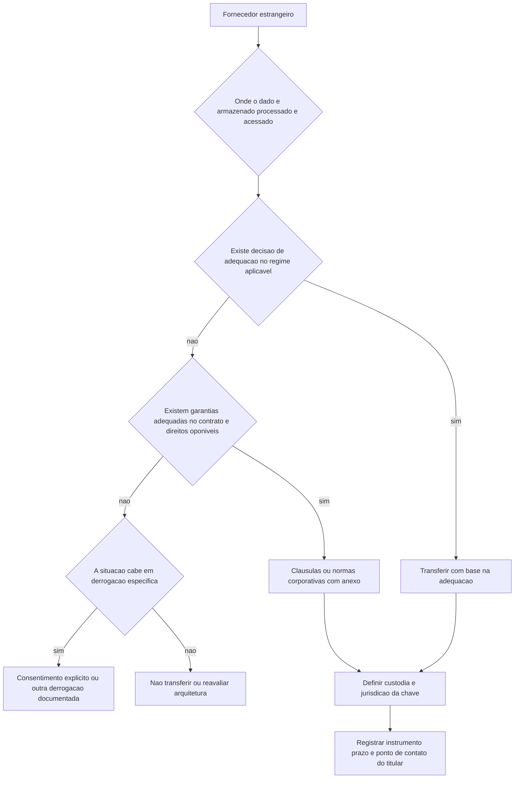

# GDPR e transferência internacional

O Capítulo V do Regulamento (UE) 2016/679 trata das transferências de dados pessoais para países terceiros ou organizações internacionais e abre, no art. 44.º, com a regra de que nenhuma disposição do capítulo pode comprometer o nível de proteção garantido pelo regulamento. A LGPD tem o seu próprio capítulo, com nove hipóteses no art. 33. Quem opera nos dois regimes assina dois contratos para o mesmo fornecedor, e é comum um deles ficar sem o anexo certo.

## 1. Objetivo de aprendizagem

Ao final deste tema você deve conseguir: escolher o instrumento de transferência internacional aplicável a um fornecedor estrangeiro específico, comparando as condições da LGPD e do GDPR e apontando a lacuna de contrato em cada regime.

## 2. Pré-requisitos

[TEMA-04](TEMA-04-lgpd-bases-legais-direitos-incidentes.md). O instrumento de transferência só serve quando existe hipótese de tratamento; decidir o contrato antes da hipótese legal produz o clássico anexo de privacidade sem finalidade declarada.

## 3. Pré-teste

Responda de palpite, antes de ler o resto. Anote a confiança de 1 a 5.

1. Quantos dias o GDPR dá para notificar a autoridade de controlo em caso de violação de dados? Aposte um número antes de ler.
   Confiança: ___
2. Para mandar dado de cliente europeu a um provedor em Frankfurt, basta cláusula-padrão europeia no contrato para atender também à ANPD? Aposte sim, não ou não sei.
   Confiança: ___
3. Cifrar o dado e manter a chave no Brasil resolve a transferência internacional? Aposte antes de ler.
   Confiança: ___
## 4. Caso real

Um grupo brasileiro contrata um provedor de nuvem com região em Frankfurt para hospedar o sistema de atendimento. O contrato traz um anexo de tratamento de dados redigido com base em cláusulas-padrão europeias e uma decisão de adequação da Comissão Europeia mencionada na capa. O jurídico brasileiro pergunta o que sustenta a mesma transferência perante a ANPD.

A pergunta trava a assinatura por duas semanas, e a discussão revela três coisas: ninguém sabe onde ficam as chaves de cifra que o provedor administra, ninguém sabe se o suporte técnico acessa os dados a partir de outro país, e ninguém sabe se o contrato prevê algo para o regime brasileiro. O conteúdo a seguir responde como fechar cada uma.

## 5. Conteúdo

### 5.1 Conceito

O GDPR organiza a transferência em três degraus. O art. 45.º autoriza a transferência quando a Comissão decidiu que o país terceiro, um território ou um ou mais setores específicos desse país, ou a organização internacional, assegura nível de proteção adequado, e nesse caso a transferência não exige autorização específica; o n.º 2 lista os elementos que a Comissão pondera, entre eles o primado do Estado de direito, o respeito pelos direitos humanos, a legislação de acesso das autoridades públicas a dados pessoais e a jurisprudência. Sem decisão de adequação, o art. 46.º permite transferir desde que existam garantias adequadas apresentadas pelo responsável ou pelo subcontratante, na condição de os titulares gozarem de direitos oponíveis e de medidas jurídicas corretivas. O terceiro degrau é o art. 49.º, que trata das derrogações para situações específicas, quando não há decisão de adequação nem garantias adequadas; a alínea a) exige que o titular tenha dado explicitamente o seu consentimento à transferência prevista, depois de informado dos possíveis riscos.

A LGPD segue estrutura parecida com vocabulário próprio. O art. 33 permite a transferência para países ou organismos internacionais que proporcionem grau de proteção adequado; quando o controlador oferecer e comprovar garantias de cumprimento dos princípios, dos direitos do titular e do regime de proteção, na forma de cláusulas contratuais específicas, cláusulas-padrão contratuais, normas corporativas globais ou selos, certificados e códigos de conduta regularmente emitidos; por cooperação jurídica internacional entre órgãos públicos; para proteção da vida ou da incolumidade física; por autorização da ANPD; por compromisso assumido em acordo de cooperação internacional; para execução de política pública ou atribuição legal do serviço público; por consentimento específico e em destaque do titular, com informação prévia sobre o caráter internacional da operação; e nas hipóteses dos incisos II, V e VI do art. 7º.

Duas diferenças importam na prática. Na LGPD, o art. 34 manda a ANPD avaliar o nível de proteção do país estrangeiro, com critérios que incluem as normas gerais e setoriais do país de destino, a natureza dos dados, a observância dos princípios e direitos, a adoção de medidas de segurança previstas em regulamento, a existência de garantias judiciais e institucionais e outras circunstâncias específicas. No GDPR, a avaliação de adequação é da Comissão. O art. 35 da LGPD deixa o conteúdo das cláusulas-padrão contratuais e a verificação de cláusulas específicas, normas corporativas globais, selos, certificados e códigos de conduta com a ANPD, que pode designar organismos de certificação, sob sua fiscalização, e revisar ou anular seus atos.

O alcance territorial é a segunda diferença. O art. 3º da LGPD aplica a lei a qualquer operação de tratamento, independentemente do meio, do país da sede ou do país onde estejam localizados os dados, desde que a operação seja realizada no território nacional, ou a atividade tenha por objetivo a oferta ou o fornecimento de bens ou serviços, ou o tratamento de dados de indivíduos localizados no território nacional, ou os dados tenham sido coletados no território nacional. Uma empresa europeia que oferece serviço a pessoas no Brasil entra no regime brasileiro sem filial aqui.

### 5.2 Como funciona

A decisão circula por quatro perguntas, e a resposta de cada uma define o instrumento.

Primeira: em que país o dado é armazenado, processado e acessado? Acesso remoto por suporte técnico em outro país é transferência, mesmo com o dado parado no Brasil. Segunda: qual é o instrumento disponível no regime aplicável — decisão de adequação, garantias adequadas ou derrogação. Terceira: quem custodia a chave de cifra e sob qual jurisdição; a garantia técnica de que o dado permanece ininteligível depende disso. Quarta: como o titular fica sabendo, e como ele exerce direitos contra quem está fora do país.

Três obrigações do regulamento definem o trabalho do gestor no dia do incidente e no dia do projeto. No incidente, o art. 33.º exige notificação à autoridade **sem demora injustificada e, sempre que possível, até 72 horas** após o conhecimento, com conteúdo mínimo de quatro itens — natureza da violação e número aproximado de titulares e registros, contato do encarregado, consequências prováveis e medidas adotadas — e admite entrega por fases; o art. 34.º só obriga a comunicar ao titular quando houver **elevado risco**, dispensando a comunicação se os dados estiverem cifrados, se houver medida posterior que elimine o risco ou se o esforço for desproporcionado. E o art. 33.º, n.º 5, obriga a **documentar todas as violações**, sem limiar de risco: é esse registro que a autoridade examina depois, e é ele que separa a empresa que teve um incidente da empresa que não sabe o que aconteceu ([EUR-Lex](https://eur-lex.europa.eu/legal-content/PT/TXT/HTML/?uri=CELEX:32016R0679), acessado em 2026-09-25).

No projeto, o art. 35.º exige a avaliação de impacto **antes** de iniciar tratamento de risco elevado, com conteúdo mínimo também de quatro itens (descrição das operações e finalidades, avaliação de necessidade e proporcionalidade, avaliação dos riscos, medidas previstas), e o parecer do encarregado deve ser solicitado quando ele existir. A designação de encarregado é obrigatória em três hipóteses, segundo o art. 37.º: autoridade ou organismo público, controlo regular e sistemático de titulares em grande escala, ou tratamento em grande escala de categorias especiais. A posição dele é protegida pelo art. 38.º — não recebe instruções, não pode ser destituído nem penalizado pelo exercício da função e reporta ao mais alto nível.

Sobre transferência, a lista de decisões de adequação em vigor inclui Andorra, Argentina, **Brasil**, Canadá (organizações comerciais), Ilhas Faroé, Guernsey, Israel, Ilha de Man, Japão, Jersey, Nova Zelândia, República da Coreia, Suíça, Reino Unido e Estados Unidos (organizações comerciais no Quadro de Privacidade de Dados UE–EUA), além da Organização Europeia de Patentes. A decisão relativa ao Brasil é de **26 de janeiro de 2026** ([commission.europa.eu](https://commission.europa.eu/law/law-topic/data-protection/international-dimension-data-protection/adequacy-decisions_en), acessado em 2026-09-25) — o mesmo movimento que a Resolução CD/ANPD nº 32, de 26 de janeiro de 2026, fez do lado brasileiro ao reconhecer a União Europeia como grau de proteção adequado. As cláusulas contratuais padrão vigentes são as da Decisão de Execução (UE) 2021/914, de 4 de junho de 2021, em vigor e sem alteração registrada ([EUR-Lex](https://eur-lex.europa.eu/eli/dec_impl/2021/914/oj)). Quem opera com fornecedor nos dois lados do Atlântico tem, desde 2026, adequação recíproca — o que não dispensa documentar a base legal nem o fluxo.

### 5.3 Exemplo resolvido

Volte ao caso do provedor em Frankfurt.

Passo 1, mapear a transferência de verdade. O dado fica na região de Frankfurt; o suporte de segundo nível é feito da Índia e de Portugal; a chave de cifra em repouso é administrada pela plataforma do provedor, com possibilidade de o provedor criar chaves gerenciadas pelo cliente. São três transferências com naturezas diferentes: armazenamento, acesso humano e custódia de chave.

Passo 2, resolver o lado europeu. Se houver decisão de adequação da Comissão cobrindo o destino, o art. 45.º basta e não há autorização específica a pedir; se não houver, o art. 46.º exige garantias adequadas e direitos oponíveis aos titulares, e o art. 49.º fica reservado às situações específicas. O instrumento europeu presente no contrato precisa ser identificado por nome e versão, não citado na capa.

Passo 3, resolver o lado brasileiro. Se o país de destino constar de avaliação de adequação da ANPD, o inciso I do art. 33 se aplica; caso contrário, o caminho natural é o inciso II, com cláusulas-padrão contratuais ou cláusulas específicas, ou normas corporativas globais. O que não existe é uma cláusula europeia que valha automaticamente no Brasil: o art. 35 dá à ANPD a definição do conteúdo das cláusulas-padrão, portanto o contrato precisa de anexo próprio para o regime brasileiro, ou de cláusulas específicas submetidas à avaliação. Eventual relação de países reconhecidos como adequados pela ANPD não foi consultada nesta execução: NAO CONFIRMADO em fonte oficial.

Passo 4, fechar a lacuna técnica. Mover a custódia de chave para o cliente ou para uma jurisdição sob controle da empresa muda o argumento de risco, e o item pertence ao contrato como requisito técnico. Vale o alerta de competência: a mecânica de chave e ciclo de vida está em [07 Criptografia e segredos](../07-criptografia-segredos/README.md); aqui se decide por que isso vira obrigação contratual.

Passo 5, registrar. Para cada fornecedor: país de armazenamento, países de acesso, instrumento por regime, versão do instrumento, jurisdição da chave, ponto de contato para o titular e prazo de revisão. Sem esse registro, a resposta à ANPD em uma fiscalização é uma promessa.

### 5.4 Problema de completar

Caso novo: uma empresa brasileira usa um CRM em nuvem cujo suporte é feito por equipe nas Filipinas, com suboperadores nos Estados Unidos para transcrição de ligações por IA.

Preencha as etapas e feche as duas últimas.

1. Lista de transferências distintas, com país e natureza de cada uma. __________
2. Instrumento aplicável em cada regime. __________
3. O que precisa constar no contrato sobre o suboperador de transcrição. __________
4. Qual é o efeito da transferência sobre a informação ao titular. __________
5. Como verificar, na prática, se o acesso remoto respeita o instrumento contratado. __________

## 6. Por que isso importa para o CISO

Transferência internacional é o ponto em que a arquitetura de nuvem encontra a obrigação legal, e é onde o CISO tem voto de qualidade. Escolher região, definir quem administra a chave e aprovar acesso remoto de suporte parecem decisões técnicas de arquitetura; na prática, determinam quantos instrumentos contratuais serão necessários e quanto risco jurídico a empresa carrega por fornecedor.

O art. 83.º, n.º 5, alínea c), do GDPR sujeita a violação das regras de transferência dos arts. 44.º a 49.º ao degrau mais alto de coima: até 20.000.000 EUR ou 4% do volume de negócios anual a nível mundial correspondente ao exercício anterior, consoante o montante mais elevado. O n.º 4 fixa o degrau inferior em até 10.000.000 EUR ou 2%, e a alínea a) alcança as obrigações dos arts. 8.º, 11.º, 25.º a 39.º e 42.º e 43.º. São duas faixas, e transferência está na faixa alta. Para um grupo com operação europeia, o desenho de região e de custódia de chave precisa passar pela mesma mesa que decide orçamento de nuvem.

## 7. Aplicação prática

Monte a matriz de transferência dos cinco fornecedores estrangeiros mais relevantes, com sete colunas: fornecedor, dado pessoal envolvido, país de armazenamento, países de acesso, instrumento europeu, instrumento brasileiro, jurisdição da chave.

Preencha só com o que tem evidência documental. Cada célula vazia é uma lacuna a comunicar a procurement e jurídico, e cada linha completa é um argumento a mais na próxima renovação de contrato. Leve a matriz para a auditoria seguinte: é o documento que responde à pergunta "onde estão os dados da empresa fora do Brasil".

## 8. Autoexplicação

Explique em três frases, sem consultar o texto, por que uma decisão de adequação europeia não resolve a transferência perante a ANPD. Conecte isso a algo que você já faz: os contratos de nuvem da sua empresa têm anexo de privacidade escrito para qual regime?

## 9. Erros comuns e equívocos

| Equívoco | Por que está errado | O que é correto |
|---|---|---|
| Dado hospedado no Brasil não é transferência internacional | Acesso remoto por suporte no exterior é tratamento no exterior e conta como transferência | Mapeie armazenamento, acesso humano e custódia de chave separadamente |
| Cifra resolve a transferência | Cifra reduz risco e ajuda a demonstrar ininteligibilidade, mas não substitui o instrumento legal | Instrumento contratual e custódia de chave são decisões distintas e complementares |
| Vale a cláusula europeia para tudo | A ANPD define o conteúdo das cláusulas-padrão no regime brasileiro | Cada regime exige seu instrumento; um contrato pode ter lacuna em um deles |
| Derrogação por consentimento serve para operação de rotina | O art. 49.º trata de situações específicas, não de fluxo contínuo de dados | Fluxo recorrente pede adequação ou garantias adequadas |
| Suboperador é problema do fornecedor | O controlador responde pelo conjunto, e o art. 46.º alcança as transferências ulteriores | Exija lista de suboperadores, país e instrumento aplicável a cada um |

## 10. Recuperação ativa

Responda tudo antes de abrir o gabarito.

1. Quais são os três degraus da transferência internacional no GDPR e o que cada um exige?
2. Quais são as hipóteses de transferência internacional da LGPD ligadas a garantias do controlador?
3. Quem avalia o nível de proteção do país estrangeiro em cada regime?
4. Qual é o teto de coima do GDPR aplicável à violação das regras de transferência, e de onde ele vem?
5. O que o art. 44.º estabelece como limite para a interpretação de todo o capítulo?

Conferir respostas

1. Decisão de adequação da Comissão, que dispensa autorização específica; garantias adequadas apresentadas pelo responsável ou subcontratante, com direitos oponíveis e medidas jurídicas corretivas para os titulares; e derrogações para situações específicas, quando não há adequação nem garantias.
2. Cláusulas contratuais específicas para determinada transferência; cláusulas-padrão contratuais; normas corporativas globais; e selos, certificados e códigos de conduta regularmente emitidos.
3. No GDPR, a Comissão; na LGPD, a ANPD, conforme os critérios do art. 34.
4. Até 20.000.000 EUR ou 4% do volume de negócios anual a nível mundial correspondente ao exercício financeiro anterior, consoante o montante mais elevado, conforme o art. 83.º, n.º 5, que lista os arts. 44.º a 49.º na alínea c).
5. Nenhuma disposição do Capítulo V pode ser aplicada de forma a comprometer o nível de proteção das pessoas singulares garantido pelo regulamento, e o mesmo vale para as transferências ulteriores do país terceiro para outro país terceiro ou organização internacional.

## 11. Revisão espaçada

| Intervalo | O que fazer | Se errar |
|---|---|---|
| D+1 | Responder a seção 10 sem reler | Rebaixar: repetir em D+1 |
| D+7 | Preencher a matriz de transferência de um fornecedor novo | Rebaixar: repetir em D+3 |
| D+30 | Verificar, em um contrato assinado, se o anexo cobre os dois regimes e a custódia de chave | Rebaixar: repetir em D+7 |

## 12. Conexões com outros temas

Leitura humana do `relacoes` do frontmatter — que é a fonte. Relações que saem desta área
também aparecem em [mapa-relacoes.md](../mapa-relacoes.md). Regras em
[templates/RELACOES-TEMAS.md](../templates/RELACOES-TEMAS.md).

| Relação | Alvo | Por que |
|---|---|---|
| aprofundado_por | 07-criptografia-segredos#TEMA-04 | a garantia técnica da transferência depende de quem detém a chave e em qual jurisdição ela está custodiada |
| complementa | 08-cloud#TEMA-06 | a transferência internacional só se materializa em cláusula contratual e anexo de garantias no contrato de nuvem |

## 13. Certificações e leitura recomendada

| Certificação | Domínio coberto | Leitura recomendada |
|---|---|---|
| CIPP/E | Direito europeu de proteção de dados, na concentração europeia da família CIPP | [Regulamento (UE) 2016/679](https://eur-lex.europa.eu/legal-content/PT/TXT/HTML/?uri=CELEX:32016R0679) |
| CDPSE | Quatro domínios de privacidade embutida em sistemas, cujos nomes a página oficial não publica | [Lei nº 13.709, de 14 de agosto de 2018](https://www2.camara.leg.br/legin/fed/lei/2018/lei-13709-14-agosto-2018-787077-normaatualizada-pl.pdf) |
## 14. Fontes verificadas

| # | Título | Tipo | URL | Acessado em | Confiança |
|---|---|---|---|---|---|
| 1 | Regulamento (UE) 2016/679 — Capítulo V e art. 83.º | primaria | https://eur-lex.europa.eu/legal-content/PT/TXT/HTML/?uri=CELEX:32016R0679 | "2026-09-25" | alta |
| 2 | Lei nº 13.709, de 14 de agosto de 2018 — texto atualizado | primaria | https://www2.camara.leg.br/legin/fed/lei/2018/lei-13709-14-agosto-2018-787077-normaatualizada-pl.pdf | "2026-09-25" | alta |
| 3 | EDPB — public consultations, guidelines and other tools | primaria | https://www.edpb.europa.eu/public-consultations_en | "2026-09-25" | alta |

Não confirmados nesta execução: a existência e o conteúdo de lista de países com nível de proteção adequado reconhecido pela ANPD; a data de início de aplicação do GDPR e de vigência da LGPD para os capítulos citados, salvo o disposto no art. 65 da LGPD quanto a sanções em 1º de agosto de 2021; os efeitos de sentenças de invalidação de instrumentos de transferência no regime europeu, que dependem de jurisprudência não consultada.

---

| Navegação | |
|---|---|
| Área | [14 Dados, privacidade e LGPD/GDPR](./README.md) |
| Tema anterior | [TEMA-04](TEMA-04-lgpd-bases-legais-direitos-incidentes.md) |
| Próximo tema | [TEMA-06](TEMA-06-programa-privacidade-encarregado.md) |
| Home | [README](../README.md) |
