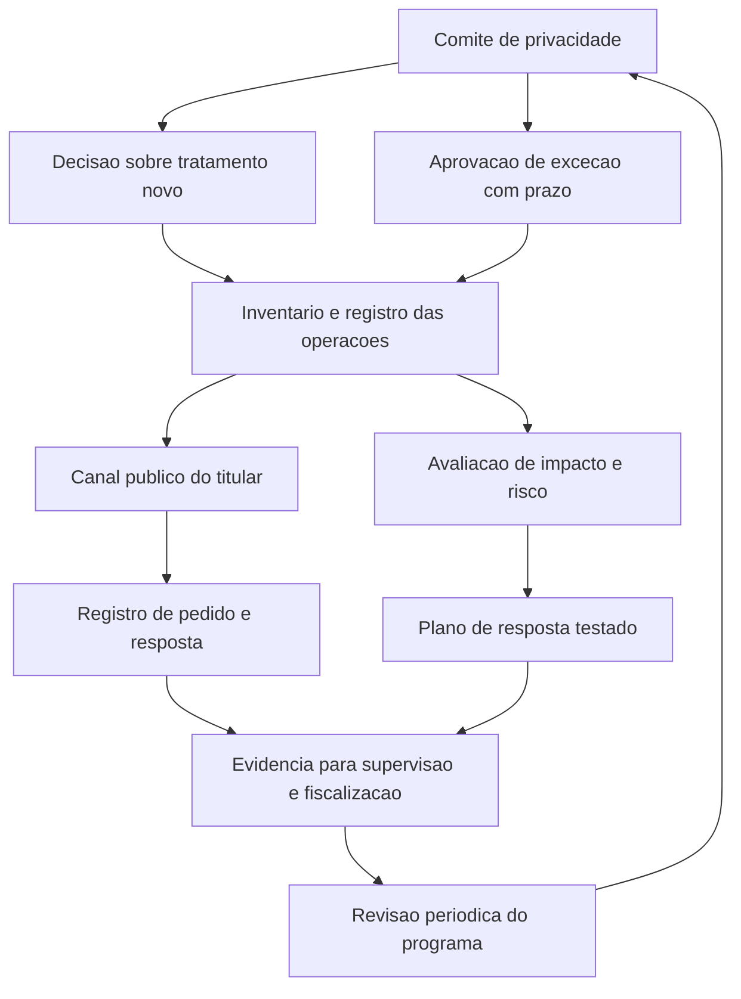

# Programa de privacidade e o papel do encarregado

O art. 50, §2º, da LGPD descreve o que um controlador pode implementar como programa de governança em privacidade, em oito alíneas que vão de demonstrar comprometimento até manter o programa atualizado com monitoramento contínuo. Duas dessas alíneas exigem o que a área de segurança já entrega: políticas e salvaguardas com base em avaliação sistemática de impactos e riscos, e planos de resposta a incidentes e remediação.

## 1. Objetivo de aprendizagem

Ao final deste tema você deve conseguir: especificar um programa de governança em privacidade com papéis, atribuições do encarregado e evidências de supervisão, integrado à governança de segurança existente e rastreável ao art. 50 da LGPD.

## 2. Pré-requisitos

[TEMA-04](TEMA-04-lgpd-bases-legais-direitos-incidentes.md). O programa existe para operar hipóteses legais, direitos e comunicação de incidente; sem esse conteúdo, ele vira organograma.

## 3. Pré-teste

Responda de palpite, antes de ler o resto. Anote a confiança de 1 a 5.

1. Que fração das empresas do seu setor você aposta que publica o nome do encarregado de forma acessível? Chute um percentual.
   Confiança: ___
2. A adoção de programa de governança em privacidade altera o valor de uma multa aplicada pela ANPD? Aposte sim, não ou não sei.
   Confiança: ___
3. Se um titular reclamar amanhã, a sua empresa consegue provar o que fez com o dado dele nos últimos dois anos? Aposte antes de ler.
   Confiança: ___
## 4. Caso real

Uma indústria nomeia o gerente de infraestrutura como encarregado, acumulando a função com a de gestor de segurança da informação. O e-mail de contato existe em uma página interna do portal do fornecedor, atrás de login. O comitê de privacidade reúne uma vez por ano, sem ata. A empresa tem inventário de dados parcial, registro das operações de tratamento em planilha mantida por um estagiário e nenhum relatório de impacto.

Quando um titular reclama à ANPD sobre uso indevido de dado em cobrança, a empresa descobre que não tem como provar nada do que fez. O caso deixa aberta a pergunta que o conteúdo resolve: o que um programa de privacidade precisa ter para servir de evidência, e não de intenção.

## 5. Conteúdo

### 5.1 Conceito

O art. 41 da LGPD estabelece que o controlador deve indicar encarregado pelo tratamento de dados pessoais e que a identidade e as informações de contato do encarregado devem ser divulgadas publicamente, de forma clara e objetiva, preferencialmente no sítio eletrônico do controlador. O §2º lista as atividades: aceitar reclamações e comunicações dos titulares, prestar esclarecimentos e adotar providências; receber comunicações da autoridade nacional e adotar providências; orientar funcionários e contratados sobre as práticas relativas à proteção de dados pessoais; e executar as demais atribuições determinadas pelo controlador ou estabelecidas em normas complementares. O §3º permite que a ANPD estabeleça normas complementares sobre a definição e as atribuições do encarregado, inclusive hipóteses de dispensa da indicação, conforme a natureza e o porte da entidade ou o volume de operações.

O art. 50 trata das regras de boas práticas e de governança, que controladores e operadores podem formular individualmente ou por meio de associações, e do programa de governança em privacidade que o §2º descreve. O programa, no texto legal, deve no mínimo demonstrar o comprometimento do controlador em adotar processos e políticas internas que assegurem o cumprimento de normas e boas práticas relativas à proteção de dados pessoais; ser aplicável a todo o conjunto de dados pessoais sob seu controle, independentemente do modo como se realizou a coleta; ser adaptado à estrutura, à escala e ao volume das operações e à sensibilidade dos dados; estabelecer políticas e salvaguardas adequadas com base em processo de avaliação sistemática de impactos e riscos à privacidade; ter o objetivo de estabelecer relação de confiança com o titular, por meio de atuação transparente e de mecanismos de participação; estar integrado à estrutura geral de governança, com mecanismos de supervisão internos e externos; contar com planos de resposta a incidentes e remediação; e ser atualizado continuamente com base em monitoramento e avaliações periódicas. O §3º determina que as regras de boas práticas e governança sejam publicadas e atualizadas periodicamente, podendo ser reconhecidas e divulgadas pela ANPD.

### 5.2 Como funciona

O programa se monta em quatro trilhos, e cada um tem dono e evidência.

Trilho de decisão: comitê com pauta fixa de privacidade, com atas, decisões sobre novos tratamentos e aprovação de exceções. É onde a hipótese legal de um tratamento novo é aprovada ou recusada. Sem ata, não há evidência de supervisão.

Trilho de registro: inventário de dados pessoais e registro das operações de tratamento, com revisão periódica e porta de entrada no ciclo de mudança do projeto. É a base de qualquer resposta à ANPD.

Trilho de direitos: canal público do titular, fluxo de atendimento com prazos, registro de cada pedido e de cada resposta, e escalonamento para o encarregado. O art. 18, §6º, exige informar de imediato os agentes com quem houve uso compartilhado, para que repitam o procedimento.

Trilho de incidente e risco: procedimento de avaliação de impacto, plano de resposta a incidentes testado e registro de decisão de comunicação, com o critério de risco ou dano relevante aplicado e arquivado.

A LGPD traça o encarregado em um artigo; a ANPD detalhou o resto. A Resolução CD/ANPD nº 18, de 16 de julho de 2024, exige que a indicação seja **ato formal**, escrito, datado e assinado, com as formas de atuação e as atividades, apresentável à ANPD quando solicitada ([in.gov.br](https://www.in.gov.br/en/web/dou/-/resolucao-cd/anpd-n-18-de-16-de-julho-de-2024-572632074), acessado em 2026-09-25). A divulgação vai em local de destaque e de fácil acesso no sítio eletrônico, com nome completo quando pessoa natural, ou nome empresarial mais o nome completo do responsável quando pessoa jurídica — e o contato precisa viabilizar tanto o exercício de direitos pelo titular quanto o recebimento de comunicações da ANPD.

Dois pontos decidem a escolha na prática. O primeiro é quem pode ser: pessoa natural interna ou externa, ou pessoa jurídica, e a norma **não exige certificação, formação nem inscrição em entidade** — o que derruba a ideia de que encarregado é credencial. O segundo é de quem é a responsabilidade: a autonomia técnica é obrigação **do agente**, que deve prover recursos, garantir atuação livre de interferência e assegurar acesso direto ao mais alto nível hierárquico; a conformidade continua sendo do agente de tratamento, não do encarregado. Conflito de interesse na acumulação de funções pode ensejar sanção ao agente. Poder público publica a indicação em Diário Oficial.

### 5.3 Exemplo resolvido

Volte ao caso da indústria. Cinco correções, em ordem de custo crescente.

Passo 1, tirar o encarregado do esconderijo. O art. 41, §1º, exige divulgação pública da identidade e do contato, preferencialmente no sítio eletrônico. Publicar o canal em página de acesso livre, com nome da função e endereço de e-mail funcional, é a correção mais barata e a mais visível para o titular.

Passo 2, resolver o conflito de papéis. Acumular encarregado e gestor de segurança não é proibido pela lei, e cria conflito quando o encarregado precisa reportar um problema de segurança ao controlador. A decisão recomendada é separar a função de reporte da função de operação, com acesso direto à diretoria, ou registrar formalmente o tratamento do conflito e o caminho de escalonamento.

Passo 3, dar periodicidade ao comitê. Uma reunião por ano não produz supervisão. Pauta mensal com ata, e aprovação de tratamento novo como item obrigatório, atende a alínea f do §2º, que exige integração à estrutura geral de governança com mecanismos de supervisão internos e externos.

Passo 4, sair da planilha do estagiário. O registro das operações de tratamento precisa de dono nomeado, revisão trimestral e ligação com o ciclo de mudança. O art. 8º do Regulamento de Comunicação de Incidente de Segurança deixa claro o custo de não ter isso: a ANPD pode pedir o registro durante a apuração de um incidente.

Passo 5, produzir o que a lei chama de avaliação sistemática. Avaliação de impacto por tratamento de alto risco, com riscos, medidas e responsável, alimenta as políticas e salvaguardas da alínea d.

O efeito sobre a sanção é concreto. O art. 52, §1º, manda a ANPD considerar, entre os critérios de dosimetria, a adoção reiterada e demonstrada de mecanismos e procedimentos internos capazes de minimizar o dano, a adoção de política de boas práticas e governança e a pronta adoção de medidas corretivas. Programa não elimina a sanção; programa entra na conta.

### 5.4 Problema de completar

Caso novo: um e-commerce com 400 mil clientes quer lançar um programa de fidelidade com coleta de dado de localização, categoria de produto preferida e histórico de navegação cruzado com o cadastro. A área de marketing quer lançar em 60 dias.

Preencha as etapas e feche as duas últimas.

1. Quem decide, em que instância, e qual evidência a decisão precisa deixar. __________
2. Quais tratamentos novos entram no registro das operações de tratamento e com qual hipótese legal. __________
3. Quais dos tratamentos exigem avaliação de impacto e por qual critério. __________
4. O que precisa existir no canal do titular antes do lançamento. __________
5. Como o programa prova, seis meses depois, que a supervisão funcionou. __________

## 6. Por que isso importa para o CISO

Programa de privacidade é a parte que a ANPD examina quando quer saber se a empresa sabe o que faz. As competências da ANPD incluem fiscalizar e aplicar sanções em processo administrativo com contraditório, apreciar petições de titular contra controlador depois de reclamação não solucionada no prazo, editar regulamentos sobre relatórios de impacto para tratamentos de alto risco, realizar auditorias ou determinar sua realização e implementar mecanismos simplificados de reclamação. O art. 55-K confirma que a aplicação das sanções compete exclusivamente à ANPD, que é o órgão central de interpretação da lei.

Para o CISO, há uma consequência de arquitetura organizacional. Quatro dos oito itens do programa já existem dentro de governança de segurança: avaliação de risco, política, plano de resposta a incidentes e monitoramento. Reaproveitar esses processos, com o dado pessoal como escopo, custa uma fração de montar um programa paralelo — e evita a empresa ter duas versões da mesma resposta de incidente. O que precisa ser novo é o trilho de direitos do titular e o registro das operações de tratamento, que não têm equivalente em segurança da informação.

## 7. Aplicação prática

Escreva, em uma página, o mandato do encarregado da sua empresa: quem ocupa, a quem reporta, quais decisões pode tomar sozinho, quais escalona, como o contato é publicado e como o conflito com a função de segurança é tratado. Confira contra os quatro itens do art. 41, §2º.

Depois audite as cinco evidências do programa: ata do comitê nos últimos seis meses, registro das operações de tratamento com data de revisão, log de pedidos de titular com prazo de resposta, avaliação de impacto do último tratamento de alto risco e relatório do último exercício de comunicação de incidente. Cada evidência ausente é um item do plano de ação, com dono e prazo.

## 8. Autoexplicação

Explique em três frases, sem consultar o texto, o que distingue o encarregado de um controlador de dados. Conecte isso a algo que você já faz: quem na sua empresa assina a resposta a uma reclamação de titular enviada à ANPD?

## 9. Erros comuns e equívocos

| Equívoco | Por que está errado | O que é correto |
|---|---|---|
| Nomear o encarregado cumpre a obrigação | A lei exige também divulgar publicamente identidade e contato, e o programa exige canal e atribuições em operação | Publique o contato em página de livre acesso e registre o fluxo de atendimento |
| Programa de privacidade é documento de política | O art. 50, §2º, pede processo, supervisão e planos de resposta, com revisão contínua | O programa é um conjunto de processos com dono, ata e evidência de execução |
| Programa paralelo ao de segurança é sinal de maturidade | Duplica avaliação de risco e resposta a incidente, e produz duas versões da verdade | Integre ao que já existe e acrescente o que é específico de privacidade |
| Relatório de impacto é obrigatório para todo tratamento | A lei prevê o relatório e a competência da ANPD de exigi-lo, com foco em alto risco | Priorize tratamento de alto risco e registre o critério de priorização |
| Responder ao titular é trabalho do jurídico | O art. 41, §2º, coloca a recepção de reclamações do titular no encarregado | Defina o fluxo entre atendimento, encarregado e jurídico, com prazo por etapa |

## 10. Recuperação ativa

Responda tudo antes de abrir o gabarito.

1. O que o art. 41 exige do controlador quanto ao encarregado, e quais são as atividades atribuídas no §2º?
2. Quais são os oito elementos mínimos do programa de governança em privacidade descritos no art. 50, §2º?
3. Em que critérios de dosimetria da sanção a existência do programa entra?
4. Quais órgãos compõem a ANPD na estrutura descrita na lei, e quem aplica as sanções da LGPD?
5. O que o art. 18, §6º, exige quando o pedido do titular envolve dado compartilhado com terceiros?

Conferir respostas

1. Indicar encarregado pelo tratamento e divulgar publicamente sua identidade e informações de contato, de forma clara e objetiva, preferencialmente no sítio eletrônico. Atividades: aceitar reclamações e comunicações dos titulares, prestar esclarecimentos e adotar providências; receber comunicações da autoridade nacional e adotar providências; orientar funcionários e contratados sobre práticas de proteção de dados pessoais; e executar as demais atribuições determinadas pelo controlador ou estabelecidas em normas complementares.
2. Demonstrar comprometimento com processos e políticas internas; ser aplicável a todo o conjunto de dados sob controle, independentemente do modo de coleta; ser adaptado a estrutura, escala, volume e sensibilidade; estabelecer políticas e salvaguardas com base em avaliação sistemática de impactos e riscos à privacidade; buscar relação de confiança com o titular, com transparência e participação; estar integrado à estrutura geral de governança, com supervisão interna e externa; contar com planos de resposta a incidentes e remediação; e ser atualizado com monitoramento contínuo e avaliações periódicas.
3. Na adoção reiterada e demonstrada de mecanismos e procedimentos internos capazes de minimizar o dano, na adoção de política de boas práticas e governança e na pronta adoção de medidas corretivas.
4. A ANPD é autarquia de natureza especial vinculada ao Ministério da Justiça e Segurança Pública, composta por Conselho Diretor, Conselho Nacional de Proteção de Dados Pessoais e da Privacidade, Corregedoria, Ouvidoria, Procuradoria, Auditoria e unidades administrativas e especializadas; a aplicação das sanções previstas na LGPD compete exclusivamente à ANPD.
5. O responsável deve informar de maneira imediata os agentes de tratamento com os quais realizou uso compartilhado, para que repitam idêntico procedimento, exceto quando a comunicação seja comprovadamente impossível ou implique esforço desproporcional.

## 11. Revisão espaçada

| Intervalo | O que fazer | Se errar |
|---|---|---|
| D+1 | Responder a seção 10 sem reler | Rebaixar: repetir em D+1 |
| D+7 | Confrontar o mandato do encarregado com os quatro itens do art. 41, §2º | Rebaixar: repetir em D+3 |
| D+30 | Auditar as cinco evidências do programa e atualizar o plano de ação | Rebaixar: repetir em D+7 |

## 12. Conexões com outros temas

Leitura humana do `relacoes` do frontmatter — que é a fonte. Relações que saem desta área
também aparecem em [mapa-relacoes.md](../mapa-relacoes.md). Regras em
[templates/RELACOES-TEMAS.md](../templates/RELACOES-TEMAS.md).

| Relação | Alvo | Por que |
|---|---|---|
| nao_confundir_com | 02-governanca-risco-compliance#TEMA-04 | o sistema de gestão de segurança da informação organiza controles; o programa de governança em privacidade decide finalidade, hipótese legal e direitos do titular |
| nao_confundir_com | 17-lideranca-ciso#TEMA-01 | o mandato do CISO responde pelo risco de segurança; o do encarregado responde pela legitimidade do tratamento e pelo canal do titular |

## 13. Certificações e leitura recomendada

| Certificação | Domínio coberto | Leitura recomendada |
|---|---|---|
| CDPSE | Quatro domínios de privacidade embutida em sistemas, cujos nomes a página oficial não publica | [Lei nº 13.709, de 14 de agosto de 2018](https://www2.camara.leg.br/legin/fed/lei/2018/lei-13709-14-agosto-2018-787077-normaatualizada-pl.pdf) |
| CIPP/E | Direito europeu de proteção de dados, na concentração europeia da família CIPP | [ANPD](https://www.gov.br/anpd/pt-br) |
## 14. Fontes verificadas

| # | Título | Tipo | URL | Acessado em | Confiança |
|---|---|---|---|---|---|
| 1 | Lei nº 13.709, de 14 de agosto de 2018 — texto atualizado | primaria | https://www2.camara.leg.br/legin/fed/lei/2018/lei-13709-14-agosto-2018-787077-normaatualizada-pl.pdf | "2026-09-25" | alta |
| 2 | ANPD — página inicial oficial | primaria | https://www.gov.br/anpd/pt-br | "2026-09-25" | media |

Não confirmados nesta execução: o conteúdo das normas complementares da ANPD sobre definição e atribuições do encarregado e sobre hipóteses de dispensa de indicação; o conteúdo do regulamento de fiscalização e do processo administrativo sancionador; a existência de programa de reconhecimento ou certificação de programas de governança em privacidade pela ANPD.

---

| Navegação | |
|---|---|
| Área | [14 Dados, privacidade e LGPD/GDPR](./README.md) |
| Tema anterior | [TEMA-05](TEMA-05-gdpr-transferencia-internacional.md) |
| Home | [README](../README.md) |
