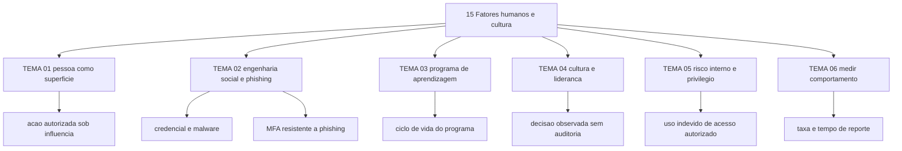

# Fatores humanos e cultura de segurança

A NIST publicou em setembro de 2024 a SP 800-50 Rev. 1, *Building a Cybersecurity and Privacy Learning Program*, que substitui a edição de 2003 e declara que o programa deve "encourage behavior change as part of risk management and lead to developing a privacy and security culture in the organization". Entre as palavras-chave da publicação estão `behavior change`, `role-based`, `security culture` e `metrics`
(https://csrc.nist.gov/pubs/sp/800/50/r1/final, acessado em 25/09/2026).

A ENISA registra, em comunicado de 26/09/2023, que o *phishing* se tornou o vetor inicial mais comum e que "social engineering is the most popular attack type to gain access to an organisation", e reproduz a frase do seu diretor executivo: "One of the weakest links in cybersecurity is humans."
(https://www.enisa.europa.eu/news/emerging-technologies-make-it-easier-to-phish, acessado em 25/09/2026).

O custo de ignorar esta área aparece na estrutura do guia conjunto CISA, NSA, FBI e MS-ISAC contra *phishing*: as mitigações alinham treinamento de usuário, DMARC em `reject`, MFA resistente a *phishing* e menor privilégio ao mesmo conjunto de metas de desempenho. Quem trata conscientização como substituto de controle técnico paga o treinamento e mantém a conta de administrador protegida por SMS.

## 1. Introdução

### 1.1 O que é esta área

Comportamento humano como superfície de ataque e como ponto de decisão, engenharia social, programa de aprendizagem com ciclo de vida, cultura, uso indevido de acesso autorizado e medição de comportamento.

Está dentro do escopo: por que uma decisão legítima é explorada, como o programa de aprendizagem se estrutura em ciclo, onde a liderança aparece no comportamento observado, como tratar risco interno sem confundir erro com intenção, e como escolher indicador sem inventar número.

Está fora do escopo: o controle técnico. MFA, identidade e privilégio pertencem a [04 Identidade, acesso e zero trust](../04-identidade-acesso/README.md); filtro de e-mail, DNS e web, a [05 Rede e infraestrutura](../05-rede-infraestrutura/README.md); detecção, a [10 Operações de segurança e SOC](../10-operacoes-soc/README.md); resposta, a [11 Resposta a incidentes e forense](../11-resposta-forense/README.md); base legal para tratar dado de empregado, a [14 Dados, privacidade e LGPD/GDPR](../14-dados-privacidade/README.md).

### 1.2 Por que isso importa para o CISO

O guia do CISA lista, entre as mitigações recomendadas a todas as organizações, "Implement user training on social engineering and phishing attacks [CPG 2.I]", ao lado de DMARC configurado em `reject` [CPG 2.M] e MFA por FIDO ou PKI [CPG 2.H]. A mesma publicação afirma que as formas de MFA sem FIDO ou PKI continuam "susceptible to malicious actors using compromised legitimate credentials to authenticate as the user in legitimate login portals", e manda priorizar MFA resistente a *phishing* para contas de administrador e de usuário privilegiado
(https://www.cisa.gov/sites/default/files/2025-03/Phishing%20Guidance%20-%20Stopping%20the%20Attack%20Cycle%20at%20Phase%20One%20508.pdf, acessado em 25/09/2026).

Isso converte "cultura de segurança" em duas decisões orçamentárias separadas: que conta recebe qual tipo de MFA, e que conteúdo o programa de aprendizagem entrega para quem. Uma decisão não paga a outra. A NIST declara que o programa deve produzir mudança de comportamento como parte da gestão de risco, o que coloca o resultado fora da sala de treinamento e dentro da operação.

Há uma consequência pouco discutida na investigação de incidente. Quando a fraude usa uma ação autorizada — a pessoa abre o portal e digita a credencial — o registro do sistema mostra um acesso legítimo. Sem uma segunda fonte, a pergunta "quem fez isso" tem a resposta errada. A leitura de detecção que sustenta esse tipo de caso está em [TEMA-03 de Operações e SOC](../10-operacoes-soc/TEMA-03-deteccao-regras-casos-de-uso-e-mitre-attack.md).

### 1.3 O que você será capaz de fazer ao final

- Explicar por que o humano é explorado, nomeando a decisão atacada e o mecanismo de influência, sem recorrer à expressão "falha do usuário".
- Identificar os sinais de engenharia social em uma mensagem, ligação ou pedido recebido no seu ambiente e apontar o controle que reduz o alcance do ataque.
- Montar um programa de aprendizagem com público, currículo, canal, ciclo e evidência de comportamento.
- Justificar investimento em cultura usando comportamento observado em vez de contagem de treinamentos concluídos.
- Delimitar o que é risco interno e ligá-lo ao controle de acesso privilegiado, com o registro que sustenta a decisão de investigar ou não.

### 1.4 Os temas desta área, em prosa

O TEMA-01 trata da razão pela qual a decisão humana é alvo: a exploração usa uma autorização que já existe, o que a torna mais barata que quebrar um controle. O TEMA-02 entra na mecânica do *phishing* e da engenharia social, separando roubo de credencial de entrega de *malware*, e mostrando onde o MFA deixa de proteger. O TEMA-03 monta o programa: ciclo de vida, segmentação por papel, canal e cadência. O TEMA-04 trata da parte que o programa não produz sozinho, que é o comportamento de quem lidera. O TEMA-05 cobre o uso indevido de acesso autorizado, o programa de risco interno e o limite entre erro e intenção. O TEMA-06 fecha com a escolha do indicador, no lugar da taxa de cliques.

## 2. Objetivos de aprendizagem (terminais)

| # | Objetivo | Bloom | Temas que o sustentam |
|---|---|---|---|
| 1 | Explicar por que o humano é explorado, nomeando o mecanismo de influência e a decisão legítima que o ataque usa, com um exemplo real do próprio ambiente. | entender | TEMA-01, TEMA-02 |
| 2 | Identificar, em uma mensagem, ligação ou pedido recebido na sua organização, os sinais de engenharia social e o controle que reduz o alcance daquele ataque. | aplicar | TEMA-02, TEMA-03 |
| 3 | Montar um programa de aprendizagem de 12 meses com público, currículo, canal, ciclo e evidência de mudança de comportamento. | criar | TEMA-03, TEMA-06 |
| 4 | Justificar, diante do comitê, o investimento em cultura de segurança com comportamento observado, declarando o que ainda não é medido. | avaliar | TEMA-04, TEMA-06 |
| 5 | Avaliar uma situação interna ambígua e decidir se ela é risco interno, erro operacional ou incidente externo, citando o registro exigido pela decisão. | avaliar | TEMA-05 |

## 3. Diagrama dos tópicos

## 4. Temas

| # | tema_id | Tema | Nível | Tempo |
|---|---|---|---|---|
| 1 | TEMA-01 | O fator humano: por que pessoas são exploradas | base | 30-40 min |
| 2 | TEMA-02 | Engenharia social e phishing | base | 35-45 min |
| 3 | TEMA-03 | Programa de conscientização que funciona | intermediario | 40-50 min |
| 4 | TEMA-04 | Cultura de segurança e o papel da liderança | base | 30-40 min |
| 5 | TEMA-05 | Insider threat e o acesso privilegiado humano | intermediario | 40-50 min |
| 6 | TEMA-06 | Medir comportamento, não cliques | intermediario | 35-45 min |

## 5. Pré-requisitos e sequência

A área pressupõe o vocabulário de risco e controle do guia básico e dos fundamentos, e o vocabulário de comunicação executiva da liderança, que é onde a mensagem de cultura é decidida. Ela fica antes do bloco de identidade e do bloco de operações porque os dois consomem o mesmo objeto: a decisão de uma pessoa autorizada.

| Antes | Esta área | Depois |
|---|---|---|
| [00 Guia básico do CISO](../00-guia-basico/README.md) | [15 Fatores humanos e cultura de segurança](./README.md) | [04 Identidade, acesso e zero trust](../04-identidade-acesso/README.md) |
| [01 Fundamentos](../01-fundamentos/README.md) | | [10 Operações de segurança e SOC](../10-operacoes-soc/README.md) |
| [17 Liderança e gestão do CISO](../17-lideranca-ciso/README.md) | | |

Dentro da área, a sequência sugerida é TEMA-01, TEMA-02, TEMA-03, TEMA-04, TEMA-05, TEMA-06. Quem já responde por investigação interna pode ler TEMA-05 antes de TEMA-03: o programa de risco interno depende de acordo com Recursos Humanos e Jurídico, que o programa de aprendizagem não resolve.

## 6. Certificações desta área

O frontmatter desta área não declara sigla. Os domínios de exame que tocam comportamento humano não foram conferidos em fonte oficial nesta execução.

| Certificação | Sigla | O que cobriria aqui | Situação |
|---|---|---|---|
| Nenhuma declarada | — | — | NAO CONFIRMADO em fonte oficial — sem atribuição de domínio conferida nesta execução |

Leitura direta recomendada, em vez de sigla: NIST SP 800-50 Rev. 1 na íntegra; a seção de mitigações do guia conjunto de *phishing*; e o guia do SEI sobre risco interno.

Ver: [90-certificacoes/](../90-certificacoes/README.md).

## 7. Conexões com outras áreas

Relações de saída dos temas desta área que apontam para fora dela, agregadas do frontmatter
`relacoes`. A visão consolidada está em [mapa-relacoes.md](../mapa-relacoes.md); as regras, em
[templates/RELACOES-TEMAS.md](../templates/RELACOES-TEMAS.md). Alvos marcados como pendentes
ainda não foram escritos.

| Tema daqui | Relação | Destino | Por que |
|---|---|---|---|
| TEMA-01 | aplicado_em | 13-ofensiva-pentest#TEMA-04 | o exercício adversarial é onde a exploração do humano é medida com resultado observável, e não presumida |
| TEMA-01 | complementa | 16-ia-seguranca#TEMA-01 | risco de IA chega à pessoa pelo canal que ela já usa, e sem a leitura do fator humano o controle de uso de IA vira bloqueio de ferramenta |
| TEMA-02 | aplicado_em | 10-operacoes-soc#TEMA-03 | a mensagem que já convenceu alguém só vira detecção se a regra aceitar como sinal um acesso autorizado fora do padrão da conta |
| TEMA-02 | complementa | 05-rede-infraestrutura#TEMA-05 | o filtro de e-mail, DNS e web corta o alcance do clique que o programa de conscientização tenta evitar, e os dois olham o mesmo evento por lados diferentes |
| TEMA-03 | aplicado_em | 02-governanca-risco-compliance#TEMA-02 | o texto da norma vira rotina quando o programa de aprendizagem o traduz para a decisão que cada público toma no dia de trabalho |
| TEMA-03 | aplicado_em | 04-identidade-acesso#TEMA-03 | o prazo de retirada de acesso no desligamento depende de gestor e de Recursos Humanos agirem, e os dois são público nomeado do programa |
| TEMA-04 | aplicado_em | 17-lideranca-ciso#TEMA-04 | a comunicação executiva é o instrumento pelo qual a liderança enuncia o que a cultura deve sustentar em caso de conflito |
| TEMA-04 | complementa | 16-ia-seguranca#TEMA-06 | uso não governado de ferramenta cede ao critério que a liderança sustenta, e não ao bloqueio de rede, o que coloca os dois temas no mesmo conflito |
| TEMA-05 | aplicado_em | 04-identidade-acesso#TEMA-04 | a revisão periódica de acesso é o controle que remove privilégio acumulado, que é a matéria-prima do uso indevido de acesso autorizado |
| TEMA-05 | nao_confundir_com | 04-identidade-acesso#TEMA-05 | o cofre de credencial controla o empréstimo e o registro da credencial privilegiada; risco interno trata a decisão de quem já tem o acesso |
| TEMA-06 | aplicado_em | 02-governanca-risco-compliance#TEMA-06 | o indicador de comportamento entra no mesmo relatório de métricas e reporte que o comitê já recebe, com a mesma exigência de decisão associada |
| TEMA-06 | aplicado_em | 10-operacoes-soc#TEMA-05 | a crítica a indicador de volume e a exigência de dono por métrica valem igual para o indicador do programa de comportamento |

## 8. Atividades práticas e laboratórios

| # | Atividade | O que a prática demonstra | Pré-requisito técnico |
|---|---|---|---|
| 1 | Listar as cinco últimas mensagens suspeitas relatadas por colegas e anotar qual decisão cada uma pedia | A exploração ataca decisão, e a decisão está registrada | nenhum |
| 2 | Pedir à equipe de e-mail os três controles ativos — DMARC, filtro e bloqueio — e conferir a política de saída em `reject` | Controle técnico e programa de aprendizagem cobrem camadas diferentes | acesso ao painel do provedor de e-mail |
| 3 | Montar o mapa de público do programa em quatro camadas e marcar quem tem acesso privilegiado | Segmentação por papel antes de comprar curso | lista de cargos |
| 4 | Escrever três métricas de comportamento com definição, dono e decisão que cada uma dispara | Indicador sem decisão associada não sobrevive ao primeiro ciclo | acesso a dados de *help desk* |
| 5 | Desenhar o fluxo de reporte interno de mensagem suspeita, do botão ao registro, com prazo de resposta | Mede-se tempo de reporte, não taxa de clique | caixa de e-mail de segurança |

## 9. Checkpoint da área

Checkpoint somativo e intercalado, montado a partir das seções 10 dos temas: nenhuma questão inédita entra aqui, e a ordem embaralhada é intencional.

1. Qual é a diferença entre *phishing* para obter credencial e *phishing* para instalar *malware*, e por que ela muda a mitigação? (TEMA-02)
2. Onde termina o programa de aprendizagem e começa o problema de cultura? (TEMA-04)
3. Um gestor relata que o indicador de cliques caiu no trimestre. Qual pergunta você faz antes de aceitar o número? (TEMA-06)
4. Por que a exploração de uma pessoa é mais barata para o atacante do que explorar uma falha técnica? (TEMA-01)
5. Quais funções o guia do SEI nomeia como interessadas no programa de risco interno, e por que segurança da informação sozinha não fecha o programa? (TEMA-05)
6. Quais são as quatro etapas do ciclo de vida descritas na edição de 2003 da NIST SP 800-50, e o que a edição de 2024 mudou no vocabulário? (TEMA-03)

Conferir respostas e critério

1. A primeira entrega credencial para acesso inicial; a segunda executa código para atividade subsequente, como escalar privilégio e manter persistência. A defesa muda: bloqueio de credencial exige MFA resistente a *phishing* e revisão de sessão; bloqueio de execução exige *allowlist* de aplicação, bloqueio de macro por padrão e isolamento de navegação.
2. No momento em que o comportamento observado de quem tem autoridade contradiz o que foi ensinado. O programa entrega conteúdo; a cultura aparece na decisão de quem poderia aplicar exceção e não aplica.
3. Qual foi a definição do indicador, se as simulações foram anunciadas, quem clicou, e qual comportamento real mudou depois disso.
4. Porque a pessoa já tem autorização legítima. O ataque não precisa quebrar controle nenhum: ele convence o dono da autorização a usá-la em favor de terceiro.
5. Management, Human Resources, Legal Counsel, Physical Security, Information Technology, Information Security, Data Owners e Software Engineers. Segurança da informação sozinha não tem alçada sobre contratação, desligamento, disciplina nem sobre a base legal de tratamento de dado de empregado.
6. *Awareness and training program design*; *awareness and training material development*; *program implementation*; *post-implementation*. A edição de 2024 substitui o vocabulário de programa de conscientização por programa de aprendizagem que abrange segurança e privacidade, declara mudança de comportamento como objetivo ligado à gestão de risco e inclui métricas e métodos de avaliação.

Critério para seguir adiante: 80% de acerto sem consultar os temas.

## 10. Termos desta área

- engenharia social
- phishing e spearphishing
- MFA resistente a phishing
- fatigue de MFA
- programa de aprendizagem
- conscientização, treinamento e educação
- segmentação por papel
- cultura de segurança
- mudança de comportamento
- risco interno
- uso indevido de acesso autorizado
- indicador de comportamento
- taxa e tempo de reporte
- canal de reporte
- engenharia social por chat e por voz

## 11. Fontes verificadas

| # | Título | Tipo | URL | Acessado em | Confiança |
|---|---|---|---|---|---|
| 1 | NIST SP 800-50 Rev. 1, *Building a Cybersecurity and Privacy Learning Program*, setembro de 2024 | primaria | https://csrc.nist.gov/pubs/sp/800/50/r1/final | "2026-09-25" | alta |
| 2 | NIST SP 800-50, edição de outubro de 2003, retirada em 12/09/2024 | primaria | https://csrc.nist.gov/pubs/sp/800/50/final | "2026-09-25" | alta |
| 3 | CISA, NSA, FBI e MS-ISAC, *Phishing Guidance: Stopping the Attack Cycle at Phase One*, outubro de 2023 | primaria | https://www.cisa.gov/sites/default/files/2025-03/Phishing%20Guidance%20-%20Stopping%20the%20Attack%20Cycle%20at%20Phase%20One%20508.pdf | "2026-09-25" | alta |
| 4 | ENISA, *Emerging technologies make it easier to phish*, 26/09/2023 | primaria | https://www.enisa.europa.eu/news/emerging-technologies-make-it-easier-to-phish | "2026-09-25" | alta |
| 5 | SEI, *Common Sense Guide to Mitigating Insider Threats*, 7ª edição, 07/09/2022 | primaria | https://www.sei.cmu.edu/library/common-sense-guide-to-mitigating-insider-threats-seventh-edition/ | "2026-09-25" | alta |
| 6 | CISA, *Insider Threat Mitigation Guide* | primaria | https://www.cisa.gov/resources-tools/resources/insider-threat-mitigation-guide | "2026-09-25" | media |
| 7 | NIST SP 800-61 Rev. 3, abril de 2025 | primaria | https://csrc.nist.gov/pubs/sp/800/61/r3/final | "2026-09-25" | alta |
| 8 | NIST CSRC, *Awareness, Training, and Education*, índice de publicações | primaria | https://csrc.nist.gov/Projects/Awareness-Training-Education/publications | "2026-09-25" | media |

### NAO CONFIRMADO em fonte oficial nesta área

| Item | Situação |
|---|---|
| Percentual de incidentes atribuído a erro humano | Nenhuma estatística desse tipo foi lida em fonte primária nesta execução. Não usar em material de conscientização nem em pedido de verba |
| Taxas de cliques em simulação de *phishing* e eficácia comparada de treinamento | Não lidas em fonte primária nesta execução |
| Efeito quantificado do exemplo da liderança sobre o comportamento de segurança | Não localizado em fonte primária; tratado como hipótese operacional, não como fato medido |
| Numeração e redação dos controles da família *Awareness and Training* do NIST SP 800-53 Rev. 5 | O nome da família aparece na página oficial da NIST SP 800-50; a numeração não foi conferida no catálogo primário |
| Contagem e conteúdo dos controles de pessoas do Anexo A da ISO/IEC 27001:2022 | Texto da norma é pago; não conferido |
| Data e conteúdo da última revisão do *Insider Threat Mitigation Guide* do CISA | A existência do guia foi confirmada no índice do domínio cisa.gov; a página não abriu nesta execução |

---

| Navegação | |
|---|---|
| Anterior | [14 Dados, privacidade e LGPD/GDPR](../14-dados-privacidade/README.md) |
| Próximo | [04 Identidade, acesso e zero trust](../04-identidade-acesso/README.md) |
| Home | [README](../README.md) |
