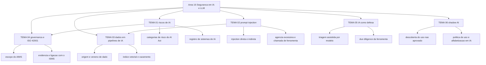

# Segurança em IA e LLM

A edição 2025 do OWASP Top 10 for LLM Applications lista dez riscos, numerados de LLM01 prompt injection a LLM10 unbounded consumption, e mantém a edição 2023-24 publicada como arquivo ([genai.owasp.org](https://genai.owasp.org/llm-top-10/), acessado em 2026-09-25). A ISO/IEC 42001:2023, edição 1, publicada em 18 de dezembro de 2023, com 51 páginas, é o primeiro padrão de sistema de gestão de inteligência artificial e se aplica a organizações que fornecem ou utilizam produtos e serviços baseados em IA ([iso.org](https://www.iso.org/standard/42001), acessado em 2026-09-25).

Esta área é uma **extensão** do roadmap. Nenhum dos frameworks que ancoram as outras quinze áreas foi escrito com IA generativa em mente: o CSEC2017 tem oito knowledge areas e não trata de modelo de linguagem, prompt ou dado de treino; o NIST CSF 2.0 organiza o programa em seis funções e não menciona IA. A ancoragem aqui é outra: ISO/IEC 42001:2023 para o sistema de gestão, ISO/IEC 23894:2023 para gestão de risco de IA — edição 1, publicada em 6 de fevereiro de 2023, 26 páginas ([iso.org](https://www.iso.org/standard/77304.html), acessado em 2026-09-25) —, o OWASP Top 10 for LLM Applications 2025 para a taxonomia de risco de aplicação e o MITRE ATLAS, descrito no próprio site como base de conhecimento de táticas e técnicas adversariais envolvendo IA, incluindo ataques contra sistemas com IA e manipulação de capacidades de IA ([atlas.mitre.org](https://atlas.mitre.org/), confirmado pelo índice de busca do domínio em 2026-09-25).

A regra de honestidade desta área é a mesma do resto do repositório, aplicada a um campo sem norma consolidada. O NIST AI RMF aparece como ancoragem declarada porque é a referência de gestão de risco de IA citada no mercado, mas o documento **não foi acessado nesta execução**: o PDF em nvlpubs.nist.gov e a página do projeto em nist.gov devolveram erro 504. Versão, data de publicação e estrutura de funções do AI RMF ficam como `NAO CONFIRMADO em fonte oficial`. Nenhuma certificação de segurança de IA foi confirmada nesta execução. Não existe, até aqui, um documento único que diga o que é "controle de segurança de IA" com o mesmo grau de fechamento que a ISO/IEC 27002 dá aos controles de segurança da informação.

## 1. Introdução

### 1.1 O que é esta área

A área cobre seis assuntos: a taxonomia de risco dos sistemas de IA, prompt injection e manipulação de modelo, segurança do dado que entra e sai do pipeline de IA, governança de IA com a ISO/IEC 42001:2023, IA como ferramenta de defesa e uso não governado de IA na empresa.

Está dentro do escopo o que o CISO assina: registro de sistemas de IA, critério de aprovação de ferramenta, escopo do sistema de gestão de IA, resposta a incidente em que o modelo é o vetor. Está fora do escopo treinar modelo, ajustar hiperparâmetro e escrever código de agente. O ciclo de vida do dado pessoal que alimenta um modelo pertence a [14-dados-privacidade](../14-dados-privacidade/README.md); o modelo de ameaças da aplicação pertence a [03-arquitetura-engenharia](../03-arquitetura-engenharia/README.md); o pipeline que publica o agente pertence a [09-aplicacoes-devsecops](../09-aplicacoes-devsecops/README.md).

### 1.2 Por que isso importa para o CISO

A Comissão Europeia registra que o AI Act entrou em vigor em 1 de agosto de 2024 e ficou aplicável em 2 de agosto de 2026, com as proibições e as obrigações de alfabetização em IA valendo desde 2 de fevereiro de 2025 e as obrigações para modelos de uso geral desde 2 de agosto de 2025 ([digital-strategy.ec.europa.eu](https://digital-strategy.ec.europa.eu/en/policies/regulatory-framework-ai), acessado em 2026-09-25). A mesma página descreve o papel de deployer: quem usa um sistema de IA, e não só quem o constrói, responde por obrigações próprias.

Um caso concreto. O jurídico pede um assistente que resuma contratos e o CISO aprova o uso de uma ferramenta pública, porque "não é dado sensível". Seis meses depois, a auditoria interna encontra, no histórico da ferramenta, cláusulas de contrato de três fornecedores e um anexo com dados bancários. Nenhum controle técnico falhou. O que faltou foi um registro de sistemas de IA em uso com dono, classificação do dado de entrada e retenção declarada — e a pergunta "quem responde pelo conteúdo enviado" não tinha resposta escrita. Esta área existe para que essa resposta exista antes da auditoria.

### 1.3 O que você será capaz de fazer ao final

- Classificar cada sistema de IA em uso na empresa nas quatro categorias de risco do AI Act e registrar o papel da organização na cadeia.
- Montar o registro de sistemas de IA em uso, com dono, fornecedor, dado de entrada e retenção, incluindo o uso não aprovado.
- Desenhar o fluxo de dados de um assistente com recuperação de documentos e apontar onde o controle entra.
- Definir o escopo de um AIMS conforme a ISO/IEC 42001:2023, com evidência de operação.
- Escrever os controles de dado que valem para conjunto de treino, base de conhecimento e índice vetorial.
- Avaliar uma ferramenta de segurança que usa IA com seis perguntas de due diligence e um critério de aceitação.

### 1.4 Os temas desta área, em prosa

O [TEMA-01](TEMA-01-riscos-de-ia.md) monta a taxonomia: o que um sistema de IA acrescenta ao registro de risco e como as quatro categorias do AI Act caem sobre a empresa. O [TEMA-02](TEMA-02-prompt-injection.md) trata da falha que dá nome à categoria: instrução e dado chegando ao modelo pelo mesmo canal.

O [TEMA-03](TEMA-03-dados-em-pipelines-de-ia.md) segue o dado, da origem do conjunto de treino ao índice vetorial e à resposta entregue ao usuário. O [TEMA-04](TEMA-04-governanca-ia-iso-42001.md) aplica o sistema de gestão da ISO/IEC 42001:2023 e mostra onde ele encosta no ISMS da ISO/IEC 27001.

O [TEMA-05](TEMA-05-ia-como-ferramenta-de-defesa.md) inverte a direção e olha a IA do lado da defesa, incluindo o que ela estraga quando o time confia no resumo do modelo. O [TEMA-06](TEMA-06-shadow-ai-uso-nao-governado.md) fecha pelo uso real: o que os funcionários já usam sem que a segurança saiba.

## 2. Objetivos de aprendizagem (terminais)

| # | Objetivo | Bloom | Temas que o sustentam |
|---|---|---|---|
| 1 | Classificar 5 sistemas de IA da própria empresa nas quatro categorias de risco do AI Act, registrando para cada um o papel da organização como fornecedora ou deployer. | avaliar | TEMA-01, TEMA-04 |
| 2 | Montar o registro de sistemas de IA em uso, com dono, fornecedor, dado de entrada, retenção e situação de aprovação, incluindo o uso não aprovado. | criar | TEMA-01, TEMA-06 |
| 3 | Explicar prompt injection em uma página, com o desenho do fluxo de dados e o ponto exato onde cada controle entra. | entender | TEMA-02, TEMA-03 |
| 4 | Escrever o escopo de um AIMS conforme a ISO/IEC 42001:2023, com as evidências que a operação precisa produzir por trimestre. | criar | TEMA-04 |
| 5 | Especificar os controles de dado de um pipeline de IA — origem, classificação, retenção e segregação do índice — e justificar cada um por escrito. | aplicar | TEMA-03 |
| 6 | Avaliar uma ferramenta de segurança que usa IA com 6 perguntas de due diligence e um critério de aceitação declarado. | avaliar | TEMA-05 |

## 3. Diagrama dos tópicos

## 4. Temas

| # | tema_id | Tema | Nível | Tempo |
|---|---|---|---|---|
| 1 | TEMA-01 | Riscos de IA e o que muda na segurança | intermediario | 35-45 min |
| 2 | TEMA-02 | Prompt injection e manipulação de modelos | avancado | 40-50 min |
| 3 | TEMA-03 | Segurança de dados em pipelines de IA | avancado | 40-50 min |
| 4 | TEMA-04 | Governança de IA e ISO/IEC 42001 | avancado | 40-45 min |
| 5 | TEMA-05 | IA como ferramenta de defesa | intermediario | 35-45 min |
| 6 | TEMA-06 | Shadow AI: uso não governado | intermediario | 30-40 min |

## 5. Pré-requisitos e sequência

Esta área não é ponto de partida. O [02-governanca-risco-compliance](../02-governanca-risco-compliance/README.md) fornece a régua de aceitação de risco sem a qual o TEMA-01 vira lista de sustos, e o [09-aplicacoes-devsecops](../09-aplicacoes-devsecops/README.md) entrega o vocabulário de validação de entrada e de pipeline do qual o TEMA-02 depende. Serve bem como último bloco do plano recomendado: é a área que exige mais contexto de negócio e menos conhecimento de máquina.

| Antes | Esta área | Depois |
|---|---|---|
| 02-governanca-risco-compliance | 16-ia-seguranca | 91-trilhas |
| 09-aplicacoes-devsecops | 16-ia-seguranca | revisão em 6 meses |

Dentro da área, TEMA-01 é entrada de todos. TEMA-02 e TEMA-03 se leem em par, na ordem que preferir. TEMA-04 só rende depois do TEMA-01, porque o escopo do AIMS é escrito a partir do inventário. TEMA-06 depende do TEMA-04: sem critério de aprovação não existe uso aprovado nem uso não aprovado.

## 6. Certificações desta área

Nenhuma certificação de segurança de IA foi confirmada em fonte oficial nesta execução, e o registro de verificação já anotava que a existência de uma credencial consolidada era indício de que não existe. O que existe e foi confirmado são os padrões, não as credenciais: a ISO comercializa a ISO/IEC 42001:2023 junto da ISO/IEC 27001:2022 no pacote "AI and information security management package" ([iso.org](https://www.iso.org/standard/42001), acessado em 2026-09-25). Siglas de exame e o detalhe de credencial ficam em [90-certificacoes/](../90-certificacoes/README.md); domínios, pesos, custo e validade não são afirmados aqui.

| Certificação | Sigla | O que cobre aqui |
|---|---|---|
| Nenhuma confirmada nesta execução | — | TEMA-01 a TEMA-06 (padrões: ISO/IEC 42001, ISO/IEC 23894, OWASP Top 10 for LLM) |

## 7. Conexões com outras áreas

Relações de saída dos temas desta área que apontam para fora dela, agregadas do frontmatter
`relacoes`. A visão consolidada está em [mapa-relacoes.md](../mapa-relacoes.md); as regras, em
[templates/RELACOES-TEMAS.md](../templates/RELACOES-TEMAS.md). Alvos marcados como pendentes
ainda não foram escritos.

| Tema daqui | Relação | Destino | Por que |
|---|---|---|---|
| TEMA-01 | aplicado_em | 02-governanca-risco-compliance#TEMA-03 | risco de IA só entra no registro com critério de aceitação declarado; o alvo é onde apetite e tolerância são escritos |
| TEMA-01 | complementa | 15-fatores-humanos#TEMA-01 | risco de IA muda o que a pessoa vê e faz; o alvo trata por que gente é explorada e sem isso o controle de uso de IA vira bloqueio de ferramenta; destino planejado |
| TEMA-02 | aplicado_em | 03-arquitetura-engenharia#TEMA-02 | o modelo de ameaças é onde a entrada do prompt entra no diagrama com ativo, ator e fronteira de confiança |
| TEMA-02 | aprofundado_por | 09-aplicacoes-devsecops#TEMA-02 | mesma classe de falha, superfície nova; o alvo trata validação de entrada e de saída no pipeline; destino planejado |
| TEMA-03 | aplicado_em | 14-dados-privacidade#TEMA-02 | classificação e inventário definem o que pode entrar em conjunto de treino e em base de conhecimento |
| TEMA-03 | complementa | 08-cloud#TEMA-05 | conjunto de treino e índice vetorial vivem em armazenamento gerenciado; o outro lado é chave, segregação e ciclo de vida na nuvem; destino planejado |
| TEMA-04 | aplicado_em | 02-governanca-risco-compliance#TEMA-04 | o sistema de gestão de IA usa a mesma mecânica de escopo, evidência e auditoria do ISMS; o alvo é a versão já rodada em segurança da informação |
| TEMA-05 | aplicado_em | 10-operacoes-soc#TEMA-03 | a detecção define o caso de uso e a telemetria que o modelo vai consumir na triagem; sem regra que gere alerta não existe dado para o modelo |
| TEMA-05 | nao_confundir_com | 09-aplicacoes-devsecops#TEMA-04 | regra determinística no pipeline e modelo probabilístico na triagem produzem vereditos de natureza diferente e não se substituem; destino planejado |
| TEMA-06 | aplicado_em | 14-dados-privacidade#TEMA-04 | dado pessoal colado em ferramenta não aprovada é tratamento sem base legal declarada e pode virar incidente comunicável |
| TEMA-06 | complementa | 15-fatores-humanos#TEMA-04 | uso não governado cede a política que a liderança sustenta, e não a bloqueio de rede; o alvo trata cultura e papel da liderança; destino planejado |

## 8. Atividades práticas e laboratórios

| # | Atividade | O que a prática demonstra | Pré-requisito técnico |
|---|---|---|---|
| 1 | Listar todo sistema de IA que a empresa usa hoje, incluindo o que apareceu em despesa de cartão corporativo | Quantos sistemas existem fora do inventário oficial | acesso a notas de despesa e ao SSO |
| 2 | Classificar os 5 sistemas mais críticos nas quatro categorias de risco do AI Act | Quanto do uso interno cai em área de risco alto sem que ninguém tenha avaliado | nenhum |
| 3 | Desenhar o fluxo de dados de um assistente com recuperação de documentos, do upload à resposta | Onde o dado sensível sai do controle da empresa sem controle correspondente | leitura de arquitetura |
| 4 | Escrever a frase de escopo de um AIMS para uma unidade de negócio, com duas exclusões justificadas | Que escopo largo demais torna a primeira auditoria impossível | leitura da ISO/IEC 42001:2023 |
| 5 | Testar, em ambiente controlado, um prompt que pede ao modelo que ignore as instruções anteriores | Que a falha não é do usuário mal-intencionado e sim do desenho do canal | modelo disponível para teste |
| 6 | Aplicar as 6 perguntas de due diligence a uma ferramenta de segurança que anuncia IA | Que "usa IA" não é critério de compra | nenhum |

## 9. Checkpoint da área

Cinco itens retirados dos temas, fora da ordem em que aparecem. Responda antes de abrir o gabarito.

1. Um analista cola um trecho de log com token de sessão em um assistente público para entender o erro. Em que seção do registro de sistemas de IA isso deveria aparecer, e o que a empresa precisa ter escrito antes do episódio? (TEMA-06)
2. Por que colocar um filtro de palavras proibidas na entrada do chat não resolve prompt injection em um assistente que lê documentos da intranet? (TEMA-02)
3. A empresa usa um modelo de terceiro por API e não treina nada. Ainda assim há risco de veneno de dado. Por quê? (TEMA-03)
4. O comitê pede "um ISO 42001". Qual é a primeira entrega concreta, antes de escolher ferramenta ou auditor? (TEMA-04)
5. Um fornecedor de EDR anuncia triagem de alerta por modelo de linguagem. Que duas perguntas decidem se o ganho é real? (TEMA-05)

Conferir respostas e critério

1. No registro de sistemas de IA, na entrada do assistente público, com o campo de dado de entrada e a situação "não aprovado". Antes do episódio a empresa precisava ter política de uso com regra por classificação de dado, lista de ferramentas aprovadas e o prazo de comunicação de incidente com dado pessoal, que pertence ao programa de privacidade.
2. Porque no assistente com recuperação o texto recuperado do documento entra na mesma janela de contexto que a instrução do usuário. Um documento da intranet com uma frase de instrução é lido pelo modelo como ordem legítima, e nenhuma lista de palavras proibidas cobre a variedade de formulações.
3. Porque o dado que entra pela base de conhecimento e pelo índice vetorial também é instrução em potencial e também define o que o modelo responde. Envenenar um documento indexado altera respostas sem tocar nos pesos do modelo, e o modelo de terceiro não muda isso.
4. O inventário de sistemas de IA em uso, com dono e papel da organização, seguido da frase de escopo do sistema de gestão. Sem inventário não existe contexto da organização, e sem escopo não existe auditoria possível.
5. Como o modelo foi avaliado em dados parecidos com a telemetria da empresa e qual é a taxa de falso positivo e de falso negativo medida, com o analista humano no circuito. Anúncio de fornecedor não é medida.

Critério para seguir adiante: acertar 80% ou mais sem consultar os temas. Erro no item 1 ou no item 4 indica que inventário e governança ainda não estão ligados; releia o TEMA-06 e o TEMA-04 antes de seguir.

## 10. Termos desta área

Termos que o glossário central precisa conter; as definições curtas ficam em [glossario.md](../glossario.md).

- sistema de IA (AI system)
- modelo de linguagem de grande porte (LLM)
- IA generativa (generative AI)
- prompt e prompt de sistema (system prompt)
- prompt injection direta e indireta
- agência excessiva (excessive agency)
- alucinação e desinformação gerada por modelo
- envenenamento de dado (data poisoning)
- conjunto de treino, ajuste fino e base de conhecimento
- recuperação aumentada por geração (RAG)
- índice vetorial e embedding
- vazamento de dado sensível por modelo
- cadeia de suprimentos de modelo
- consumo não limitado (unbounded consumption)
- sistema de gestão de IA (AIMS)
- avaliação de impacto de IA
- fornecedor de modelo de uso geral (GPAI)
- deployer e provider no AI Act
- alfabetização em IA (AI literacy)
- shadow AI e uso não governado
- inventário de sistemas de IA

## 11. Fontes verificadas

| # | Título | Tipo | URL | Acessado em | Confiança |
|---|---|---|---|---|---|
| 1 | OWASP Top 10 for LLM Applications 2025 | primaria | https://genai.owasp.org/llm-top-10/ | "2026-09-25" | alta |
| 2 | ISO/IEC 42001:2023 — AI management system | primaria | https://www.iso.org/standard/42001 | "2026-09-25" | alta |
| 3 | ISO/IEC 23894:2023 — Guidance on risk management | primaria | https://www.iso.org/standard/77304.html | "2026-09-25" | alta |
| 4 | European Commission — AI Act, Regulation (EU) 2024/1689 | primaria | https://digital-strategy.ec.europa.eu/en/policies/regulatory-framework-ai | "2026-09-25" | alta |
| 5 | ENISA — Artificial Intelligence Cybersecurity Challenges | primaria | https://www.enisa.europa.eu/publications/artificial-intelligence-cybersecurity-challenges | "2026-09-25" | media |
| 6 | MITRE ATLAS | primaria | https://atlas.mitre.org/ | "2026-09-25" | media |
| 7 | NIST AI Risk Management Framework — página do projeto, acesso não concluído | primaria | https://www.nist.gov/itl/ai-risk-management-framework | "2026-09-25" | baixa |

As confirmações desta execução ainda não foram lançadas em [99-fontes/registro-verificacao.md](../99-fontes/registro-verificacao.md), que é atualizado na auditoria de citação; até lá os documentos ficam com `status_verificacao: pendente`.

**NAO CONFIRMADO em fonte oficial nesta execução:** número, versão, data de publicação e estrutura de funções do NIST AI RMF e do seu perfil para IA generativa — o PDF em nvlpubs.nist.gov e a página do projeto devolveram erro 504 em quatro tentativas; contagem de táticas e técnicas do MITRE ATLAS — apenas a definição da página inicial foi confirmada pelo índice do domínio; data de publicação do relatório da ENISA; existência de certificação consolidada de segurança de IA; número de controles do Anexo A da ISO/IEC 42001:2023 e sua organização, porque o texto da norma é pago; qualquer estatística de adoção de IA nas organizações, de incidentes com IA ou de uso não governado, que não teve fonte primária localizada; e os guias conjuntos de agências de governo sobre implantação segura de IA citados no mercado, que não foram abertos nesta execução.

---

| Navegação | |
|---|---|
| Anterior | [13 Segurança ofensiva](../13-ofensiva-pentest/README.md) |
| Home | [README](../README.md) |
