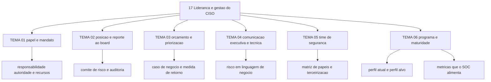

# Liderança e gestão do CISO

A NIS2 (Diretiva 2022/2555) trouxe a segurança cibernética para a sala do conselho ao introduzir a
responsabilização da alta administração pelo descumprimento das medidas de gestão de risco. Quem
assina a resposta por essa responsabilidade, na prática, é o CISO: um cargo com autoridade
delegada, orçamento disputado e nenhuma linha de código sob controle direto. Esta área trata do
trabalho que sobra quando o assunto deixa de ser técnico e passa a ser decisão.

O custo de ignorá-la é observável. Programas de segurança falham menos por falta de ferramenta e
mais por prioridade não acordada, verba aprovada fora de ciclo e relatório que o conselho não
consegue usar.

## 1. Introdução

### 1.1 O que é esta área

O cargo, o mandato e o funcionamento do programa de segurança vistos de dentro de quem responde
por eles: o que o CISO decide, a quem reporta, como pede verba, como comunica em dois registros
diferentes, como monta o time e como transforma maturidade em plano com dono e prazo.

Fora do escopo: conteúdo técnico de controle. Firewall, criptografia, detecção e resposta têm
áreas próprias neste roadmap; aqui elas aparecem apenas como item de decisão, custo ou risco
declarado.

### 1.2 Por que isso importa para o CISO

O CSF 2.0 coloca a função **Govern** no centro da roda porque ela informa como as outras cinco
funções serão implementadas, e estabelece em `GV.RR-01` que a liderança da organização é
responsável e accountable pelo risco cibernético. Accountability não se delega ao fornecedor de
EDR. O que se delega é execução. A diferença entre os dois aparece no dia em que alguém precisa
dizer ao conselho quanto risco a empresa aceitou, por qual motivo e a que custo.

### 1.3 O que você será capaz de fazer ao final

- Descrever o próprio mandato em termos de responsabilidade, autoridade e recursos, com limite
  explícito do que não é seu.
- Montar a matriz de quem decide, quem aprova e quem é informado em cada tipo de decisão de
  segurança.
- Justificar um pedido de verba com risco declarado, opções comparadas e métrica de retorno.
- Traduzir um achado técnico em uma página que o comitê de auditoria usa para decidir.
- Dimensionar o time, decidir o que terceirizar e planejar a reposição de competências.
- Escrever um plano de maturidade com estado atual, estado-alvo, dono, custo e calendário.

### 1.4 Os temas desta área, em prosa

O TEMA-01 delimita o papel e o mandato: o que é responsabilidade do CISO, o que é do conselho e o
que é do encarregado pelo tratamento de dados. O TEMA-02 resolve onde o cargo se posiciona na
estrutura e como o reporte ao board acontece em obrigação legal, não em cortesia. O TEMA-03 trata
de dinheiro: orçamento, priorização entre riscos concorrentes e como medir retorno de segurança. O
TEMA-04 trata de linguagem, no sentido prático de escrever para dois públicos que decidem coisas
diferentes. O TEMA-05 cobre a construção e a liderança do time. O TEMA-06 fecha o programa: o
plano de maturidade que transforma diagnóstico em fila de trabalho com dono e data.

## 2. Objetivos de aprendizagem (terminais)

| # | Objetivo | Bloom | Temas que o sustentam |
|---|---|---|---|
| 1 | Descrever o mandato do CISO em termos de responsabilidade, autoridade e recursos, com ao menos um limite explícito de escopo e um exemplo de decisão real. | entender | TEMA-01 |
| 2 | Distinguir as instâncias que decidem, aprovam e são informadas sobre risco cibernético, produzindo uma matriz de decisão aplicada a três decisões da sua organização. | aplicar | TEMA-02, TEMA-04 |
| 3 | Justificar um pedido de verba apresentando risco quantificado, duas opções comparadas e a métrica que indicará se o gasto funcionou. | avaliar | TEMA-03 |
| 4 | Construir um plano de maturidade de 12 meses com estado atual, estado-alvo, donos, custo e revisão trimestral. | criar | TEMA-05, TEMA-06 |

## 3. Diagrama dos tópicos

## 4. Temas

| # | tema_id | Tema | Nível | Tempo |
|---|---|---|---|---|
| 1 | TEMA-01 | O papel e o mandato do CISO | base | 30-40 min |
| 2 | TEMA-02 | Posição na estrutura e reporte ao board | base | 30-40 min |
| 3 | TEMA-03 | Orçamento, priorização e retorno de segurança | base | 35-45 min |
| 4 | TEMA-04 | Comunicação com o executivo e com o técnico | base | 30-35 min |
| 5 | TEMA-05 | Construir e liderar o time de segurança | base | 30-40 min |
| 6 | TEMA-06 | Programa de segurança e plano de maturidade | base | 35-45 min |

## 5. Pré-requisitos e sequência

A área pressupõe o vocabulário mínimo do guia básico e a noção de risco e controle dos
fundamentos. Ela vem antes do bloco de governança formal porque a estrutura decisória descrita em
[02 Governança, risco e compliance](../02-governanca-risco-compliance/README.md) só funciona
quando existe alguém com mandato para usá-la.

| Antes | Esta área | Depois |
|---|---|---|
| [00 Guia básico do CISO](../00-guia-basico/README.md) | [17 Liderança e gestão do CISO](./README.md) | [02 Governança, risco e compliance](../02-governanca-risco-compliance/README.md) |
| [01 Fundamentos](../01-fundamentos/README.md) | | [15 Fatores humanos e cultura](../15-fatores-humanos/README.md) |

## 6. Certificações desta área

| Certificação | Sigla | O que cobre aqui |
|---|---|---|
| Certified Information Security Manager | CISM | Domínios 1 e 3: governança, estratégia, caso de negócio, métricas do programa e comunicação |
| Certified Chief Information Security Officer | CCISO | Domínios 1, 2 e 5: papel do CISO diante do conselho, liderança, orçamento e retorno |

Ver: [90-certificacoes/](../90-certificacoes/README.md).

## 7. Conexões com outras áreas

Relações de saída dos temas desta área que apontam para fora dela, agregadas do frontmatter
`relacoes`. A visão consolidada está em [mapa-relacoes.md](../mapa-relacoes.md); as regras, em
[templates/RELACOES-TEMAS.md](../templates/RELACOES-TEMAS.md). Alvos marcados como pendentes
ainda não foram escritos.

| Tema daqui | Relação | Destino | Por que |
|---|---|---|---|
| TEMA-01 | nao_confundir_com | 14-dados-privacidade#TEMA-06 | responder por risco cibernético não transfere ao CISO o papel do encarregado pelo tratamento de dados pessoais |
| TEMA-02 | aplicado_em | 11-resposta-forense#TEMA-06 | o reporte ao board se testa na comunicação de crise e na notificação regulatória |
| TEMA-02 | complementa | 02-governanca-risco-compliance#TEMA-01 | a posição do cargo só produz efeito dentro de uma estrutura decisória declarada |
| TEMA-03 | complementa | 02-governanca-risco-compliance#TEMA-06 | orçamento e reporte usam as mesmas métricas |
| TEMA-03 | nao_confundir_com | 02-governanca-risco-compliance#TEMA-03 | apetite declara quanto risco se aceita; orçamento decide quanto se paga para reduzir risco já declarado |
| TEMA-04 | aplicado_em | 02-governanca-risco-compliance#TEMA-06 | o relatório ao board é onde a comunicação executiva é medida |
| TEMA-04 | aplicado_em | 15-fatores-humanos#TEMA-04 | a mensagem da liderança é o que sustenta cultura de segurança |
| TEMA-05 | aplicado_em | 00-guia-basico#TEMA-05 | a trilha dos primeiros 90 dias define quais papéis existem antes de qualquer contratação |
| TEMA-05 | aplicado_em | 10-operacoes-soc#TEMA-01 | o modelo de SOC escolhido define o que fica com time próprio e o que vai para terceiro |
| TEMA-06 | aplicado_em | 10-operacoes-soc#TEMA-05 | a maturidade do programa aparece nas métricas do SOC |
| TEMA-06 | complementa | 02-governanca-risco-compliance#TEMA-04 | o programa de segurança e o ISMS descrevem o mesmo objeto em linguagens diferentes |

## 8. Atividades práticas e laboratórios

| # | Atividade | O que a prática demonstra | Pré-requisito técnico |
|---|---|---|---|
| 1 | Escrever a própria carta de mandato em uma página, com três decisões que você toma sozinho e três que exigem aprovação | Limite real de autoridade, sem depender do organograma | nenhum |
| 2 | Listar as seis últimas decisões de segurança da sua organização e apontar quem decidiu | Matriz de decisão com dados seus, não hipotéticos | acesso à ata ou ao e-mail que registrou a decisão |
| 3 | Transformar um relatório técnico recebido esta semana em uma página destinada ao comitê | Comunicação em dois registros, com o mesmo fato | nenhum |
| 4 | Montar o inventário de papéis de segurança e marcar o que é interno, o que é terceirizado e o que não existe | Lacuna de competência visível | lista de contratos de segurança |
| 5 | Rodar uma autoavaliação de maturidade em um domínio só e escrever o plano de 12 meses daquele domínio | Plano com dono, custo e data | acesso a orçamento e a responsáveis |

## 9. Checkpoint da área

Avaliação da área: itens retirados das seções de recuperação ativa dos seis temas, apresentados fora da ordem em que foram estudados e sem perguntas novas.

1. Qual subcategoria do CSF 2.0 declara a liderança responsável e accountable pelo risco cibernético? (TEMA-01)
2. O que a Regra S-K, Item 106(c), exige que a empresa descreva sobre o conselho? (TEMA-02)
3. Por que uma métrica de contagem de vulnerabilidades abertas não serve como medida de retorno de um investimento? (TEMA-03)
4. Qual é o fluxo de informação que o CSF 2.0 descreve entre executivos, gestores e praticantes? (TEMA-04)
5. Um gerente pede para contratar uma pessoa para operar o SIEM. Quais duas perguntas a estrutura de papéis responde antes da contratação? (TEMA-05)
6. Qual é a diferença entre perfil atual e perfil alvo, e quantos Tiers o CSF 2.0 define? (TEMA-06)

Conferir respostas e critério

1. `GV.RR-01`, dentro da categoria Roles, Responsibilities, and Authorities da função Govern.
2. A descrição da supervisão do conselho sobre os riscos de ameaças cibernéticas e o papel da administração na avaliação e gestão desses riscos materiais.
3. Porque mede atividade, não efeito sobre risco: o número pode cair sem que a exposição mude, e pode subir porque o inventário melhorou.
4. Fluxo bidirecional em dois níveis: executivos e gestores trocam prioridade e estratégia; gestores e praticantes trocam operação e resultado, com praticantes enviando atualizações, percepções e preocupações para cima.
5. Se a atividade existe como papel definido com tarefas próprias e se a competência necessária está descrita antes de virar vaga.
6. O perfil atual descreve os resultados que a organização alcança hoje; o perfil alvo descreve os que foram selecionados e priorizados. São quatro Tiers: Partial, Risk Informed, Repeatable e Adaptive.

Critério para seguir adiante: 80% de acerto sem consultar os temas.

## 10. Termos desta área

- CISO
- mandato
- accountability
- apetite de risco
- tolerância ao risco
- registro de riscos
- caso de negócio
- perfil atual e perfil alvo
- Tier do CSF
- maturity indicator level
- métrica de segurança
- indicador-chave de desempenho
- indicador-chave de risco
- matriz de decisão
- MSSP

## 11. Fontes verificadas

| # | Título | Tipo | URL | Acessado em | Confiança |
|---|---|---|---|---|---|
| 1 | NIST CSF 2.0 — NIST CSWP 29, 26/02/2024 | primaria | https://nvlpubs.nist.gov/nistpubs/CSWP/NIST.CSWP.29.pdf | "2026-09-25" | alta |
| 2 | ENISA ECSF Role Profiles, 19/09/2022 | primaria | https://www.enisa.europa.eu/publications/european-cybersecurity-skills-framework-role-profiles | "2026-09-25" | alta |
| 3 | ISACA CISM Exam Content Outline | primaria | https://www.isaca.org/credentialing/cism/cism-exam-content-outline | "2026-09-25" | alta |
| 4 | EC-Council CCISO Blueprint v3 | primaria | https://cert.eccouncil.org/images/doc/CCISO-New-Blueprint-v3.pdf | "2026-09-25" | alta |
| 5 | European Commission — NIS2 Directive | primaria | https://digital-strategy.ec.europa.eu/en/policies/nis2-directive | "2026-09-25" | alta |
| 6 | SEC Release 33-11216, vigente desde 05/09/2023 | primaria | https://www.sec.gov/files/rules/final/2023/33-11216.pdf | "2026-09-25" | alta |
| 7 | NIST SP 800-181 Rev. 1, novembro de 2020 | primaria | https://csrc.nist.gov/pubs/sp/800/181/r1/final | "2026-09-25" | alta |
| 8 | DOE C2M2, versão 2.1 de junho de 2022 | primaria | https://www.energy.gov/ceser/cybersecurity-capability-maturity-model-c2m2 | "2026-09-25" | alta |
| 9 | NIST IR 8286, edição de outubro de 2020, retirada em 18/12/2025 | primaria | https://nvlpubs.nist.gov/nistpubs/ir/2020/NIST.IR.8286.pdf | "2026-09-25" | alta |

---

| Navegação | |
|---|---|
| Anterior | [01 Fundamentos de segurança da informação](../01-fundamentos/README.md) |
| Próximo | [02 Governança, risco e compliance](../02-governanca-risco-compliance/README.md) |
| Home | [README](../README.md) |
