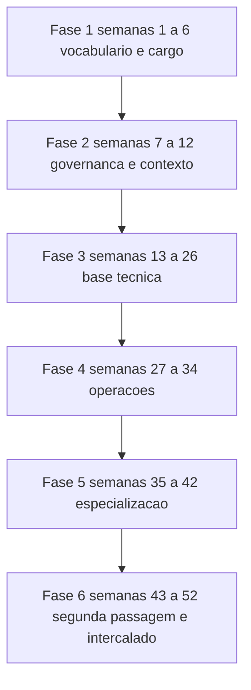

# Plano de estudo — 12 meses

O roadmap tem 153,4 a 172,6 h de conteúdo — 109 temas lidos, aplicados e laborados — e mais 54,5 h
de fila de revisão espaçada, o que dá 208 a 227 h. A 8 h por semana isso fecha em 26 a 28,4
semanas, ou 6 a 7 meses. Doze meses a 8 h por semana são 416 h. A diferença de 189 a 208 h está
declarada na seção 3.3, e não é conteúdo escondido: é o intervalo entre o plano que os números
sustentam e o ano real de quem tem plantão, auditoria e viagem no calendário.

## 1. Perfil e ponto de partida

| Item | Valor |
|---|---|
| Cargo atual | CISO |
| Base técnica | nenhuma ou básica |
| Tempo disponível | 8 h por semana, em seis blocos |
| Restrição principal | agenda; o estudo compete com fechamento de trimestre e ciclo de auditoria |
| Objetivo ao final | vocabulário, registro de risco, apetite aprovado, plano de maturidade e capacidade de questionar proposta técnica de qualquer uma das 18 áreas |

### 1.1 Pré-teste diagnóstico

Dez itens, dos checkpoints das áreas iniciais. Os quatro primeiros vêm das áreas cobertas pelo
plano de 90 dias; os seis seguintes vêm de 02, 14 e 15, que este plano cobre por inteiro.

| # | Origem do item | Acertei |
|---|---|---|
| 1 | [00 Guia básico do CISO](../00-guia-basico/README.md), checkpoint, item 3 | sim/não |
| 2 | [01 Fundamentos](../01-fundamentos/README.md), checkpoint, item 2 | sim/não |
| 3 | [17 Liderança e gestão do CISO](../17-lideranca-ciso/README.md), checkpoint, item 3 | sim/não |
| 4 | [02 Governança, risco e compliance](../02-governanca-risco-compliance/README.md), checkpoint, item 1 | sim/não |
| 5 | [02 Governança, risco e compliance](../02-governanca-risco-compliance/README.md), checkpoint, item 2 | sim/não |
| 6 | [02 Governança, risco e compliance](../02-governanca-risco-compliance/README.md), checkpoint, item 5 | sim/não |
| 7 | [14 Dados, privacidade e LGPD/GDPR](../14-dados-privacidade/README.md), quaisquer 2 itens do checkpoint | sim/não |
| 8 | [14 Dados, privacidade e LGPD/GDPR](../14-dados-privacidade/README.md), quaisquer 2 itens do checkpoint | sim/não |
| 9 | [15 Fatores humanos e cultura](../15-fatores-humanos/README.md), quaisquer 2 itens do checkpoint | sim/não |
| 10 | [15 Fatores humanos e cultura](../15-fatores-humanos/README.md), quaisquer 2 itens do checkpoint | sim/não |

| Acertos | Ponto de entrada |
|---|---|
| 0 a 3 | Fase 1 pelo TEMA-01 de 00, sem pular tema |
| 4 a 7 | Fase 1 pelo TEMA-01 de 00, com 01 lido como revisão em duas semanas |
| 8 a 10 | Fases 1 e 2 comprimidas, e a semana liberada vai para a Fase 3 |

Quem já percorreu o [plano de 90 dias](./plano-90-dias.md) entra na Fase 2 com 00 TEMA-01 a
TEMA-04, 01 inteiro, 17 inteiro e 02 TEMA-01 a TEMA-03 creditados, e usa a Fase 1 só para o
TEMA-05 de 00 e para o TEMA-04 de 17 remanescente.

## 2. Faixas de carga

| Faixa | Horas por semana | Duração total | O que fica de fora |
|---|---|---|---|
| Mínimo viável | 4 h | 12 meses, sem folga de agenda | áreas 09, 13 e 16; a conta fecha, o calendário não |
| Recomendada | 8 h | 6 a 7 meses de estudo, distribuídos em 12 | nada |
| Intensiva | 12 h | 4 a 5 meses de estudo | nada; inclui os laboratórios de fase |

A faixa mínima não é uma versão menor da recomendada, é uma exclusão declarada. Com 09, 13 e 16
fora, a carga cai para 182 a 198 h, o que a 4 h por semana ocupa 46 a 50 semanas. Nesse ritmo,
qualquer duas semanas perdidas estouram o horizonte.

### 2.1 A conta da carga

Regra, igual nas três trilhas: **leitura** = soma de `tempo_estimado` do frontmatter de cada tema;
**aplicação** = 30 min por tema para o exercício da seção 7 do tema; **laboratório** = 2 h por área
para as atividades da seção 8 do guia mais o checkpoint.

| Área (ordem de estudo) | Temas | Leitura | Aplicação | Laboratório | Total |
|---|---|---|---|---|---|
| 00 Guia básico do CISO | 5 | 2,4–3,3 | 2,5 | 2,0 | 6,9–7,8 |
| 01 Fundamentos | 8 | 3,8–5,2 | 4,0 | 2,0 | 9,8–11,2 |
| 17 Liderança e gestão do CISO | 6 | 3,2–4,1 | 3,0 | 2,0 | 8,2–9,1 |
| 02 Governança, risco e compliance | 6 | 3,7–4,7 | 3,0 | 2,0 | 8,7–9,7 |
| 14 Dados, privacidade e LGPD/GDPR | 6 | 3,4–4,4 | 3,0 | 2,0 | 8,4–9,4 |
| 15 Fatores humanos e cultura | 6 | 3,5–4,5 | 3,0 | 2,0 | 8,5–9,5 |
| 04 Identidade, acesso e zero trust | 6 | 3,8–5,0 | 3,0 | 2,0 | 8,8–10,0 |
| 05 Rede e infraestrutura | 6 | 3,5–4,8 | 3,0 | 2,0 | 8,5–9,8 |
| 07 Criptografia e segredos | 6 | 3,4–4,4 | 3,0 | 2,0 | 8,4–9,4 |
| 08 Cloud | 6 | 3,3–4,4 | 3,0 | 2,0 | 8,3–9,4 |
| 03 Arquitetura e engenharia | 6 | 3,2–4,4 | 3,0 | 2,0 | 8,2–9,4 |
| 06 Endpoint e plataforma | 6 | 3,3–4,5 | 3,0 | 2,0 | 8,3–9,5 |
| 10 Operações e SOC | 6 | 3,8–4,8 | 3,0 | 2,0 | 8,8–9,8 |
| 11 Resposta, forense e resiliência | 6 | 4,2–5,2 | 3,0 | 2,0 | 9,2–10,2 |
| 12 Vulnerabilidades e threat intel | 6 | 3,4–4,4 | 3,0 | 2,0 | 8,4–9,4 |
| 09 Aplicações e DevSecOps | 6 | 3,7–4,7 | 3,0 | 2,0 | 8,7–9,7 |
| 13 Ofensiva e pentest | 6 | 3,7–4,7 | 3,0 | 2,0 | 8,7–9,7 |
| 16 Segurança em IA e LLM | 6 | 3,8–4,8 | 3,0 | 2,0 | 8,8–9,8 |
| **Total** | **109** | **62,9–82,1** | **54,5** | **36,0** | **153,4–172,6** |

Fila de revisão: 109 temas × 3 passagens × 10 min = **54,5 h**. Carga total da trilha:
**208 a 227 h**. A média por tema é de 34,6 a 45,2 min de leitura, acima dos 25 a 40 min que a
[home](../README.md) declara, porque três temas passam de 50 min e o TEMA-02 de 11 vai a 55.

Conferência contra a home: a home declara 160 h de leitura e prática e, na faixa de 8 h, duração
de 5 a 7 meses; a intensiva de 12 h, 3 a 4 meses. Recontado com as três parcelas desta seção:
153,4–172,6 h de conteúdo equivalem a 19,2–21,6 semanas a 8 h — de 4,5 a 5 meses — e a
12,8–14,4 semanas a 12 h, ou 3 a 4 meses. As duas contas fecham com a home quando o conteúdo é
comparado com o conteúdo. Com a fila de revisão somada, o mesmo percurso vai a 26–28,4 semanas a
8 h e a 17,3–18,9 semanas a 12 h.

## 3. Fases e marcos

As fases seguem `ordem_estudo`, não a numeração das pastas. A sequência completa está na
[home](../README.md) e o contrato de numeração em
[templates/INDICE-TEMAS.md](../templates/INDICE-TEMAS.md).

| Fase | Semanas | Áreas (ordem_estudo) | Carga | Marco de saída |
|---|---|---|---|---|
| 1 Vocabulário e cargo | 1 a 6 | 00, 01, 17 | 24,9–28,0 h | Checkpoint de 00 com 4 em 5, o de 01 com 4 em 5 e o de 17 com 80%; carta de mandato e as três primeiras linhas de registro de risco com dono |
| 2 Governança e contexto | 7 a 12 | 02, 14, 15 | 25,6–28,6 h | Checkpoint de 02 com 4 em 5; declaração de apetite de risco submetida ao patrocinador executivo; matriz que liga cinco controles a CSF 2.0, CIS Controls e Anexo A da ISO/IEC 27001 |
| 3 Base técnica | 13 a 26 | 04, 05, 07, 08, 03, 06 | 50,5–57,5 h | Explicar em uma página por onde um ataque atravessa a rede da empresa e em que camada ele para, usando o vocabulário das seis áreas; checkpoints das seis áreas no critério declarado em cada guia |
| 4 Operações | 27 a 34 | 10, 11, 12 | 26,3–29,4 h | Playbook de um tipo de incidente em duas páginas e um exercício de mesa de 90 min com quatro participantes, com as lacunas fechadas com dono e prazo |
| 5 Especialização | 35 a 42 | 09, 13, 16 | 26,1–29,1 h | Leitura crítica de um relatório de pentest real, com o escopo autorizado e o que o relatório não cobre; página de risco de IA com o inventário de uso não governado |
| 6 Segunda passagem | 43 a 52 | todas | 54,5 h | Checkpoint intercalado de cada área, com itens de áreas diferentes na mesma sessão, e o plano de maturidade de 12 meses do TEMA-06 de 17 |

A Fase 3 ocupa 14 semanas para 50,5–57,5 h. O excesso é deliberado: as atividades de 05 e 06
pedem acesso à arquitetura e conversa com operações, e as de 08 pedem acesso ao console da nuvem.
Nenhuma dessas três coisas acontece na semana em que você decide pedir.

### 3.1 Áreas dentro das fases

A ordem dentro da fase é a de `ordem_estudo`, e não a de dificuldade percebida.

| Fase | Sequência | Duas semanas por área, exceto onde anotado |
|---|---|---|
| 1 | 00 (1 semana) → 01 (2 semanas) → 17 (2 semanas) → consolidação (1 semana) | 6 semanas |
| 2 | 02 (2) → 14 (2) → 15 (2) | 6 semanas |
| 3 | 04 (2) → 05 (2) → 07 (2) → 08 (2) → 03 (2) → 06 (2) → consolidação (2) | 14 semanas |
| 4 | 10 (2) → 11 (3, pela mesa) → 12 (2) → consolidação (1) | 8 semanas |
| 5 | 09 (2) → 13 (2) → 16 (2) → consolidação (2) | 8 semanas |
| 6 | revisão espaçada vencida, intercalado e os artefatos anuais | 10 semanas |

### 3.2 Marco por área

Cada área tem marco próprio, e ele é o checkpoint da seção 9 do guia, no critério que o próprio
guia declara — 4 acertos em 5 ou 80%, conforme a área. O critério não se copia para cá: se o guia
mudar o limiar, ele prevalece sobre esta trilha. O artefato da fase é a atividade sem pré-requisito
técnico da seção 8 do guia, mais as que o time aceitar conduzir com você.

### 3.3 As 189 a 208 h excedentes

Três destinos, declarados:

| Destino | Para que serve |
|---|---|
| Picos de agenda | plantão, ciclo de auditoria, fechamento de trimestre e férias. Duas semanas perdidas em cada trimestre consomem 64 h do ano. |
| Terceira passagem | os temas que a fila rebaixou duas vezes (erro sem consulta) voltam a D+7 no mês seguinte. |
| Trabalho com o time | as atividades de 11, 12 e 13 dependem de terceiros e não cabem na hora de estudo. |

Se a sua intenção é fechar o conteúdo e parar, a conta é 26 a 28,4 semanas, e a Fase 6 vira revisão
final. Este plano cobre 12 meses porque a agenda cobre 12 meses, e não porque o material ocupe o
ano.

## 4. Ritmo semanal

Seis blocos somam 480 min, com o tema novo sempre em dois deles.

| Dia | Bloco | Atividade |
|---|---|---|
| Segunda | 90 min | Tema novo: leitura e pré-teste |
| Quarta | 60 min | Fila de revisão, nas datas D+1, D+7 e D+30 |
| Quinta | 90 min | Tema novo: leitura, exemplo resolvido e autoexplicação |
| Sexta | 60 min | Laboratório da área, com quem executa |
| Sábado | 90 min | Aplicação prática do tema, seção 7, e checkpoint da semana |
| Um bloco a escolher | 90 min | Artefato da fase ou intercalado da Fase 6 |

Na faixa de 4 h, mantenha segunda, quarta e sábado, pela metade, e remova 09, 13 e 16 do escopo. Na
faixa de 12 h, acrescente dois blocos de 90 min na terça e no domingo, e mantenha o escopo.

## 5. Avaliação

Referência: Kirkpatrick, em quatro níveis. A Kirkpatrick Partners descreve o desenho a partir do
nível 4, com indicadores que a organização já rastreia em algum lugar. Esta trilha não mede o
nível 4.

| Nível | O que mede | Instrumento | Medido? |
|---|---|---|---|
| 1 Reação | relevância e utilidade percebidas | três linhas no sábado: útil, inútil, o que travou | sim |
| 2 Aprendizado | conhecimento e confiança | checkpoints das 18 áreas, no critério declarado em cada guia, e o intercalado da Fase 6 | sim |
| 3 Comportamento | aplicação no trabalho | um artefato por fase, seis no ano, com autoavaliação | sim, por autoavaliação |
| 4 Resultados | risco e exposição da organização | número de incidentes, tempo de correção, cobertura de inventário | **não medido nesta trilha** |

Nenhum dos seis artefatos do nível 3 passa por revisor externo. A evidência disponível é que o
documento existe, tem dono nomeado e foi usado pelo menos uma vez em uma decisão real.

## 6. Fila de revisão

Esta trilha define o calendário e o formato do estado da revisão. Cada tema sugere os intervalos na
sua seção 11; em runtime, o estado de cada usuário fica no aplicativo, e a tabela desta seção é o
exemplo.

| Momento | O que entra na fila | Intervalos |
|---|---|---|
| Toda quarta, 60 min | os temas lidos nas duas semanas anteriores | D+1 e D+7 |
| Primeiro bloco do mês | os temas completados há 30 dias | D+30 |
| Última semana da área | o checkpoint da área, inteiro, fora da ordem | intercalado |
| Fase 6 | todos os temas, em três sessões semanais | D+90 e além |

Regra de rebaixamento, copiada do TEMA-05 de 00 e do §11 dos temas: erro sem consulta volta pela
metade do prazo — D+7 no lugar de D+30, D+3 no lugar de D+7. Duas passagens falhas seguidas mandam
o tema para releitura completa, contada na conta da seção 3.3.

| Tema | Intervalo devido | Próxima revisão | Resultado | Ação |
|---|---|---|---|---|
| 00 TEMA-03 | D+30 | D+30 | ok / revisar | avançar / repetir em D+7 |
| 02 TEMA-03 | D+30 | D+30 | ok / revisar | avançar / repetir em D+7 |
| 04 TEMA-06 | D+7 | D+7 | ok / revisar | avançar / repetir em D+3 |
| 11 TEMA-02 | D+30 | D+30 | ok / revisar | avançar / repetir em D+7 |
| 16 TEMA-02 | D+7 | D+7 | ok / revisar | avançar / repetir em D+3 |

## 7. Critério para seguir adiante

Duas condições por área, as duas verificáveis no sábado:

1. Checkpoint da seção 9 do guia no critério declarado pelo próprio guia — 4 acertos em 5 ou 80%,
   sem consultar.
2. O artefato da área produzido, com dono nomeado, a partir da seção 8 do guia.

Reprovou o checkpoint: releia os temas da coluna "Temas que o sustentam" da área antes de avançar,
e agende uma passagem extra. A área seguinte não começa com a anterior reprovada.

## 8. Registro de progresso

| Data | Área | Tema | Recuperação | Artefato produzido |
|---|---|---|---|---|
| AAAA-MM-DD | 00-guia-basico | TEMA-05 | ok / revisar | carta de mandato |
| AAAA-MM-DD | 02-governanca-risco-compliance | TEMA-03 | ok / revisar | declaração de apetite de risco |
| AAAA-MM-DD | 02-governanca-risco-compliance | TEMA-06 | ok / revisar | página de reporte trimestral com uma decisão pedida |
| AAAA-MM-DD | 05-rede-infraestrutura | TEMA-03 | ok / revisar | mapa de segmentação atual, com as zonas de confiança |
| AAAA-MM-DD | 11-resposta-forense | TEMA-02 | ok / revisar | playbook de duas páginas e as lacunas da mesa |
| AAAA-MM-DD | 13-ofensiva-pentest | TEMA-05 | ok / revisar | leitura crítica do último relatório recebido |
| AAAA-MM-DD | 17-lideranca-ciso | TEMA-06 | ok / revisar | plano de maturidade de 12 meses |

---

| Trilhas | |
|---|---|
| [Plano de 90 dias](./plano-90-dias.md) | [Plano de 24 meses](./plano-24-meses.md) |
| [Índice das trilhas](./README.md) | [Home](../README.md) |
