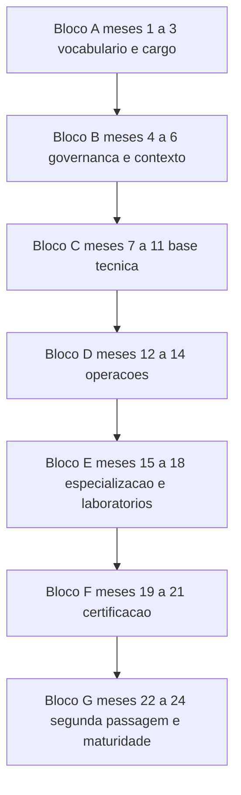

# Plano de estudo — 24 meses

Vinte e quatro meses a 8 h por semana são 832 horas. O roadmap inteiro, com laboratórios e duas
credenciais, soma 308 a 328 h. A média é de 3 h por semana, e esse número é o mais útil desta
página: quem declara 8 h semanais por dois anos está declarando quase o triplo da carga real do
material. Este plano prefere declarar a folga a inflar o conteúdo.

O alvo de 24 meses depende de o cargo consumir a agenda, e não de o roadmap ter material para
tanto. A revisão é obrigatória a cada seis meses: o outline do CISM muda com efeito em 03/11/2026,
e qualquer credencial citada aqui precisa de fonte primária do fornecedor antes de virar
agendamento.

## 1. Perfil e ponto de partida

| Item | Valor |
|---|---|
| Cargo atual | CISO |
| Base técnica | nenhuma ou básica |
| Tempo disponível | 8 h por semana em média, com picos de 12 h em bloco de exame |
| Restrição principal | agenda; laboratório depende de acesso a console, repositório e ambiente de teste |
| Objetivo ao final | as 18 áreas lidas duas vezes, cinco laboratórios concluídos com dado real, uma credencial obtida e o programa de segurança com plano de maturidade em uso |

### 1.1 Pré-teste diagnóstico

Dez itens, dos checkpoints das áreas de operações e de especialização — as que este plano leva mais
longe. Os itens de 14, 15, 04 e 05 já apareceram no [plano de 12 meses](./plano-12-meses.md);
repetir aqueles ali é aceitável, porque a distância entre as duas aplicações é o que mede retenção.

| # | Origem do item | Acertei |
|---|---|---|
| 1 | [10 Operações de segurança e SOC](../10-operacoes-soc/README.md), quaisquer 2 itens do checkpoint | sim/não |
| 2 | [10 Operações de segurança e SOC](../10-operacoes-soc/README.md), quaisquer 2 itens do checkpoint | sim/não |
| 3 | [11 Resposta a incidentes, forense e resiliência](../11-resposta-forense/README.md), quaisquer 2 itens do checkpoint | sim/não |
| 4 | [11 Resposta a incidentes, forense e resiliência](../11-resposta-forense/README.md), quaisquer 2 itens do checkpoint | sim/não |
| 5 | [12 Vulnerabilidades e threat intelligence](../12-vulnerabilidades-threat-intel/README.md), quaisquer 2 itens do checkpoint | sim/não |
| 6 | [12 Vulnerabilidades e threat intelligence](../12-vulnerabilidades-threat-intel/README.md), quaisquer 2 itens do checkpoint | sim/não |
| 7 | [09 Aplicações e DevSecOps](../09-aplicacoes-devsecops/README.md), quaisquer 2 itens do checkpoint | sim/não |
| 8 | [09 Aplicações e DevSecOps](../09-aplicacoes-devsecops/README.md), quaisquer 2 itens do checkpoint | sim/não |
| 9 | [13 Segurança ofensiva](../13-ofensiva-pentest/README.md), quaisquer 2 itens do checkpoint | sim/não |
| 10 | [16 Segurança em IA e LLM](../16-ia-seguranca/README.md), quaisquer 2 itens do checkpoint | sim/não |

| Acertos | Ponto de entrada |
|---|---|
| 0 a 3 | Bloco A pelo TEMA-01 de 00, com as áreas de operações tratadas como primeira leitura, sem pressa |
| 4 a 7 | Bloco A pelo TEMA-01 de 00, e o Bloco D recebe uma semana extra para 11 |
| 8 a 10 | Bloco A comprimido em duas semanas, e o tempo liberado vai para os laboratórios L3 e L4 |

Com 8 a 10 acertos, a tentação é pular para o Bloco E. Não pule: a Fase 3 é o que dá vocabulário
para julgar o relatório de pentest e a arquitetura que o Bloco E cobra.

## 2. Faixas de carga

| Faixa | Horas por semana | Duração real do conteúdo | O que fica de fora |
|---|---|---|---|
| Mínimo viável | 4 h | 46 a 50 semanas | 09, 13, 16, os cinco laboratórios e a preparação para certificação |
| Recomendada | 8 h | 39 a 41 semanas | nada |
| Intensiva | 12 h | 26 a 28 semanas | nada; sirva-se dela em blocos de até 12 semanas seguidas |

As três durações cobrem a passagem completa, os laboratórios e a certificação, com a fila de
revisão dentro. Nenhuma delas chega perto de 104 semanas, e é por isso que este plano existe: o
horizonte de 24 meses é o da agenda, não o do material.

### 2.1 A conta da carga

Quatro parcelas. A primeira é a mesma das outras duas trilhas, e a tabela linha a linha das 18
áreas pertence a [plano-12-meses.md](./plano-12-meses.md), que é a dona desse número.

| Parcela | Carga | Origem do número |
|---|---|---|
| Passagem 1 nas 18 áreas | 153,4–172,6 h | leitura = soma de `tempo_estimado` dos 109 temas; aplicação = 30 min por tema; laboratório = 2 h por área |
| Revisão espaçada, 3 passagens | 54,5 h | 109 temas × 3 passagens × 10 min de recuperação ativa |
| Cinco laboratórios aprofundados | 20 h | estimativa declarada desta trilha: 4 h por laboratório, sem medição no repositório |
| Preparação para certificação | 80 h | estimativa declarada desta trilha: 40 h por credencial. Nenhum fornecedor publica carga horária de estudo de forma normativa — NAO CONFIRMADO em fonte oficial |
| **Total** | **308–328 h** | 39 a 41 semanas a 8 h |

Pela faixa mínima de 4 h, sem 09, 13 e 16, sem laboratórios e sem certificação, a conta cai para
182 a 198 h, ou 46 a 50 semanas. Pelos 12 h, 26 a 28 semanas.

### 2.2 Os cinco laboratórios

Cada um usa dado real da empresa e um artefato verificável. Nenhum deles é simulação de tela.

| # | Laboratório | Origem no roadmap | Artefato verificável |
|---|---|---|---|
| L1 | Exercício de mesa de resposta a incidente, 90 min, quatro participantes: plantão, jurídico, comunicação e dono do serviço mais exposto | [11 TEMA-02](../11-resposta-forense/README.md) e a seção 8 do guia da área | playbook de duas páginas e a lista de lacunas com dono e prazo |
| L2 | Leitura crítica de um relatório de pentest real, com o escopo autorizado ao lado | [13 TEMA-05](../13-ofensiva-pentest/README.md) e [13 TEMA-02](../13-ofensiva-pentest/README.md) | página com o que o relatório cobre e o que ele não cobre, com o achado que você decidiu não corrigir e por quê |
| L3 | Pipeline com SAST, DAST e SCA em um repositório de aplicação próprio | [09 TEMA-04](../09-aplicacoes-devsecops/README.md) e [12 TEMA-01](../12-vulnerabilidades-threat-intel/README.md) | taxa de achados por natureza, tempo até o fechamento e o que entrou no backlog |
| L4 | Reconciliação de inventário e priorização com CVSS e EPSS em 50 ativos | [12 TEMA-01](../12-vulnerabilidades-threat-intel/README.md) e [12 TEMA-02](../12-vulnerabilidades-threat-intel/README.md) | fila de remediação com prazo e responsável, e a dívida declarada |
| L5 | Autoavaliação de maturidade em um domínio, usando as mais de 350 práticas em 10 domínios e os 3 níveis indicadores do C2M2 | [17 TEMA-06](../17-lideranca-ciso/README.md) | plano de maturidade de 12 meses com estado atual, estado-alvo, dono e custo |

O C2M2 declara que a autoavaliação cabe em um único dia, o que faz de L5 o laboratório com melhor
relação entre custo e saída. Os laboratórios L2 e L3 exigem gasto ou acesso que talvez você não
tenha no mês em que pretende rodá-los; nesse caso, rode-os no ano seguinte, com a passagem 2.

### 2.3 Preparação para certificação

O catálogo fica em [90-certificacoes/](../90-certificacoes/README.md). A pasta reúne os arquivos
por fornecedor listados no índice — CompTIA, EC-Council, ISC2, ISACA, GIAC, OffSec, cloud,
privacidade — e a cobertura de fonte primária é desigual entre eles. Consequência prática: pesos,
custo, validade e número de questões que não constem de página oficial confirmada em
[99-fontes/registro-verificacao.md](../99-fontes/registro-verificacao.md) seguem
**NAO CONFIRMADO em fonte oficial**, e nenhum exame deve ser agendado antes de o fornecedor ser
conferido ali.

| Credencial | Âncora no roadmap | Confirmado em fonte primária | Sequência sugerida |
|---|---|---|---|
| CISM | 00, 02, 17 | 4 domínios, 150 questões, pesos 17 / 20 / 33 / 30, outline novo com efeito em 03/11/2026 | mês 21, primeira credencial |
| CCISO | 00, 17 | 5 domínios, pesos 15 / 16 / 12 / 46 / 11 | mês 21, alternativa ao CISM |
| Security+ | 01, 05, 06, 10 | 5 domínios, pesos 12 / 22 / 18 / 28 / 20 | mês 19, se você ainda não tem nenhuma credencial |
| CISSP | bloco técnico inteiro | 8 domínios, outline vigente desde 15/04/2024 | mês 24; pesos por domínio NAO CONFIRMADO |
| CCSP ou CCSK | 08 | nada além do nome no índice da home | mês 24, se a empresa for majoritariamente em cloud |
| CSSLP ou OSWE | 09 | nada além do nome no índice da home | não agende antes de L3 estar rodando |
| PenTest+ ou OSCP | 13 | nada além do nome no índice da home | só se você for usar o resultado ofensivo diretamente |

Uma credencial gerencial e uma técnica é o teto que este plano sustenta. Duas gerenciais cobrem o
mesmo conteúdo e custam dois ciclos de estudo.

## 3. Fases e marcos

Blocos de mês, seguindo `ordem_estudo`. Os nomes das fases são os mesmos de
[plano-12-meses.md](./plano-12-meses.md), porque a sequência de áreas é a mesma; o que muda é a
profundidade e o tempo.

| Bloco | Meses | Áreas (ordem_estudo) | Carga | Marco de saída |
|---|---|---|---|---|
| A Vocabulário e cargo | 1 a 3 | 00, 01, 17 | 24,9–28,0 h | Carta de mandato, mapa de direitos de decisão e registro de risco com 15 ativos e dono nomeado; checkpoints de 00 e 01 com 4 em 5 e o de 17 com 80% |
| B Governança e contexto | 4 a 6 | 02, 14, 15 | 25,6–28,6 h | Declaração de apetite aprovada, classificação de dados com retenção e descarte, e o primeiro programa de conscientização com métrica de comportamento |
| C Base técnica | 7 a 11 | 04, 05, 07, 08, 03, 06 | 50,5–57,5 h | Mapa de segmentação e zonas de confiança, inventário de identidades privilegiadas, revisão de certificado e chave, e a página que explica onde um ataque para |
| D Operações | 12 a 14 | 10, 11, 12 | 26,3–29,4 h | Laboratório L1 concluído, página de reporte trimestral com indicador ligado ao apetite, e a fila de remediação com prazo e responsável |
| E Especialização e laboratórios | 15 a 18 | 09, 13, 16 | 26,1–29,1 h | Laboratórios L2 e L3; inventário de uso de IA não governado e a página de risco de IA com dono |
| F Certificação | 19 a 21 | revisão dirigida pelas áreas da credencial escolhida | 80 h | Uma credencial obtida ou o exame agendado com data, e as lacunas registradas |
| G Segunda passagem e maturidade | 22 a 24 | todas | 54,5 h | Laboratórios L4 e L5, checkpoint intercalado das 18 áreas e o plano de maturidade de 12 meses em uso |

### 3.1 Por que a profundidade muda, e não o escopo

Cada bloco relê a seção 8 do guia da área com dado real, o que o plano de 12 meses faz uma vez. O
que este plano acrescenta é a segunda execução das atividades de maior custo — as que exigem
acesso, orçamento ou terceiro. Duas passagens com intervalo de um ano é o que Dunlosky et al.
(2013) chamam de prática espaçada com estado, e o intervalo é o componente que faz efeito.

### 3.2 O que fica de fora, e por quê

| Fora do escopo | Motivo |
|---|---|
| Segunda credencial gerencial | CISM e CCISO cobrem o mesmo conteúdo — governança, risco, orçamento — e custam dois ciclos. |
| Certificação de segurança de IA | A existência de credencial consolidada para o tema está registrada como pendente em [99-fontes/registro-verificacao.md](../99-fontes/registro-verificacao.md): **NAO CONFIRMADO em fonte oficial**. |
| Exercício adversarial de red team | Custa mais que um pentest e exige maturidade de detecção que só existe depois do Bloco D. |
| ISMS certificado | A decisão depende do registro de risco, do inventário e do apetite já em operação, e do orçamento de auditoria. É decisão de ciclo, fora de um plano de estudo. |

## 4. Ritmo semanal

Seis blocos somam 480 min na média. Em bloco de exame, os dois blocos de leitura migram para
revisão e o total vai a 720 min por até 12 semanas.

| Dia | Bloco | Atividade |
|---|---|---|
| Segunda | 90 min | Tema novo: leitura e pré-teste |
| Quarta | 60 min | Fila de revisão, nas datas D+1, D+7 e D+30 |
| Quinta | 90 min | Tema novo: leitura, exemplo resolvido e autoexplicação |
| Sexta | 60 min | Laboratório em andamento, com quem opera |
| Sábado | 90 min | Aplicação prática do tema, seção 7, e checkpoint |
| Um bloco a escolher | 90 min | Artefato do bloco, ou a preparação do Bloco F |

Na faixa de 4 h, mantenha segunda, quarta e sábado pela metade, e remova 09, 13, 16 e os
laboratórios. Na faixa de 12 h, os blocos de segunda e quinta viram revisão dirigida ao exame
durante o Bloco F.

## 5. Avaliação

A avaliação segue os quatro níveis de Kirkpatrick. O que esta trilha mede é o par 2 e 3: conhecimento pelos checkpoints e comportamento pelos artefatos produzidos a cada bloco. O nível 4, impacto sobre o risco da organização, fica declarado como não medido.

| Nível | O que mede | Instrumento | Medido? |
|---|---|---|---|
| 1 Reação | relevância e utilidade percebidas | três linhas no sábado | sim |
| 2 Aprendizado | conhecimento e confiança | checkpoints das 18 áreas no critério de cada guia, o intercalado do Bloco G e as questões de prática da credencial escolhida | sim |
| 3 Comportamento | aplicação no trabalho | os sete artefatos de bloco e os cinco laboratórios, com autoavaliação | sim, por autoavaliação |
| 4 Resultados | risco, exposição e custo | incidentes, tempo de correção, cobertura de inventário, gasto por risco tratado | **não medido nesta trilha** |

O nível 3 tem sete artefatos e cinco laboratórios, todos com dado real, e ainda assim nenhum
revisor externo. A evidência é a mesma das outras trilhas: o documento existe, tem dono nomeado e
foi usado em uma decisão. O nível 4 exigiria atribuir a mudança de indicador a 300 h de estudo, e
nenhum indicador de risco da empresa tem essa dependência.

## 6. Fila de revisão

A trilha define o calendário e o formato do estado; em runtime, o estado de cada usuário fica no
aplicativo. O desenho da fila, a regra de rebaixamento e a distribuição semanal estão em
[plano-12-meses.md](./plano-12-meses.md), seção 6; o que muda aqui é o intervalo entre as passagens.

| Momento | O que entra na fila | Intervalos |
|---|---|---|
| Toda quarta, 60 min | temas lidos nas duas semanas anteriores | D+1 e D+7 |
| Primeiro bloco do mês | temas completados há 30 dias | D+30 |
| Última semana de cada bloco | checkpoint da área, inteiro, fora da ordem | intercalado |
| Bloco G | todas as 18 áreas, com itens de áreas diferentes na mesma sessão | D+90 e além |
| Após a credencial | os temas que a credencial cobriu voltam em D+7 | D+7 e D+30 |

| Tema | Intervalo devido | Próxima revisão | Resultado | Ação |
|---|---|---|---|---|
| 02 TEMA-03 | D+90 | D+90 | ok / revisar | avançar / repetir em D+30 |
| 06 TEMA-03 | D+90 | D+90 | ok / revisar | avançar / repetir em D+30 |
| 11 TEMA-02 | D+90 | D+90 | ok / revisar | avançar / repetir em D+30 |
| 12 TEMA-02 | D+30 | D+30 | ok / revisar | avançar / repetir em D+7 |
| 16 TEMA-04 | D+7 | D+7 | ok / revisar | avançar / repetir em D+3 |

## 7. Critério para seguir adiante

Três condições por bloco:

1. Checkpoint da área no critério declarado pelo próprio guia — 4 acertos em 5 ou 80%, sem
   consultar.
2. Artefato do bloco produzido, com dono nomeado.
3. No Bloco E, o laboratório correspondente concluído com dado real. Sem L1 e L2, o Bloco F não
   começa: nenhuma credencial gerencial se sustenta em exercício não feito.

Reprovou o checkpoint: releia os temas da coluna "Temas que o sustentam" do guia da área. Reprovação
dupla em uma área bloqueia o bloco seguinte, e o prazo do plano se estende — a extensão tem de vir
do Bloco G, não da supressão da revisão espaçada.

## 8. Registro de progresso

| Data | Área | Tema | Recuperação | Artefato produzido |
|---|---|---|---|---|
| AAAA-MM-DD | 00-guia-basico | TEMA-05 | ok / revisar | carta de mandato |
| AAAA-MM-DD | 02-governanca-risco-compliance | TEMA-03 | ok / revisar | declaração de apetite aprovada |
| AAAA-MM-DD | 06-endpoint-plataforma | TEMA-02 | ok / revisar | linha de base de configuração com a exceção registrada |
| AAAA-MM-DD | 11-resposta-forense | TEMA-02 | ok / revisar | playbook, lacunas da mesa e L1 concluído |
| AAAA-MM-DD | 12-vulnerabilidades-threat-intel | TEMA-02 | ok / revisar | fila de remediação com CVSS e EPSS, e L4 concluído |
| AAAA-MM-DD | 13-ofensiva-pentest | TEMA-05 | ok / revisar | leitura crítica do relatório, e L2 concluído |
| AAAA-MM-DD | 17-lideranca-ciso | TEMA-06 | ok / revisar | plano de maturidade e L5 concluído |
| AAAA-MM-DD | — | — | ok / revisar | credencial obtida ou exame agendado |

---

| Trilhas | |
|---|---|
| [Plano de 90 dias](./plano-90-dias.md) | [Plano de 12 meses](./plano-12-meses.md) |
| [Índice das trilhas](./README.md) | [Home](../README.md) |
