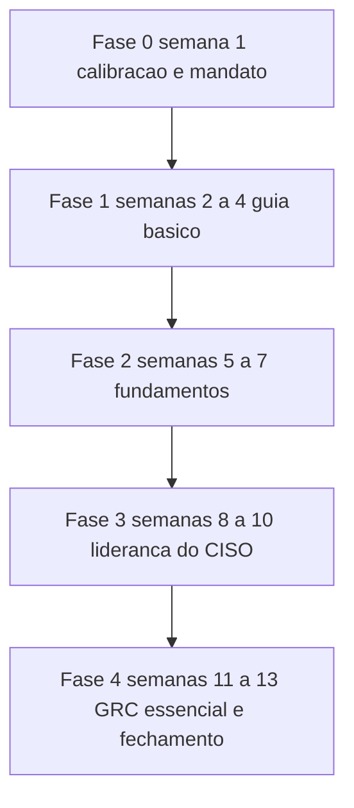

# Plano de estudo — 90 dias

Treze semanas a 8 h por semana são 104 horas. As quatro áreas desta trilha somam 29,2 a 32,8 h de
leitura, aplicação prática e laboratório, e a fila de revisão espaçada das 22 primeiras leituras
acrescenta 11 h. Sobram 60 a 64 h no orçamento, e elas não cabem em leitura adicional: ficam com o
trabalho de campo do trimestre, descrito na seção 3.

## 1. Perfil e ponto de partida

| Item | Valor |
|---|---|
| Cargo atual | CISO, primeiro cargo de gestão na área de segurança |
| Base técnica | nenhuma ou básica |
| Tempo disponível | 8 h por semana, em seis blocos |
| Restrição principal | agenda, viagens, plantão e reunião de conselho fora de ciclo |
| Objetivo ao final | quatro artefatos assinados e o vocabulário de risco em uso na empresa |

O que o cargo exige no dia 1 não é opinião: a Resolução CMN nº 4.893/2021, art. 7º, cobra de
instituições autorizadas pelo Banco Central a designação de diretor responsável pela política de
segurança cibernética **e pela execução** do plano de ação e de resposta a incidentes, e a Lei nº
13.709/2018, art. 41, exige do controlador a indicação de encarregado pelo tratamento de dados
pessoais. Duas designações, dois entregáveis, dois interlocutores. O trimestre começa localizando
os dois documentos na sua empresa.

### 1.1 Pré-teste diagnóstico

Os dez itens abaixo vêm dos checkpoints das áreas cobertas, fora da ordem de estudo. Responda sem
abrir o tema e marque o acerto. Não é nota: é ponto de entrada.

| # | Origem do item | Acertei |
|---|---|---|
| 1 | [00 Guia básico do CISO](../00-guia-basico/README.md), checkpoint, item 3 | sim/não |
| 2 | [00 Guia básico do CISO](../00-guia-basico/README.md), checkpoint, item 4 | sim/não |
| 3 | [01 Fundamentos](../01-fundamentos/README.md), checkpoint, item 2 | sim/não |
| 4 | [01 Fundamentos](../01-fundamentos/README.md), checkpoint, item 4 | sim/não |
| 5 | [01 Fundamentos](../01-fundamentos/README.md), checkpoint, item 5 | sim/não |
| 6 | [17 Liderança e gestão do CISO](../17-lideranca-ciso/README.md), checkpoint, item 1 | sim/não |
| 7 | [17 Liderança e gestão do CISO](../17-lideranca-ciso/README.md), checkpoint, item 2 | sim/não |
| 8 | [17 Liderança e gestão do CISO](../17-lideranca-ciso/README.md), checkpoint, item 5 | sim/não |
| 9 | [02 Governança, risco e compliance](../02-governanca-risco-compliance/README.md), checkpoint, item 1 | sim/não |
| 10 | [02 Governança, risco e compliance](../02-governanca-risco-compliance/README.md), checkpoint, item 2 | sim/não |

| Acertos | Ponto de entrada |
|---|---|
| 0 a 3 | Fase 1 pelo TEMA-01 de 00, sem pular tema |
| 4 a 7 | Fase 1 pelo TEMA-01 de 00, com o TEMA-05 de 00 em leitura corrida |
| 8 a 10 | Fases 1 e 2 comprimidas em duas semanas, com a semana liberada alocada em 02 TEMA-03 |

A diferença em relação ao mapeamento padrão do `templates/TEMPLATE-plano-estudo.md`: ninguém salta
para 02 antes de 17. Apetite de risco aprovado por quem não tem mandato declarado volta do comitê
sem assinatura, e a área 17 é a que produz o mandato.

## 2. Faixas de carga

| Faixa | Horas por semana | Duração total | O que fica de fora |
|---|---|---|---|
| Mínimo viável | 4 h | 13 semanas | 02 TEMA-02, o trabalho de campo e o laboratório de 02 |
| Recomendada | 8 h | 13 semanas | nada do escopo desta trilha |
| Intensiva | 12 h | 9 semanas | nada do escopo desta trilha; o escopo não cresce, o calendário encurta |

Do dia 91 em diante, a faixa de 12 h alimenta a Fase 1 de
[plano-12-meses.md](./plano-12-meses.md).

### 2.1 A conta da carga

A regra, aplicada igual nas três trilhas:

- **Leitura** = soma do campo `tempo_estimado` do frontmatter de cada tema.
- **Aplicação** = 30 min por tema, para o exercício da seção 7 do próprio tema.
- **Laboratório** = 2 h por área, para as atividades da seção 8 do guia da área mais o checkpoint.
- Área lida em parte recebe laboratório proporcional: 1 h para os três temas de 02 em escopo.

| Área | Temas | Leitura | Aplicação | Laboratório | Total |
|---|---|---|---|---|---|
| 00 Guia básico do CISO | 5 | 2,4–3,3 | 2,5 | 2,0 | 6,9–7,8 |
| 01 Fundamentos | 8 | 3,8–5,2 | 4,0 | 2,0 | 9,8–11,2 |
| 17 Liderança e gestão do CISO | 6 | 3,2–4,1 | 3,0 | 2,0 | 8,2–9,1 |
| 02 GRC, TEMA-01 a TEMA-03 | 3 | 1,8–2,3 | 1,5 | 1,0 | 4,3–4,8 |
| **Total** | **22** | **11,2–14,9** | **11,0** | **7,0** | **29,2–32,8** |

Fila de revisão: 22 temas × 3 passagens × 10 min = 11 h. Total do trimestre: **40,2 a 43,8 h de
estudo declarado**, contra um orçamento de 104 h. A tabela das 18 áreas está em
[plano-12-meses.md](./plano-12-meses.md), que é a dona da conta completa.

## 3. Fases e marcos

As fases seguem `ordem_estudo` (00 → 01 → 17 → 02), não a numeração das pastas.

| Fase | Semanas | Áreas e temas | Marco de saída |
|---|---|---|---|
| 0 | 1 | [00 TEMA-05](../00-guia-basico/README.md) e o mapeamento dos dois designados formais | Carta de mandato de uma página, com três decisões próprias e três que exigem aprovação |
| 1 | 2 a 4 | [00 Guia básico do CISO](../00-guia-basico/README.md), 5 temas | Checkpoint de 00 com 4 acertos em 5, sem consultar, e as três primeiras linhas de registro de risco com dono nomeado |
| 2 | 5 a 7 | [01 Fundamentos](../01-fundamentos/README.md), 8 temas | Checkpoint de 01 com 4 acertos em 5, e a linha de risco reescrita com impacto, probabilidade e risco residual separados |
| 3 | 8 a 10 | [17 Liderança e gestão do CISO](../17-lideranca-ciso/README.md), 6 temas | Checkpoint de 17 com 80% de acerto, e o mapa de direitos de decisão com as seis últimas decisões de segurança da empresa e quem assinou cada uma |
| 4 | 11 a 13 | [02 GRC](../02-governanca-risco-compliance/README.md), TEMA-01, TEMA-02 e TEMA-03 | Declaração de apetite de risco de uma página, submetida ao patrocinador executivo, e os itens 1 e 2 do checkpoint de 02 acertados |

### 3.1 O trabalho de campo das 60 a 64 h restantes

As atividades da seção 8 dos guias substituem qualquer leitura extra neste horizonte. Elas cabem em
seis blocos semanais de 90 min: as quatro atividades de 00, as seis de 01 — três delas com
planilha e conversa com operações — e as cinco de 17. O custo por atividade não tem previsão de
horas porque depende de quantos donos de processo aceitam sentar à mesa no mesmo mês.

### 3.2 O que fica de fora, e por quê

| Fora do escopo | Motivo |
|---|---|
| 02 TEMA-04 (ISMS e ISO/IEC 27001) | O escopo de um sistema de gestão definido antes de existirem inventário e registro de risco sai largo, e a primeira auditoria fica impossível. Certificação é decisão de ciclo anual, não de trimestre. |
| 02 TEMA-05 (NIST CSF 2.0 e CIS Controls) | Sem registro de risco, a comparação entre catálogos se resolve por preferência. O guia da área já declara que TEMA-06 depende de TEMA-03. |
| 02 TEMA-06 (métricas, reporte e auditoria) | Não existe série histórica no dia 30. Indicador sem dois trimestres de dado e sem apetite aprovado descreve o passado em vez de pedir decisão. |
| 14 Dados, privacidade e LGPD/GDPR | Vem depois de 02 na ordem de estudo. O trimestre cobre as duas designações formais, não abre programa de privacidade. |
| 15 Fatores humanos e cultura | Programa de conscientização é consequência da política aprovada, que ainda não existe no dia 90. |
| 04, 05, 07, 08, 03 e 06 (base técnica) | Nenhuma delas muda uma decisão do trimestre sem o vocabulário de risco já em uso. As atividades de 05 e 06 exigem acesso à arquitetura e conversa com operações, e competem com o trabalho de campo desta trilha. |
| 10, 11 e 12 (operações, resposta e vulnerabilidades) | Contratar SOC, escrever playbook ou abrir programa de vulnerabilidade sem inventário e apetite declarados produz gasto sem critério. A obrigação de designar responsável entra pelo TEMA-04 de 00; o procedimento é assunto da Fase 4 do plano de 12 meses. |
| 09, 13 e 16 (avançadas) | Nenhuma das três decide algo no primeiro trimestre. |

Esta trilha não entrega no dia 90: política aprovada, sistema de gestão certificado, SOC
contratado, teste de intrusão, programa de conscientização nem credencial. Quem promete isso no
primeiro trimestre está vendendo calendário, não capacidade.

## 4. Ritmo semanal

Seis blocos somam 480 min. Nenhum deles depende de estar no escritório, exceto o de sexta.

| Dia | Bloco | Atividade |
|---|---|---|
| Segunda | 90 min | Tema novo: leitura e pré-teste, antes do conteúdo |
| Terça | 60 min | Aplicação prática do tema de segunda, seção 7 do tema |
| Quarta | 60 min | Fila de revisão, nas datas D+1, D+7 e D+30 |
| Quinta | 90 min | Tema novo: leitura, exemplo resolvido e autoexplicação |
| Sexta | 90 min | Trabalho de campo: conversa de diagnóstico, inventário, revisão de documento |
| Sábado | 90 min | Checkpoint da semana e produção do artefato da fase |

Na faixa de 4 h, ficam segunda, terça e quarta; o trabalho de campo migra para o dia 91 e 02
TEMA-02 sai. Na faixa de 12 h, acrescente dois blocos de 90 min e um de 60 min na quinta, na sexta e no
sábado — 480 mais 240 min, que fecham as 12 h: o escopo permanece, o calendário cai para nove
semanas.

## 5. Avaliação

Referência: Kirkpatrick, em quatro níveis. A Kirkpatrick Partners descreve o desenho começando
pelo nível 4, com indicadores que a organização já rastreia. Esta trilha não mede o nível 4.

| Nível | O que mede | Instrumento | Medido? |
|---|---|---|---|
| 1 Reação | utilidade percebida e relevância | três linhas no sábado: o que foi útil, o que não foi, o que travou | sim |
| 2 Aprendizado | conhecimento | checkpoints das áreas 00, 01, 02 e 17, no critério declarado em cada guia | sim |
| 3 Comportamento | aplicação no trabalho | os quatro artefatos do §3, com autoavaliação | sim, por autoavaliação |
| 4 Resultados | risco da organização | indicadores de exposição e de incidente | **não medido nesta trilha** |

Sem revisor externo, o nível 3 tem uma única evidência: o artefato existe, está assinado e o dono
nomeado sabe que existe. Trate isso como indício. O nível 4 exigiria atribuir a mudança de
indicador a horas de estudo, e nenhum indicador de risco da empresa tem essa dependência.

## 6. Fila de revisão

Esta trilha define o calendário e o formato do estado; em runtime, o estado de cada usuário fica no
aplicativo, e a tabela desta seção é o exemplo. Os temas apenas sugerem os intervalos; a regra de
rebaixamento está registrada no TEMA-05 de 00 e no §11 de cada tema.

| Tema | Intervalo devido | Próxima revisão | Resultado | Ação |
|---|---|---|---|---|
| 00 TEMA-01 | D+1 | D+1 | ok / revisar | avançar / repetir em D+1 |
| 00 TEMA-01 | D+7 | D+7 | ok / revisar | avançar / repetir em D+3 |
| 00 TEMA-01 | D+30 | D+30 | ok / revisar | avançar / repetir em D+7 |
| 01 TEMA-06 | D+7 | D+7 | ok / revisar | avançar / repetir em D+3 |
| 17 TEMA-03 | D+30 | D+30 | ok / revisar | avançar / repetir em D+7 |
| 02 TEMA-03 | D+7 | D+7 | ok / revisar | avançar / repetir em D+3 |

Regra de rebaixamento, a mesma dos temas: erro sem consulta volta pela metade do prazo — D+7 no
lugar de D+30, D+3 no lugar de D+7, D+1 no lugar de D+1. A recuperação ativa de 10 min por
passagem é a seção 10 do tema, respondida antes do gabarito.

## 7. Critério para seguir adiante

Duas condições, as duas verificáveis no sábado:

1. Checkpoint da área no critério declarado pelo próprio guia, que é o dono do critério. Nesta
   trilha, em 02 apenas os itens 1 e 2 tratam dos temas em escopo: acertá-los é o que a fase cobra, e
   os outros três ficam para quando a área entrar inteira, na trilha de 12 meses.
2. Artefato da fase produzido, com dono nomeado.

Reprovou o checkpoint: a remediação é refazer os temas da coluna "Temas que o sustentam" do guia
da área antes de avançar, mais a passagem extra da fila. Nenhuma fase começa com a anterior
reprovada.

## 8. Registro de progresso

| Data | Área | Tema | Recuperação | Artefato produzido |
|---|---|---|---|---|
| AAAA-MM-DD | 00-guia-basico | TEMA-05 | ok / revisar | carta de mandato de uma página |
| AAAA-MM-DD | 01-fundamentos | TEMA-03 | ok / revisar | inventário de 15 ativos com dono e retenção |
| AAAA-MM-DD | 01-fundamentos | TEMA-06 | ok / revisar | 3 linhas de risco em matriz 5x5 |
| AAAA-MM-DD | 17-lideranca-ciso | TEMA-02 | ok / revisar | mapa de direitos de decisão |
| AAAA-MM-DD | 02-governanca-risco-compliance | TEMA-03 | ok / revisar | declaração de apetite de risco |

---

| Trilhas | |
|---|---|
| [Plano de 12 meses](./plano-12-meses.md) | [Plano de 24 meses](./plano-24-meses.md) |
| [Índice das trilhas](./README.md) | [Home](../README.md) |
