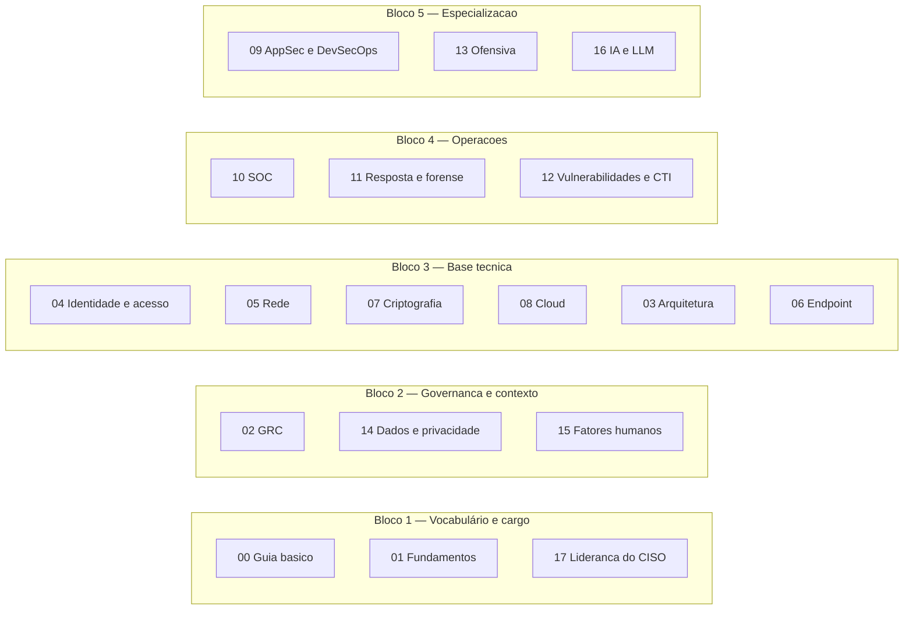
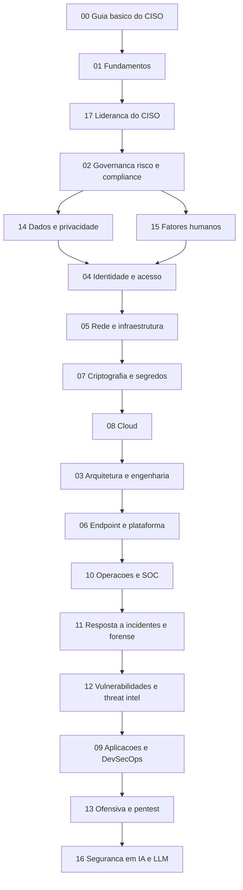

# Roadmap CISO

Um caminho de estudo em segurança da informação para quem assumiu a responsabilidade pela
segurança de uma organização sem ter vindo da área técnica.

São **18 áreas**, **109 temas** e três trilhas de prazos diferentes — de 90 dias a 24 meses. O
conteúdo está em Markdown, na pasta correspondente a cada área, e cada tema é um arquivo que se
lê em 25 a 60 minutos.

Este roadmap não forma um engenheiro de segurança. Ele forma um gestor capaz de entender o que
está sendo decidido, questionar o que chega pronto, priorizar gasto e responder por um incidente.

## Como o conteúdo está organizado

```
00-guia-basico/              vocabulário mínimo e o mandato do cargo
01-fundamentos/              conceitos, ativos, risco, controles
...
17-lideranca-ciso/           o cargo em si: verba, board, métricas
90-certificacoes/            catálogo por área de conhecimento
91-trilhas/                  os planos de 90 dias, 12 e 24 meses
99-fontes/                   bibliografia e registro de verificação
glossario.md                 definições, com fonte
templates/                   os cinco formatos e as regras
scripts/relacoes.py          validador das ligações entre temas
```

Cada pasta de área tem um `README.md` (o guia da área) e arquivos `TEMA-NN-*.md`. O guia traz a
introdução, o diagrama, os objetivos e a tabela de temas; o tema traz o conteúdo.

## Mapa geral



## Sequência sugerida

A ordem abaixo é sugestão, não pré-requisito rígido. O número no rótulo é o `ordem_estudo` da
área, que difere do nome da pasta — a pasta guarda a identidade, não a posição.



## As 18 áreas

| Ordem | Área | Nível | Ancoragem em framework | Certificação-âncora |
|---|---|---|---|---|
| 1 | [Guia básico do CISO](./00-guia-basico/README.md) | base | ENISA ECSF: CISO | CCISO, CISM |
| 2 | [Fundamentos de segurança da informação](./01-fundamentos/README.md) | base | CSEC2017: Data Security; NIST CSF: Identify | Security+, ISC2 CC |
| 3 | [Liderança e gestão do CISO](./17-lideranca-ciso/README.md) | base | ENISA ECSF: CISO; NICE: Overseeing and Governing | CCISO, CISM |
| 4 | [Governança, risco e compliance](./02-governanca-risco-compliance/README.md) | intermediário | NIST CSF: Govern; CSEC2017: Organizational | CISM, CRISC |
| 5 | [Dados, privacidade e LGPD/GDPR](./14-dados-privacidade/README.md) | intermediário | CSEC2017: Data, Societal | CDPSE, CIPP/E |
| 6 | [Fatores humanos e cultura](./15-fatores-humanos/README.md) | base | CSEC2017: Human | — |
| 7 | [Identidade, acesso e zero trust](./04-identidade-acesso/README.md) | intermediário | NIST CSF: Protect | CISSP D5, AZ-500 |
| 8 | [Segurança de rede e infraestrutura](./05-rede-infraestrutura/README.md) | intermediário | CSEC2017: Connection | Network+, Security+ |
| 9 | [Criptografia e gestão de segredos](./07-criptografia-segredos/README.md) | intermediário | CSEC2017: Data | CISSP D3 |
| 10 | [Segurança em cloud](./08-cloud/README.md) | intermediário | ENISA ECSF: Architect; NICE: Designing and Developing | CCSP, CCSK |
| 11 | [Arquitetura e engenharia de segurança](./03-arquitetura-engenharia/README.md) | intermediário | CSEC2017: Component | CISSP D3, SecurityX |
| 12 | [Endpoint e plataforma](./06-endpoint-plataforma/README.md) | intermediário | NIST CSF: Protect; NICE: Operating and Maintaining | SC-200, GSEC |
| 13 | [Operações de segurança e SOC](./10-operacoes-soc/README.md) | intermediário | NIST CSF: Detect; NICE: Collecting and Operating | CySA+, GCIH |
| 14 | [Resposta a incidentes, forense e resiliência](./11-resposta-forense/README.md) | intermediário | NIST CSF: Respond, Recover | CHFI, GCFA |
| 15 | [Vulnerabilidades e threat intelligence](./12-vulnerabilidades-threat-intel/README.md) | intermediário | NICE: Analyzing and Investigating | CySA+ |
| 16 | [Aplicações e DevSecOps](./09-aplicacoes-devsecops/README.md) | avançado | CSEC2017: Software | CSSLP, OSWE |
| 17 | [Segurança ofensiva](./13-ofensiva-pentest/README.md) | avançado | CSEC2017: Connection, Societal | PenTest+, CEH, OSCP |
| 18 | [Segurança em IA e LLM](./16-ia-seguranca/README.md) | avançado | ISO/IEC 42001 (extensão proposta) | — |

## Plano de estudo

### Faixas de carga

O total de leitura e prática é de aproximadamente 160 horas. As faixas abaixo traduzem isso em
calendário; recalcule conforme o seu ritmo real.

| Faixa | Horas por semana | Duração aproximada | O que fica de fora |
|---|---|---|---|
| Mínimo viável | 4 h | 10 a 12 meses | áreas 09, 13 e 16 |
| Recomendada | 8 h | 5 a 7 meses | — |
| Intensiva | 12 h | 3 a 4 meses | inclui laboratórios e preparação para certificação |

### Ritmo semanal

| Dia | Bloco | Atividade |
|---|---|---|
| Segunda | 45 min | Tema novo |
| Quarta | 30 min | Fila de revisão, nas datas D+1, D+7 e D+30 |
| Sexta | 60 min | Aplicação prática do tema da semana |

### Fases

| Fase | Áreas | Marco de saída |
|---|---|---|
| 1. Vocabulário e cargo | 00, 01, 17 | Explicar risco, controle e mandato sem consultar |
| 2. Governança e contexto | 02, 14, 15 | Escrever uma política e um registro de risco |
| 3. Base técnica | 04, 05, 07, 08, 03, 06 | Explicar como um ataque atravessa a rede e onde ele para |
| 4. Operações | 10, 11, 12 | Conduzir um exercício de mesa com o time |
| 5. Especialização | 09, 13, 16 | Avaliar um relatório de pentest e um risco de IA |

As trilhas detalhadas estão em [91-trilhas/](./91-trilhas/README.md).

## Como este material é verificado

Toda afirmação normativa — versão de norma, percentual de exame, prazo legal, obrigação
regulatória — exige **fonte primária** do próprio publicador, com URL e data de acesso. O que não
puder ser confirmado é registrado como `NAO CONFIRMADO em fonte oficial`, nunca preenchido por
inferência. O log fica em [99-fontes/registro-verificacao.md](./99-fontes/registro-verificacao.md).

Cada arquivo carrega `status_verificacao`: `rascunho`, `pendente` ou `verificado`. Nada é marcado
como verificado antes de uma auditoria que compare o texto com as fontes citadas.

## Ligações entre temas

Áreas diferentes tratam do mesmo problema por ângulos diferentes. O bloco `relacoes` no
frontmatter de cada tema registra cinco tipos de vínculo — entre eles `complementa`, que liga
temas de áreas distintas, e `nao_confundir_com`, que separa conceitos que a maioria confunde, como
vulnerabilidade e risco.

A visão consolidada é gerada, não escrita à mão: [mapa-relacoes.md](./mapa-relacoes.md). As regras
estão em [templates/RELACOES-TEMAS.md](./templates/RELACOES-TEMAS.md) e o validador é
`python3 scripts/relacoes.py`.

## Navegação

| Recurso | Onde |
|---|---|
| Trilhas de estudo | [91-trilhas/](./91-trilhas/README.md) |
| Certificações por área | [90-certificacoes/](./90-certificacoes/README.md) |
| Mapa de relações entre temas | [mapa-relacoes.md](./mapa-relacoes.md) |
| Glossário | [glossario.md](./glossario.md) |
| Fontes e verificação | [99-fontes/](./99-fontes/README.md) |
| Índice de fontes (gerado) | [99-fontes/indice-fontes.md](./99-fontes/indice-fontes.md) |
| Regras de autoria | [CONTRIBUTING.md](./CONTRIBUTING.md) |
| Formato dos documentos | [templates/](./templates/) |
