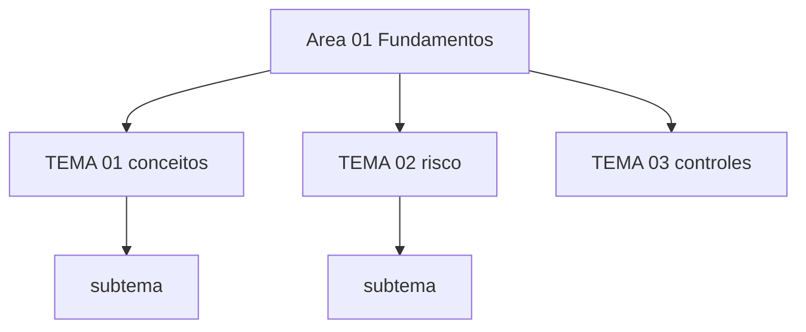

# Nome da área

Abertura factual: o que esta área cobre, em 2 ou 3 frases, e o custo de ignorá-la. Sem instruções
de uso — elas vivem no CONTRIBUTING.

## 1. Introdução

### 1.1 O que é esta área
Definição curta. O que está dentro e o que está fora do escopo.

### 1.2 Por que isso importa para o CISO
Que decisão, risco, verba ou conversa com o board depende disso. Um caso concreto, não uma lista.

### 1.3 O que você será capaz de fazer ao final
3 a 5 capacidades observáveis.

### 1.4 Os temas desta área, em prosa
Nomeie cada tema em uma frase, para que o diagrama da seção 3 chegue depois do vocabulário.

## 2. Objetivos de aprendizagem (terminais)

Objetivo = verbo observável + conteúdo + critério. São as competências de saída da área; os
objetivos habilitadores ficam em cada tema (`objetivo_aprendizagem`), ligados de volta por
`atende_objetivo`.

| # | Objetivo | Bloom | Temas que o sustentam |
|---|---|---|---|
| 1 | Descrever X, com critério Y. | entender | TEMA-01, TEMA-02 |
| 2 | Aplicar X a Y, produzindo Z. | aplicar | TEMA-03 |
| 3 | Avaliar X contra Y, justificando Z. | avaliar | TEMA-04, TEMA-05 |

## 3. Diagrama dos tópicos

Regras de sintaxe: rótulo sem `<`, sem `"`, sem `(` e sem `#`; nunca usar `end` como id de nó;
sem `click` nem links em nós. Conferir o render no GitHub e no Obsidian antes de commitar.

## 4. Temas

| # | tema_id | Tema | Nível | Tempo |
|---|---|---|---|---|
| 1 | TEMA-01 | Título | base | 25 a 35 min |
| 2 | TEMA-02 | Título | base | 20 a 30 min |

## 5. Pré-requisitos e sequência

O que estudar antes e por quê. `ordem_estudo` desta área é o número no frontmatter; a sequência
completa das áreas vive no README raiz.

| Antes | Esta área | Depois |
|---|---|---|
| area-id | area-id | area-id |

## 6. Certificações desta área

Apenas siglas e link. Domínios, pesos e custos pertencem a `90-certificacoes/`.

| Certificação | Sigla | O que cobre aqui |
|---|---|---|
| Nome | Sigla | TEMA-01 e TEMA-03 |

Ver: [90-certificacoes/](../90-certificacoes/README.md).

## 7. Conexões com outras áreas

Relações de saída dos temas desta área que apontam para fora dela, agregadas do frontmatter
`relacoes`. A visão consolidada de todas as áreas está em
[mapa-relacoes.md](../mapa-relacoes.md); as regras, em
[templates/RELACOES-TEMAS.md](../templates/RELACOES-TEMAS.md).

| Tema daqui | Relação | Destino | Por que |
|---|---|---|---|
| TEMA-01 | complementa | area-id#TEMA-NN | motivo |
| TEMA-03 | nao_confundir_com | area-id#TEMA-NN | motivo |

## 8. Atividades práticas e laboratórios

| # | Atividade | O que a prática demonstra | Pré-requisito técnico |
|---|---|---|---|
| 1 | Atividade guiada | Resultado observável | nenhum |

## 9. Checkpoint da área

Avaliação somativa e **intercalada**: selecione itens de 3 ou mais temas desta área, sem criar
itens novos (os itens vivem nos temas, seção 10). A ordem das perguntas não deve seguir a ordem
dos temas. Privilegie itens cujos pares `complementa` cruzem outras áreas.

1. Item do TEMA-01.
2. Item do TEMA-03.
3. Item do TEMA-02.

Conferir respostas e critério

1. Resposta esperada.
2. Resposta esperada.
3. Resposta esperada.

Critério para seguir adiante: acertar 80% ou mais sem consultar os temas.

## 10. Termos desta área

Lista de termos que o glossário central deve conter. As definições ficam em `glossario.md`.

- termo
- termo

## 11. Fontes verificadas

| # | Título | Tipo | URL | Acessado em | Confiança |
|---|---|---|---|---|---|
| 1 | Título | primaria | url | "AAAA-MM-DD" | alta |

---

| Navegação | |
|---|---|
| Anterior | [area-id](../area-id/README.md) |
| Próximo | [area-id](../area-id/README.md) |
| Home | [README](../README.md) |
